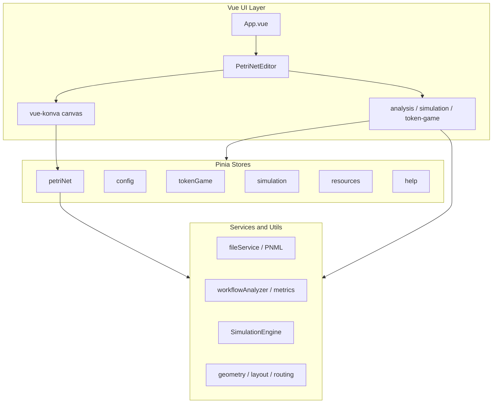

# AGENTS.md — WoPeD Next

Tool-agnostic reference for human developers and AI coding agents (Cursor, Copilot, ChatGPT, Codex, etc.). Describes **current** repository facts only. For deeper design detail, see [docs/dev/architecture.md](docs/dev/architecture.md).

---

## Project Overview

**WoPeD Next** is a browser-based Petri net editor and workflow analysis tool. It is the web successor to the Java Swing **WoPeD** (Workflow Petri Net Designer), aimed at education and research: modeling processes, running the token game, qualitative analysis, and quantitative simulation.

### Architecture



### Application entry points

| File | Role |
|------|------|
| `src/main.js` | Creates Vue app, registers Pinia, vue-i18n, vue-konva; loads config store and locale |
| `src/App.vue` | Root shell; renders `PetriNetEditor` |
| `src/components/editor/PetriNetEditor.vue` | Main editor layout (toolbar, canvas, side panels) |

### Layer responsibilities

- **Components** (`src/components/`) — UI and Konva canvas rendering; delegate business logic to stores and services.
- **Stores** (`src/stores/`) — Application state, selection, viewport, persistence where applicable.
- **Services** (`src/services/`) — Pure TypeScript business logic (import/export, analysis, simulation, templates).
- **Types** (`src/types/`) — Domain and config TypeScript interfaces.
- **Utils** (`src/utils/`) — Geometry, arc routing, auto-layout, validation, Zod schemas.

---

## Tech Stack

Versions below match [package.json](package.json) at time of writing.

| Area | Technology | Purpose |
|------|------------|---------|
| UI framework | Vue 3.5 | Composition API, `<script setup>` |
| Build | Vite 7 | Dev server, production bundle |
| State | Pinia 3 | Centralized reactive state |
| Canvas | Konva 10 + vue-konva 3 | Petri net diagram rendering |
| i18n | vue-i18n 11 | English and German UI |
| Types | TypeScript 5 | Strict checking via `jsconfig.json` |
| Styling | Tailwind CSS 4 + CSS variables | Global utilities + theme tokens |
| Validation | Zod 4 | Runtime schemas in `src/utils/schemas.ts` |
| IDs | nanoid 5 | Unique element and net IDs |
| Layout | dagre 0.8 | Hierarchical auto-layout |
| Utilities | @vueuse/core 14 | Vue composition utilities |
| Tests | Vitest 4, happy-dom, @vue/test-utils | Unit and component tests |
| Production | nginx (Docker), GitHub Pages | Static hosting |

**Runtime:** Node.js 22 (Dockerfile and GitHub Actions deploy workflow).

**Not in this repository today:** npm workspaces / `packages/` monorepo, backend (Express/SQLite), pnpm, ESLint/Prettier config, PR CI workflow (only deploy on `main` exists).

---

## Repository Structure

This is a **single npm package** at the repository root — **not** a monorepo. There is no `packages/` directory in the current codebase.

> **Future note:** [docs/features/01-discord-auth.md](docs/features/01-discord-auth.md) describes a planned monorepo split (`packages/frontend`, `packages/server`, `packages/shared`). Do not assume that structure exists until it is merged.

```
woped-next/
├── src/                         # Application source
│   ├── components/              # Vue SFCs by feature
│   │   ├── analysis/            # Analysis panels, metrics, coverability graph
│   │   ├── canvas/              # Konva nodes (Place, Transition, Arc, Operator, …)
│   │   ├── editor/              # PetriNetEditor, toolbar, canvas, properties
│   │   ├── file/                # File menu (import/export)
│   │   ├── help/                # Help dialog, tooltips, guided tour
│   │   ├── resources/           # Resource manager UI
│   │   ├── settings/            # Settings dialog
│   │   ├── simulation/          # Quantitative simulation UI
│   │   ├── token-game/          # Token game controls and stats
│   │   └── triggers/            # Transition trigger editor
│   ├── composables/             # Shared composition functions
│   ├── stores/                  # Pinia stores
│   ├── services/                # Business logic (no Vue imports)
│   ├── types/                   # TypeScript interfaces
│   ├── utils/                   # Helpers (geometry, layout, routing, schemas)
│   ├── i18n/                    # vue-i18n setup and locale files
│   ├── help/                    # Help content (articles, tours, tooltips)
│   ├── __tests__/               # Vitest test files
│   ├── App.vue
│   ├── main.js
│   └── style.css                # Tailwind import + CSS theme variables
├── docs/                        # Human documentation
│   ├── dev/                     # Architecture, design
│   ├── features/                # Feature specs and roadmap
│   ├── learn/                   # Tutorials (Vue, Pinia, i18n, Tailwind, …)
│   ├── migration/               # Java → web migration status
│   └── ops/                     # Deployment, configuration
├── .cursor/rules/               # Cursor-specific rules (subset of this file)
├── .github/workflows/           # deploy.yml (GitHub Pages on push to main)
├── vite.config.js
├── vitest.config.js
├── tailwind.config.js
├── postcss.config.js
├── jsconfig.json
├── Dockerfile
├── docker-compose.yml
├── nginx.conf
└── package.json
```

### `docs/` overview

| Path | Contents |
|------|----------|
| `docs/dev/architecture.md` | System design, directory map, Pinia and vue-konva patterns |
| `docs/dev/design.md` | UI colors and design tokens |
| `docs/learn/` | Step-by-step guides for stack concepts |
| `docs/migration/` | Feature parity with legacy WoPeD |

### Cursor-specific rules

When using **Cursor**, additional context lives in `.cursor/rules/`:

| Rule file | Scope |
|-----------|--------|
| `project.mdc` | Global project summary |
| `vue-components.mdc` | Vue SFC conventions |
| `pinia-stores.mdc` | Store structure and reactivity |
| `petri-net.mdc` | Petri net data model and canvas |
| `services.mdc` | Service layer patterns |
| `docker.mdc` | Docker and nginx |

### GitHub MCP Server

The repository ships a GitHub MCP server configuration at `.cursor/mcp.json`. This gives Cursor (and other MCP-compatible agents) standardized access to GitHub — reading issues, PRs, and repository metadata without manual API calls.

**Setup:**

1. Create a GitHub Personal Access Token (PAT) at <https://github.com/settings/tokens> with at least the `repo` scope.
2. Export it in your shell profile:
   ```bash
   export GITHUB_PERSONAL_ACCESS_TOKEN=ghp_yourTokenHere
   ```
3. Restart Cursor — it picks up the variable automatically via the `${GITHUB_PERSONAL_ACCESS_TOKEN}` placeholder in `.cursor/mcp.json`.

The token is never stored in the repository; the config file only references the environment variable.

---

## Development Conventions

### Vue components

- Use **Composition API** with `<script setup>`.
- Most production SFCs use plain `<script setup>` (JavaScript). TypeScript is used in `stores/`, `services/`, `types/`, `utils/`, and tests; add `lang="ts"` to components when you need `import type` or strict props typing.
- Name component files in **PascalCase** (e.g. `EditorToolbar.vue`).
- Group components by feature under `src/components/<feature>/`.
- Prefer **`scoped`** styles in `<style scoped>`.
- Use **`defineProps()`** and **`defineEmits()`** for component API.

Example pattern (from `src/components/editor/ViewToolbar.vue`):

```vue
<script setup>
import { ref, computed } from 'vue'
import { storeToRefs } from 'pinia'
import { useI18n } from 'vue-i18n'
import { usePetriNetStore } from '@/stores/petriNet'
import { useConfigStore } from '@/stores/config'
import { useViewport } from '@/composables/useViewport'

const { t } = useI18n()
const store = usePetriNetStore()
const { net, viewport } = storeToRefs(store)
const configStore = useConfigStore()
const showGrid = computed(() => configStore.$state.editor.showGrid)
</script>

<template>
  <button :title="t('view.zoomIn')">…</button>
</template>
```

### TypeScript

- Strict mode is enabled in [jsconfig.json](jsconfig.json) (`"strict": true`).
- Domain types live in `src/types/` (e.g. `petri-net.ts`, `config.ts`, `simulation.ts`).
- Path alias: `@/` → `src/` (configured in `vite.config.js` and `jsconfig.json`).
- Use `import type { … } from '@/types/…'` for type-only imports.
- Runtime validation: Zod schemas in `src/utils/schemas.ts` (e.g. triggers, places).

### Naming conventions

| Kind | Convention | Example |
|------|------------|---------|
| Vue components | PascalCase file and name | `PlaceNode.vue` |
| Feature folders | kebab-case | `token-game/` |
| Composables | `use` + PascalCase | `useViewport.ts` |
| Pinia stores | camelCase file, `use*Store` export | `petriNet.ts` → `usePetriNetStore` |
| Services | camelCase or PascalCase class | `fileService.ts`, `SimulationEngine.ts` |
| Translation keys | dot-separated namespaces | `menu.file`, `simulation.run` |

### Import conventions

```typescript
import { usePetriNetStore } from '@/stores/petriNet'
import { fileService } from '@/services/file/fileService'
import type { Place, Arc } from '@/types/petri-net'
import { autoLayout } from '@/utils/layout'
```

Always use the `@/` alias for `src/` imports — avoid deep relative paths like `../../../stores/petriNet`.

### Composables

Place reusable composition logic in `src/composables/`:

| File | Purpose |
|------|---------|
| `useViewport.ts` | Zoom, pan, fit-to-view, element bounds |
| `useAutoSave.ts` | Auto-save behavior tied to config |

Pattern:

```typescript
export function useViewport() {
  const store = usePetriNetStore()
  const { viewport } = storeToRefs(store)
  // computed helpers and methods
  return { zoomPercent, fitToView, /* … */ }
}
```

### Pinia stores

Pinia stores live in **`src/stores/`**. Each file defines one store: `defineStore('<id>', { state, getters, actions })` and exports `use<Name>Store` (e.g. `petriNet.ts` → `usePetriNetStore`). Check that directory for the current set of stores before adding state or creating a new one.

**Options API** style (`defineStore('id', { state, getters, actions })`).

**Nested state reactivity:** For nested config (e.g. `editor.showGrid`), use one of:

1. Store getters + `storeToRefs(store)`
2. `computed(() => store.$state.editor.showGrid)` in components
3. Explicit toggle actions on the store

See [docs/dev/architecture.md](docs/dev/architecture.md) and `.cursor/rules/pinia-stores.mdc`.

### Services

Business logic stays out of Vue components. Structure:

```
src/services/
├── analysis/
│   ├── index.ts              # Qualitative analysis entry
│   ├── metricsCalculator.ts
│   ├── soundnessAnalyzer.ts
│   ├── statistics.ts
│   └── workflowAnalyzer.ts
├── file/
│   ├── fileService.ts        # Import/export coordination
│   ├── pnmlParser.ts / pnmlWriter.ts
│   ├── jsonParser.ts
│   └── imageExporter.ts
├── simulation/
│   ├── SimulationEngine.ts   # Discrete-event simulation
│   └── XESExporter.ts
└── templates/
    └── petriNetTemplates.ts  # Educational example nets
```

- **Object singleton** for coordinators: `export const fileService = { … }`
- **Classes** for stateful engines: `export class SimulationEngine`

Services must not import Vue or Pinia.

### Petri net domain

- Types: `src/types/petri-net.ts`
- State mutations: `src/stores/petriNet.ts`
- Elements: **Place**, **Transition**, **Arc**, **Operator** (AND/XOR split/join), **SubProcess**
- Generate new IDs with **`nanoid()`** — never reuse or hardcode IDs
- Arcs connect Place ↔ Transition (or Operator/SubProcess); weights ≥ 1

Canvas components live in `src/components/canvas/`. For vue-konva:

- Pass Konva options via **computed `config` objects**
- Prefer Konva **`visible`** over **`v-if`** on layers (reactivity)

Details: `.cursor/rules/petri-net.mdc`.

---

## Styling Conventions

### CSS variables (primary theming)

Global theme tokens are defined in `src/style.css`. Use them in component styles — **do not hardcode theme colors**.

| Variable | Typical use |
|----------|-------------|
| `--color-bg` | Page background |
| `--color-bg-secondary` | Panels, cards |
| `--color-bg-tertiary` | Subtle fills |
| `--color-text` | Primary text |
| `--color-text-secondary` | Secondary text |
| `--color-text-muted` | Hints, placeholders |
| `--color-border` | Borders |
| `--color-primary` | Actions, links |
| `--color-success` / `--color-warning` / `--color-error` | Status |
| `--color-canvas` | Editor canvas background |
| `--color-grid` | Grid lines |

**Dark mode:** Applied via `data-theme="dark"` on `<html>` (managed by `config` store). Variables switch automatically.

Example:

```css
.toolbar-btn {
  background: var(--color-bg-secondary);
  color: var(--color-text);
  border: 1px solid var(--color-border);
}
.toolbar-btn:hover {
  background: var(--color-primary);
}
```

### Scoped CSS (dominant UI pattern)

Most editor UI uses **semantic class names** and **scoped CSS**, not Tailwind utility strings:

- `src/components/editor/EditorToolbar.vue` — `.editor-toolbar`, `.tool-btn`
- `src/components/analysis/AnalysisPanel.vue` — `.stats-grid`, flex layout in `<style scoped>`

Match existing components in the same feature folder when adding UI.

### Tailwind CSS v4

- Imported globally: `@import "tailwindcss";` in `src/style.css`
- PostCSS: `@tailwindcss/postcss` in `postcss.config.js`
- Content paths: `index.html`, `src/**/*.{vue,js,ts,jsx,tsx}` in `tailwind.config.js`

Tailwind is available for new UI but is **not** the primary pattern in existing editor panels. Tutorials: `docs/learn/08-tailwind-css.md`, `docs/learn/examples/08-TailwindCard.vue`.

---

## Internationalization (i18n)

### Setup

- Configuration: `src/i18n/index.ts` (vue-i18n, `legacy: false`, Composition API)
- Locales: `src/i18n/locales/en.ts`, `src/i18n/locales/de.ts`
- Help strings: `help-en.ts`, `help-de.ts` merged into each locale as `help` namespace
- Locale switching: `setLocale()` from `src/i18n/index.ts`, driven by `config` store

### Translation key structure

Nested objects with **dot notation** in templates:

```typescript
// src/i18n/locales/en.ts
export default {
  common: { save: 'Save', cancel: 'Cancel' },
  menu: { file: 'File', new: 'New' },
  simulation: { run: 'Run Simulation' },
}
```

```vue
<template>
  <span>{{ $t('menu.file') }}</span>
</template>
```

```typescript
const { t } = useI18n()
const items = computed(() => [
  { id: 'hierarchical', label: t('layout.hierarchical') },
])
```

### Rules for new UI text

1. Add the key to **`src/i18n/locales/en.ts`**
2. Add the same key structure to **`src/i18n/locales/de.ts`**
3. Use `$t('namespace.key')` or `t('namespace.key')` — never hardcode user-visible strings
4. Use **feature namespaces** (`menu`, `simulation`, `analysis`, `tokenGame`, …) consistently
5. Help-specific copy goes in `help-en.ts` / `help-de.ts`

Guide: `docs/learn/07-i18n.md`.

---

## Testing

### Stack

| Tool | Role |
|------|------|
| Vitest | Test runner |
| happy-dom | DOM environment |
| @vue/test-utils | Component mounting |

Configuration: [vitest.config.js](vitest.config.js)

- `include`: `src/**/*.test.{js,ts}`
- `globals`: `true`
- Alias `@/` → `src/`

### Test location

Tests live in **`src/__tests__/`** (not co-located next to each source file).

Examples:

| File | Covers |
|------|--------|
| `petriNet.store.test.ts` | Petri net store |
| `config.store.test.ts` | Config persistence |
| `simulation.engine.test.ts` | SimulationEngine |
| `analysis.service.test.ts` | Analysis services |
| `validation.test.ts` | Petri net validation |
| `triggerEditor.component.test.ts` | Vue component |

### Commands

```bash
npm run test              # Watch mode
npm run test:run          # Single run (use before PR)
npm run test:coverage     # Coverage report
```

When adding features, extend existing test files or add `src/__tests__/<name>.test.ts` following current patterns.

---

## Build & Development Commands

All scripts are defined in [package.json](package.json). Use **npm** (lockfile: `package-lock.json`).

| Command | Description |
|---------|-------------|
| `npm install` | Install dependencies |
| `npm run dev` | Development server at http://localhost:5173 |
| `npm run build` | Production build to `dist/` |
| `npm run preview` | Preview production build locally |
| `npm run test` | Vitest watch mode |
| `npm run test:run` | Run all tests once |
| `npm run test:coverage` | Tests with coverage |
| `docker compose up --build` | Build image and serve on http://localhost:8080 |

### Production build notes

- Vite `base` is `/woped-next/` in production ([vite.config.js](vite.config.js)) for GitHub Pages.
- Deploy: push to **`main`** triggers [.github/workflows/deploy.yml](.github/workflows/deploy.yml) (Node 22, `npm ci`, `npm run build`).
- Live demo: https://taminofischer.github.io/woped-next/

### Docker

Multi-stage build: Node 22 Alpine → nginx Alpine. See [Dockerfile](Dockerfile) and [docker-compose.yml](docker-compose.yml).

```bash
docker compose up --build    # Port 8080 → container 80
docker build -t woped-next .
docker run -p 8080:80 woped-next
```

---

## AI Agent Guidelines

Follow these rules when generating or modifying code:

### Architecture and scope

- **Respect the single-package layout** — no `packages/frontend` or backend API unless that migration has landed.
- **Place code in the correct layer** — UI in `components/`, state in `stores/`, logic in `services/` or `utils/`.
- **Do not change architecture** without a clear, user-requested reason (e.g. do not introduce a new state library or monorepo split).
- **Prefer small, reviewable diffs** over large refactors.

### Reuse and dependencies

- **Reuse existing stores, services, and components** before adding parallel implementations.
- **Do not add npm dependencies** unless necessary; justify new packages in the PR description.
- **Do not create dead files** — every new file should be imported and used.

### Code quality

- **Type new business logic in TypeScript** under `services/`, `stores/`, `types/`, or `utils/`.
- **Use `nanoid()`** for new Petri net element IDs.
- **Validate** with existing patterns (`src/utils/validation.ts`, Zod schemas) where applicable.
- **Match naming and folder conventions** of neighboring files.

### UI and i18n

- **Translate all user-visible strings** in both `en.ts` and `de.ts`.
- **Use CSS variables** for colors; support light and dark theme.
- **Canvas changes:** follow vue-konva patterns in `src/components/canvas/`.

### Documentation and comments

- **Write rules, comments, and docs in English** (project convention).
- **Do not invent APIs or paths** — verify in the repo before documenting or calling them.

### Git behavior (agents with git access)

- **Commit and push only when the user explicitly asks.**
- Use meaningful commit messages focused on *why*.
- Never force-push to `main`.

### Cursor users

Use `.cursor/rules/` as additional, IDE-specific hints; this file remains the cross-tool source of truth.

### Roadmap (not implemented yet)

Planned AI/dev workflow improvements are described in [docs/features/02-ai-development-enablement.md](docs/features/02-ai-development-enablement.md) (PR CI, issue templates, `auto-mate`). Do not assume those workflows exist until the corresponding files are in the repo.

---

## Contribution Workflow

There is no `CONTRIBUTING.md` yet. Current practice:

1. **Branch** from `main` for your change.
2. **Develop** locally with `npm run dev`.
3. **Test** with `npm run test:run` before opening a PR.
4. **Open a pull request** against `main` with a clear description and test plan.
5. **Review** — maintainer merges after review; GitHub Pages deploys automatically on merge to `main`.

### Checklist before submitting

- [ ] `npm run build` succeeds
- [ ] `npm run test:run` passes
- [ ] New UI strings added to `en.ts` and `de.ts`
- [ ] No hardcoded theme colors
- [ ] Changes scoped to the requested feature or fix

### Further reading

- [docs/dev/architecture.md](docs/dev/architecture.md) — Architecture and Pinia/vue-konva details
- [docs/dev/design.md](docs/dev/design.md) — UI design tokens
- [docs/migration/migrations.md](docs/migration/migrations.md) — Feature migration status
- [README.md](README.md) — Quick start and feature overview
