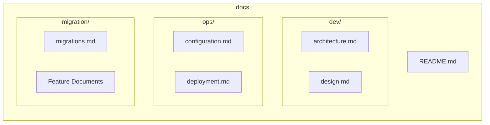
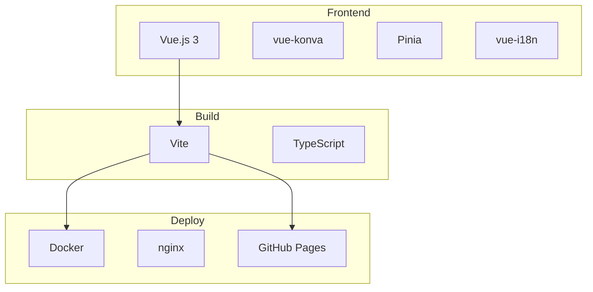

# WoPeD Next - Documentation

## Overview

WoPeD Next is a modern web application for modeling and analyzing Petri nets and workflow processes. Migrated from the original Java Swing desktop application to Vue.js 3.



## Features

### Editor
| Feature | Description |
|---------|-------------|
| **Petri Net Editor** | Places, transitions, arcs with weights |
| **Workflow Operators** | AND/XOR split/join, combined operators |
| **Subprocesses** | Hierarchical nets with drill-down navigation |
| **Visualization** | Grid, snap-to-grid, auto-layout, fit-to-view |

### Simulation & Analysis
| Feature | Description |
|---------|-------------|
| **Token Game** | Animated simulation with conflict resolution |
| **Quantitative Simulation** | Time-based simulation with resources |
| **Qualitative Analysis** | Structure analysis, soundness checking |
| **Process Metrics** | Complexity and structural metrics |

### File & Export
| Feature | Description |
|---------|-------------|
| **PNML Import/Export** | Standard Petri net format |
| **JSON Import/Export** | Custom format with full support |
| **Image Export** | SVG and PNG export |
| **Templates** | 10 educational example nets |

### UI/UX
| Feature | Description |
|---------|-------------|
| **Themes** | Dark/light mode with system detection |
| **Languages** | German and English |
| **Responsive** | Collapsible panels, adaptive toolbar |

## Table of Contents

### Development (`dev/`)
- [Architecture](dev/architecture.md) - System architecture, tech stack, patterns
- [Design](dev/design.md) - UI/UX design guidelines

### Operations (`ops/`)
- [Configuration](ops/configuration.md) - Environment variables and settings
- [Deployment](ops/deployment.md) - Build and deployment processes

### Migration (`migration/`)
- [Migrations](migration/migrations.md) - Changelog and implementation status
- [Feature Documents](migration/00-migration-overview.md) - Detailed feature specifications

## Quick Start

```bash
# Installation
npm install

# Development server
npm run dev

# Production build
npm run build

# Docker
docker-compose up
```

## Quick Links

| Area | Description |
|------|-------------|
| [Dev Setup](dev/architecture.md#development-environment) | Start local development |
| [Docker Deploy](ops/deployment.md#docker) | Container deployment |
| [Changelog](migration/migrations.md) | Version changes |
| [Feature Status](migration/migrations.md#implementation-status) | Implementation status |

## Technology Stack


