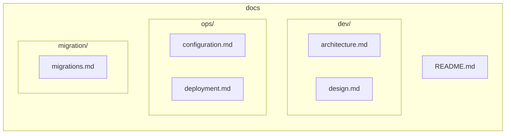

# WoPeD Next - Dokumentation

## Übersicht

## Inhaltsverzeichnis

### Development (`dev/`)
- [Architektur](dev/architecture.md) - Systemarchitektur und Komponenten
- [Design](dev/design.md) - UI/UX Design-Richtlinien

### Operations (`ops/`)
- [Konfiguration](ops/configuration.md) - Umgebungsvariablen und Settings
- [Deployment](ops/deployment.md) - Build und Deployment-Prozesse

### Migration (`migration/`)
- [Migrationen](migration/migrations.md) - Änderungshistorie und Migrationsschritte

## Quick Links

| Bereich | Beschreibung |
|---------|--------------|
| [Dev Setup](dev/architecture.md#entwicklungsumgebung) | Lokale Entwicklung starten |
| [Docker Deploy](ops/deployment.md#docker) | Container-Deployment |
| [Changelog](migration/migrations.md) | Versionsänderungen |
