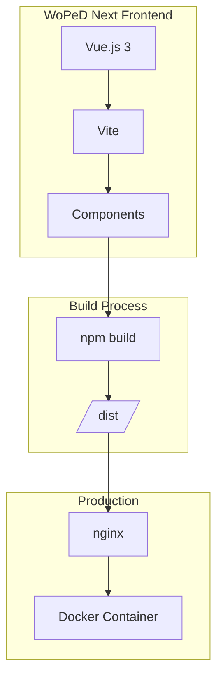
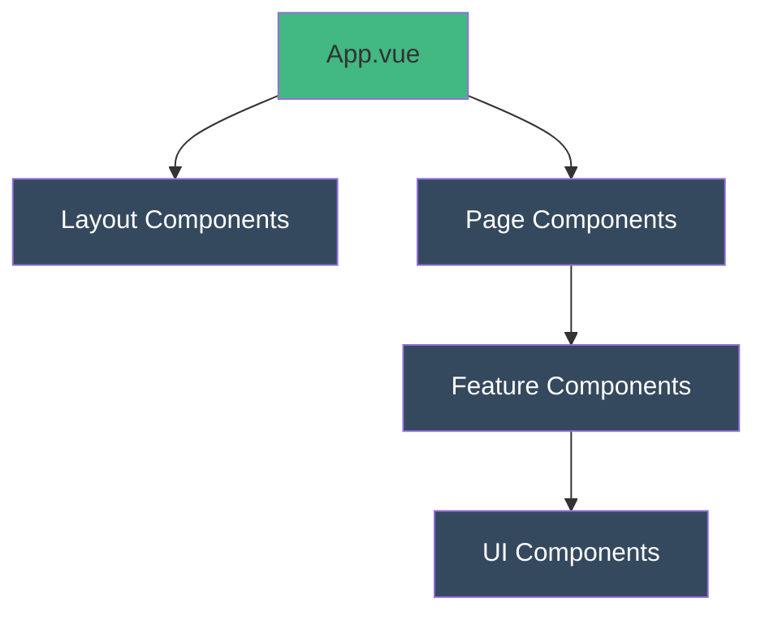

# Architektur

## Systemübersicht



## Komponentenstruktur



## Verzeichnisstruktur

```
src/
├── assets/          # Statische Assets (Bilder, Fonts)
├── components/      # Wiederverwendbare Komponenten
├── composables/     # Vue Composition Functions
├── views/           # Seiten-Komponenten
├── router/          # Vue Router Konfiguration
├── stores/          # Pinia Stores (State Management)
├── utils/           # Hilfsfunktionen
├── App.vue          # Root-Komponente
└── main.js          # Einstiegspunkt
```

## Entwicklungsumgebung

### Voraussetzungen
- Node.js 22+
- npm 10+

### Setup

```bash
npm install
npm run dev
```

## Tech Stack

| Technologie | Version | Zweck |
|-------------|---------|-------|
| Vue.js | 3.x | Frontend Framework |
| Vite | 6.x | Build Tool |
| nginx | alpine | Webserver (Produktion) |
