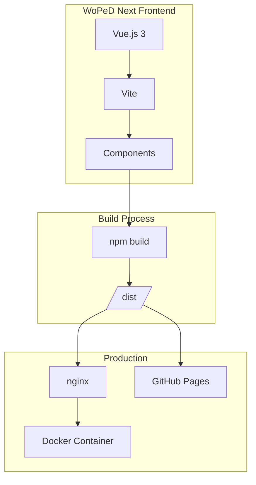
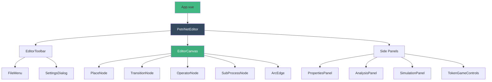
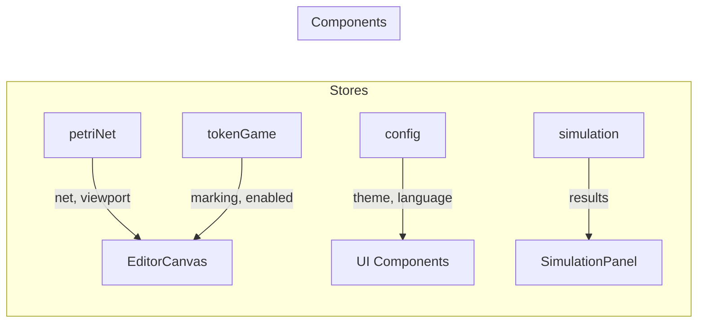

# Architecture

## System Overview



## Component Structure



## Directory Structure

```
src/
├── assets/              # Static assets
├── components/
│   ├── analysis/        # Analysis components
│   │   ├── AnalysisPanel.vue
│   │   └── MetricsSection.vue
│   ├── canvas/          # Konva canvas elements
│   │   ├── PlaceNode.vue
│   │   ├── TransitionNode.vue
│   │   ├── OperatorNode.vue
│   │   ├── SubProcessNode.vue
│   │   ├── ArcEdge.vue
│   │   └── TokenAnimation.vue
│   ├── editor/          # Main editor components
│   │   ├── PetriNetEditor.vue
│   │   ├── EditorCanvas.vue
│   │   ├── EditorToolbar.vue
│   │   ├── ViewToolbar.vue
│   │   ├── PropertiesPanel.vue
│   │   ├── BreadcrumbNav.vue
│   │   └── SubprocessPreview.vue
│   ├── file/            # File operations
│   │   └── FileMenu.vue
│   ├── settings/        # Settings
│   │   └── SettingsDialog.vue
│   ├── simulation/      # Quantitative simulation
│   │   ├── SimulationPanel.vue
│   │   ├── SimulationConfig.vue
│   │   ├── SimulationResults.vue
│   │   ├── TimeModelConfig.vue
│   │   ├── ResourceConfig.vue
│   │   └── BottleneckAnalysis.vue
│   ├── token-game/      # Token game
│   │   ├── TokenGameControls.vue
│   │   ├── TokenGameStats.vue
│   │   └── ConflictDialog.vue
│   └── triggers/        # Trigger editor
│       └── TriggerEditor.vue
├── composables/         # Vue Composition Functions
│   └── useViewport.ts
├── i18n/                # Internationalization
│   ├── index.ts
│   └── locales/
│       ├── en.ts
│       └── de.ts
├── services/            # Business logic
│   ├── analysis/        # Analysis services
│   │   ├── index.ts
│   │   └── metricsCalculator.ts
│   ├── file/            # File services
│   │   ├── fileService.ts
│   │   ├── pnmlParser.ts
│   │   ├── pnmlWriter.ts
│   │   ├── jsonParser.ts
│   │   └── imageExporter.ts
│   ├── simulation/      # Simulation services
│   │   ├── SimulationEngine.ts
│   │   └── XESExporter.ts
│   └── templates/       # Template service
│       └── petriNetTemplates.ts
├── stores/              # Pinia stores
│   ├── petriNet.ts      # Main store for Petri net
│   ├── config.ts        # Configuration & settings
│   ├── tokenGame.ts     # Token game state
│   └── simulation.ts    # Simulation state
├── types/               # TypeScript types
│   ├── petri-net.ts     # Petri net types
│   ├── config.ts        # Config types
│   ├── simulation.ts    # Simulation types
│   ├── metrics.ts       # Metrics types
│   ├── triggers.ts      # Trigger types
│   └── file-formats.ts  # File format types
├── utils/               # Helper functions
│   ├── geometry.ts      # Geometry calculations
│   ├── routing.ts       # Arc routing
│   ├── layout.ts        # Auto-layout algorithms
│   └── random.ts        # Random generators
├── App.vue
└── main.js
```

## Tech Stack

| Technology | Version | Purpose |
|------------|---------|---------|
| Vue.js | 3.x | Frontend framework |
| Vite | 6.x | Build tool |
| Pinia | 3.x | State management |
| vue-i18n | 11.x | Internationalization |
| vue-konva | 3.x | Canvas rendering (Petri net) |
| nanoid | 5.x | Unique ID generation |
| nginx | alpine | Web server (production) |

## State Management (Pinia)

### Store Overview



### Reactivity Patterns for Nested Objects

Nested state objects (e.g., `config.editor.showGrid`) can cause reactivity issues. Recommended solutions:

```typescript
// Store: Getters for nested properties
getters: {
  showGrid(): boolean {
    return this.editor.showGrid
  }
}

// Store: Explicit toggle actions
actions: {
  toggleShowGrid() {
    this.editor.showGrid = !this.editor.showGrid
    this.save()
  }
}
```

```typescript
// Component: Reference $state explicitly
const showGrid = computed(() => configStore.$state.editor.showGrid)
```

### Vue-Konva Integration

Avoid `v-if` on layers with vue-konva - use Konva's native `visible` property instead:

```vue
<v-layer :config="gridLayerConfig">

<script setup>
const gridLayerConfig = computed(() => ({
  visible: showGrid.value
}))
</script>
```

## Development Environment

### Prerequisites
- Node.js 22+
- npm 10+

### Setup

```bash
npm install
npm run dev
```

### Build

```bash
# Production build
npm run build

# Preview
npm run preview
```

### Docker

```bash
docker-compose up --build
```

## Internationalization (i18n)

The application supports multiple languages via `vue-i18n`:

- **Configuration**: `src/i18n/index.ts`
- **Language files**: `src/i18n/locales/`
- **Supported languages**: English (en), German (de)

### Usage in Components

```vue
<script setup>
import { useI18n } from 'vue-i18n'
const { t } = useI18n()
</script>

<template>
  <span>{{ $t('key.path') }}</span>
</template>
```

### Adding New Translations

1. Add key in `src/i18n/locales/en.ts`
2. Add translation in `src/i18n/locales/de.ts`
3. Use in component with `$t('key.path')`

## Deployment

### GitHub Pages

The project is deployed on GitHub Pages:
- **URL**: https://taminofischer.github.io/woped-next/
- **CI/CD**: GitHub Actions

### Docker

```bash
# Build and start
docker-compose up --build

# Build only
docker build -t woped-next .

# Start container
docker run -p 80:80 woped-next
```
