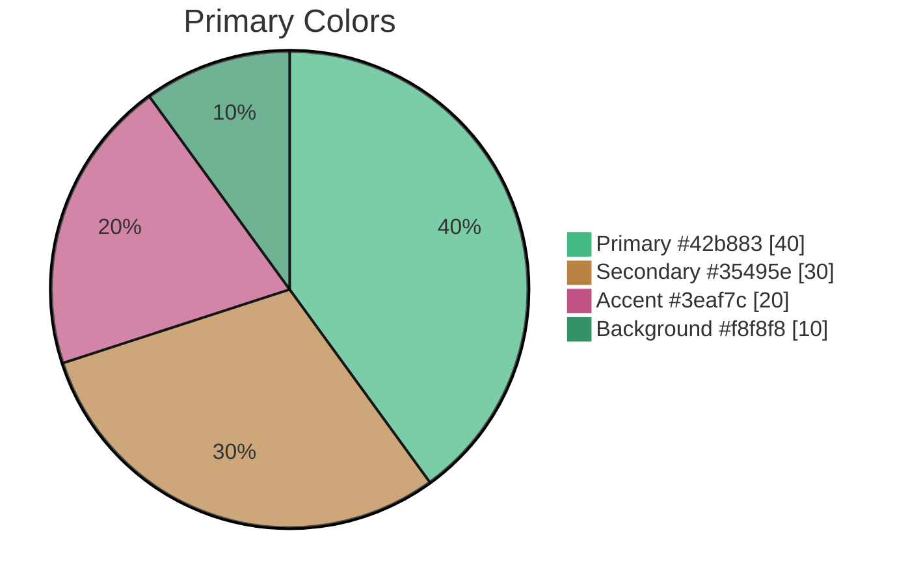

# Design

## UI Concept

```mermaid
graph LR
    subgraph Design System
        COLORS[Color Palette]
        TYPO[Typography]
        SPACE[Spacing]
        ICONS[Icons]
    end
    
    subgraph Components
        BTN[Buttons]
        FORM[Forms]
        CARD[Cards]
        NAV[Navigation]
    end
    
    Design System --> Components
```

## Color Palette



| Color | Hex | Usage |
|-------|-----|-------|
| Primary | `#42b883` | Vue Green - Main actions |
| Secondary | `#35495e` | Dark Blue - Text, Headers |
| Accent | `#3eaf7c` | Highlights, Links |
| Background | `#f8f8f8` | Background |
| Error | `#e74c3c` | Error messages |
| Success | `#27ae60` | Success messages |

## Typography

| Element | Font | Size | Weight |
|---------|------|------|--------|
| H1 | System | 2.5rem | 700 |
| H2 | System | 2rem | 600 |
| H3 | System | 1.5rem | 600 |
| Body | System | 1rem | 400 |
| Small | System | 0.875rem | 400 |

## Spacing System

```
4px  - xs
8px  - sm
16px - md
24px - lg
32px - xl
48px - 2xl
```

## Component States

```mermaid
stateDiagram-v2
    [*] --> Default
    Default --> Hover: Mouse Enter
    Hover --> Default: Mouse Leave
    Default --> Focus: Tab/Click
    Focus --> Default: Blur
    Default --> Disabled: disabled=true
    Default --> Loading: loading=true
    Loading --> Default: Complete
```

## Responsive Breakpoints

| Breakpoint | Width | Target Devices |
|------------|-------|----------------|
| sm | 640px | Mobile |
| md | 768px | Tablet |
| lg | 1024px | Desktop |
| xl | 1280px | Large Desktop |
