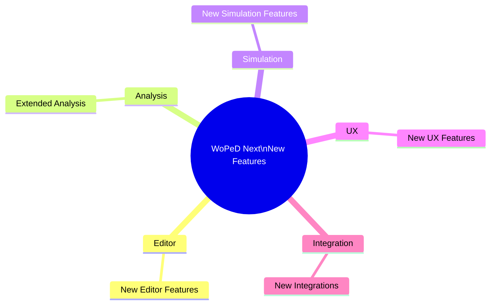

# New Features — Overview

## Purpose

This directory documents all **newly developed features** in WoPeD Next that are not part of the original Java-WoPeD migration. This includes new functionality, UX improvements, and extensions specifically designed for the web version.



## Categories

| Category | Description |
|----------|-------------|
| **Editor** | New features in the Petri net editor |
| **Analysis** | Extended or new analysis methods |
| **Simulation** | New simulation and visualization features |
| **UX** | User experience improvements |
| **Integration** | New external integrations and interfaces |

## Feature Documents

| # | Feature | Category | Priority |
|---|---------|----------|----------|
| — | [Bugfixes & Improvements](bugfixes-improvements.md) | Cross-cutting | Ongoing |
| [01](01-discord-auth.md) | Discord Authentication | Integration | P1 |
| [02](02-ai-development-enablement.md) | AI Development Enablement | Integration | P1 |
| [03](03-nlp-chat.md) | NLP Chat Assistant | Integration | P1 |

## Template

New feature documents use the following structure:

```markdown
# Feature: <Name>

## Overview

Brief description of the feature and its purpose.

## Motivation

Why is this feature needed? What problem does it solve?

## Design

### Architecture

Components, stores, services — with Mermaid diagrams.

### Data Model

TypeScript interfaces and relevant types.

### Components

Vue components and their relationships.

## Implementation

### Affected Files

Which existing files are modified, which are newly created.

### Steps

Numbered implementation steps.

## UI/UX

Mockups, wireframes, or descriptions of the user interface.

## Dependencies

New npm packages or internal dependencies.

## Test Plan

| Test | Description |
|------|-------------|
| Unit | Store actions, services |
| Component | Rendering, interactions |
| E2E | Full feature workflow |
```

## Conventions

- **Numbering**: `XX-feature-name.md` (sequential, two-digit) — long-lived collection documents are unnumbered
- **Language**: English (consistent within a document)
- **Diagrams**: Mermaid for architecture, flows, and data models
- **Status updates**: Update the table in `features.md` when progress is made
