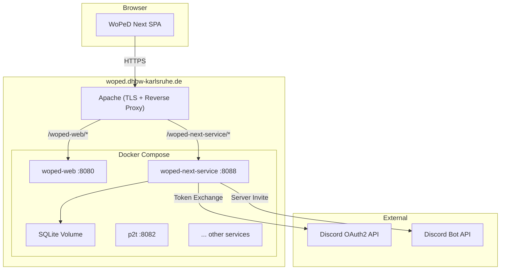
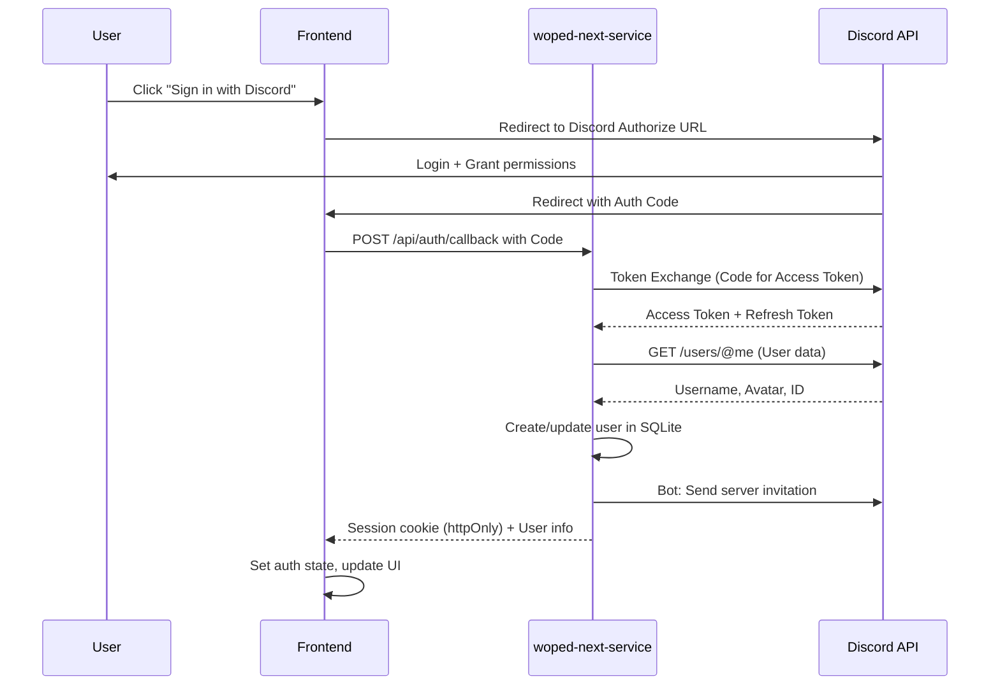

# Feature: Discord Authentication

## Overview

User authentication via Discord OAuth2 with automatic invitation to the WoPeD Discord server. A lightweight Express backend (`woped-next-service`) stores basic user data in SQLite and provides an admin overview.

## Motivation

- **User Overview**: Who is using WoPeD Next? Admins should be able to view logged-in users with name, avatar, and last login.
- **Community Networking**: The WoPeD Discord server serves as the central platform for feedback, knowledge transfer, and support. Through automatic invitation after login, users are directly connected.
- **Foundation for Extensions**: The auth infrastructure enables future cloud storage, collaboration, or personalized settings.

## Prerequisite: Monorepo Structure

This feature requires the conversion of `woped-next/` into an npm workspaces monorepo. Frontend and backend live in the same repository:

```
woped-next/
  package.json                <- Workspace Root (workspaces: ["packages/*"])
  packages/
    frontend/                 <- Existing Vue app (moved from root)
      src/
      package.json            <- @woped/frontend
      vite.config.js
      Dockerfile
      ...
    server/                   <- New Express backend
      src/
      package.json            <- @woped/server
      tsconfig.json
      Dockerfile
    shared/                   <- Shared TypeScript types
      src/
        index.ts              <- Exports User, Session etc.
      package.json            <- @woped/shared
  docs/                       <- Stays in root
  docker-compose.yml
  README.md
```

**Benefits for this feature:**
- `User` interface is defined once in `@woped/shared` and imported by both frontend (Auth-Store, AdminUsersView) and backend (DB, Routes)
- AI agent sees both sides in the same context and can make consistent changes
- A single `npm install` in the root installs all packages

## Design

### Architecture



The new service integrates into the existing infrastructure:
- **Apache** on the host terminates TLS and forwards `/woped-next-service/` to port 8088
- **Docker Compose** in `infrastructure/webservices/docker-compose.yml` defines the container
- **Env variables** follow the existing pattern `env-definitions/.env.woped-next-service`

### OAuth2 Flow



### Data Model

```typescript
interface User {
  id: string               // Discord User ID
  username: string          // Discord Username
  displayName: string       // Discord Display Name
  avatar: string            // Avatar URL
  firstLoginAt: string      // ISO Timestamp
  lastLoginAt: string       // ISO Timestamp
  discordServerJoined: boolean
}
```

SQLite schema:

```sql
CREATE TABLE users (
  id TEXT PRIMARY KEY,
  username TEXT NOT NULL,
  display_name TEXT NOT NULL,
  avatar TEXT,
  first_login_at TEXT NOT NULL,
  last_login_at TEXT NOT NULL,
  discord_server_joined INTEGER DEFAULT 0
);

CREATE TABLE sessions (
  id TEXT PRIMARY KEY,
  user_id TEXT NOT NULL REFERENCES users(id),
  expires_at TEXT NOT NULL,
  created_at TEXT NOT NULL
);
```

### Components

**Shared** (`packages/shared/`):

```
packages/shared/
  package.json             -- @woped/shared
  tsconfig.json
  src/
    index.ts               -- Re-export of all types
    types/
      user.ts              -- User, Session interfaces
```

**Backend** (`packages/server/`):

```
packages/server/
  package.json             -- @woped/server, imports @woped/shared
  tsconfig.json
  Dockerfile
  src/
    index.ts               -- Express server, middleware
    config.ts              -- Env variables
    routes/
      auth.ts              -- /api/auth/login, /callback, /logout, /me
      admin.ts             -- /api/admin/users (protected)
    services/
      discord.ts           -- OAuth2 Token Exchange, User Info, Bot Invite
      session.ts           -- Session creation, validation
    db/
      schema.ts            -- SQLite schema, migrations
      users.ts             -- User CRUD
    middleware/
      auth.ts              -- Session validation
      admin.ts             -- Admin check
```

**Frontend** (new files in `packages/frontend/src/`):

| File | Description |
|------|-------------|
| `stores/auth.ts` | Pinia Auth Store (user, login, logout, fetchUser), imports `User` from `@woped/shared` |
| `components/auth/LoginButton.vue` | Discord login button in the toolbar |
| `components/auth/UserMenu.vue` | Dropdown with avatar, profile, logout |
| `components/auth/AdminUsersView.vue` | User table for admins |

## Implementation

### Affected Files

**New files:**
- `packages/shared/` — shared types (`User`, `Session`)
- `packages/server/` — entire backend (see structure above)
- `packages/frontend/src/stores/auth.ts` — Auth Store
- `packages/frontend/src/components/auth/` — Auth UI components

**Modified files:**
- `packages/frontend/src/main.js` — load auth state on app start
- `packages/frontend/src/components/editor/EditorToolbar.vue` — integrate LoginButton/UserMenu
- `infrastructure/webservices/docker-compose.yml` — new service `woped-next-service`
- `infrastructure/webservices/000-https-woped.conf` — add Apache ProxyPass
- `infrastructure/webservices/env-definitions/` — new `.env.woped-next-service`

### Steps

0. **Perform monorepo conversion**: create `packages/frontend`, `packages/server`, `packages/shared`, configure npm workspaces
1. **Create Discord Application + Bot** in the Developer Portal, configure OAuth2 Redirect URL (`https://woped.dhbw-karlsruhe.de/woped-next-service/auth/callback`), Scopes: `identify`, `guilds.join`
2. **Create shared types**: `User` and `Session` interface in `packages/shared`
3. **Set up Express backend**: project structure in `packages/server`, TypeScript config, dependencies (express, better-sqlite3, etc.)
4. **Implement SQLite schema** and User CRUD
5. **Implement OAuth2 flow**: `/api/auth/login`, `/callback`, `/logout`, `/me`
6. **Discord service**: Token Exchange, fetch user info, bot invitation to server
7. **Session management** with httpOnly cookies
8. **Admin API**: `GET /api/admin/users` with admin middleware
9. **Frontend Auth Store** (`packages/frontend/src/stores/auth.ts`) with login/logout/fetchUser
10. **Frontend UI components**: LoginButton, UserMenu, AdminUsersView
11. **Docker deployment**: Dockerfile, Compose service, Apache config, env file

## UI/UX

### Toolbar (not logged in)

```
┌─────────────────────────────────────────────────────────────────┐
│ [Select] [Place] [Transition] [Arc]  │  [Undo] [Redo]  │ [🔗 Sign in with Discord] │
└─────────────────────────────────────────────────────────────────┘
```

### Toolbar (logged in)

```
┌─────────────────────────────────────────────────────────────────┐
│ [Select] [Place] [Transition] [Arc]  │  [Undo] [Redo]  │ [Avatar ▼]               │
└─────────────────────────────────────────────────────────────────┘
                                                           ┌──────────────┐
                                                           │ Username     │
                                                           │ ───────────  │
                                                           │ Admin Panel  │
                                                           │ Logout       │
                                                           └──────────────┘
```

### Admin User Overview

```
┌─────────────────────────────────────────────────────────────────┐
│ Registered Users (42)                                            │
├────────┬──────────────┬──────────────┬──────────────────────────┤
│ Avatar │ Username     │ First Login  │ Last Login               │
├────────┼──────────────┼──────────────┼──────────────────────────┤
│ [img]  │ MaxMuster    │ 01.05.2026   │ 03.05.2026, 14:30        │
│ [img]  │ AnnaSchmidt  │ 28.04.2026   │ 03.05.2026, 09:15        │
│ ...    │ ...          │ ...          │ ...                       │
└────────┴──────────────┴──────────────┴──────────────────────────┘
```

## Deployment

### Docker Compose (new service)

```yaml
    woped-next-service:
        build:
            context: ../../woped-next/packages/server
            dockerfile: Dockerfile
        image: woped/woped-next-service:latest
        container_name: woped-next-service
        ports:
            - 8088:3000
        env_file:
            - ./env-definitions/.env.woped-next-service
        volumes:
            - woped_next_service_data:/app/data
```

### Apache ProxyPass

```apache
        <Location /woped-next-service>
            ProxyPass "http://localhost:8088/"
            ProxyPassReverse "http://localhost:8088/"
        </Location>
```

### Env Variables

```env
DISCORD_CLIENT_ID=
DISCORD_CLIENT_SECRET=
DISCORD_BOT_TOKEN=
DISCORD_GUILD_ID=
SESSION_SECRET=
ADMIN_USER_IDS=
FRONTEND_URL=https://woped.dhbw-karlsruhe.de/woped-web
```

### Admin Access

Admins are defined via their Discord User ID (env variable `ADMIN_USER_IDS`, comma-separated). No separate roles table needed for the initial version.

## Dependencies

### Backend (packages/server)

```json
{
  "name": "@woped/server",
  "dependencies": {
    "@woped/shared": "*",
    "express": "^5.x",
    "better-sqlite3": "^11.x",
    "nanoid": "^5.x"
  },
  "devDependencies": {
    "typescript": "~5.6.x",
    "@types/express": "^5.x",
    "@types/better-sqlite3": "^7.x"
  }
}
```

### Shared (packages/shared)

```json
{
  "name": "@woped/shared",
  "private": true,
  "type": "module",
  "main": "src/index.ts",
  "types": "src/index.ts"
}
```

### Discord Prerequisites

- Discord Application with OAuth2 credentials
- Discord Bot with `guilds.join` permission
- Bot must be a member of the target server

## Test Plan

| Test | Description |
|------|-------------|
| Unit | Session service, User CRUD, Discord Token Exchange |
| Integration | OAuth2 callback flow, admin middleware |
| Frontend | Auth Store state transitions, LoginButton/UserMenu rendering |
| E2E | Complete Login → Redirect → Session → Logout flow |
