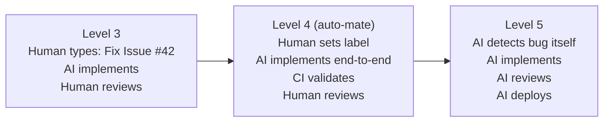
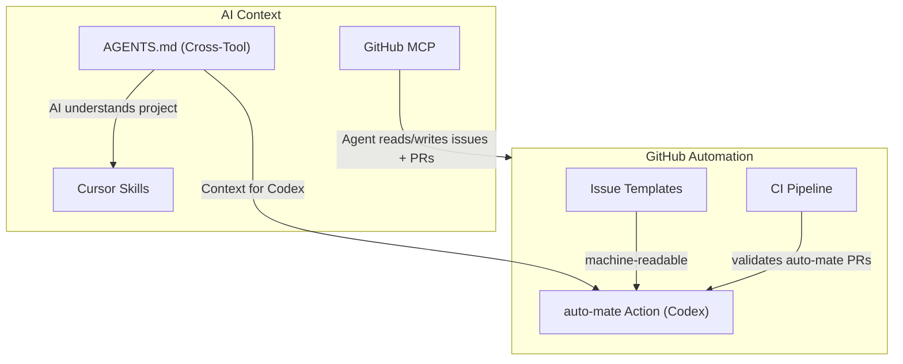
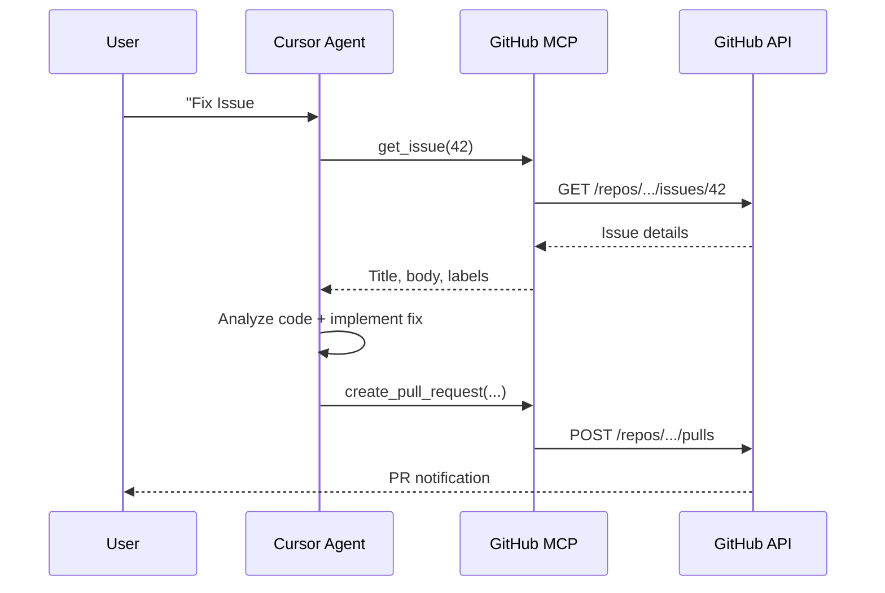
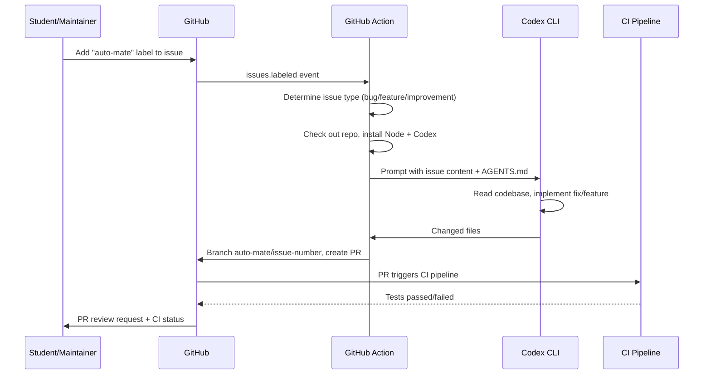

# Feature: AI-Driven Development Enablement

## Classification: Autonomy Levels in AI Development

Analogous to the autonomy levels in autonomous driving, AI-assisted development can be classified into five levels:

| Level | Name | Description | Example |
|-------|------|-------------|---------|
| **0** | No AI | Manual coding | Vim without plugins |
| **1** | AI-Assisted | Inline suggestions, autocomplete | Copilot Autocomplete |
| **2** | AI-Augmented | AI writes code blocks on demand | Copilot Chat, ChatGPT |
| **3** | AI-Collaborative | AI executes tasks autonomously, human is in control | Cursor Agent, Claude Code, Codex CLI |
| **4** | AI-Autonomous | Automated trigger, AI implements end-to-end, human reviews | **auto-mate (goal of this feature)** |
| **5** | Fully Autonomous | AI detects problems, implements, reviews, and deploys on its own | Future vision |

### Our Goal: Level 4 — Conditional Autonomy



**Level 3** is what we already have today: Students use Cursor/Claude Code/Codex, give instructions, and the AI agent implements under supervision.

**Level 4** is the goal of this feature: Adding a label to a GitHub issue is enough — the rest runs automatically (implementation, branch, PR, CI). The human only comes back for the review.

**Level 5** would be technically achievable (monitoring detects bug → auto-mate → auto-merge on green CI), but for a student project, Level 4 with human review is the right balance between automation and control.

| Building Block | Level 3 (today) | Level 4 (auto-mate) | Level 5 (future) |
|----------------|-----------------|---------------------|-------------------|
| **Trigger** | Human at the computer | Human sets label | AI detects problem itself |
| **Implementation** | AI under supervision | AI autonomous | AI autonomous |
| **Validation** | Human checks | CI Pipeline | AI + CI |
| **Review** | Human | Human | AI review + human as fallback |
| **Merge/Deploy** | Human | Human | AI with rollback safeguard |

## Overview

Technical enabling for AI-assisted development in WoPeD Next. Students work with various AI coding tools (Cursor, Claude Code, Codex, Copilot) — this feature ensures that all tools have the necessary project context and that GitHub workflows run automatically.

## Motivation

- **Students use various AI tools** — a unified project context (`AGENTS.md`) ensures that every tool knows the same conventions
- **Recurring workflows** (creating a feature, creating a component, fixing an issue) should be accelerated through Cursor Skills
- **GitHub Issues** should be structured and machine-readable so that AI agents can process them directly
- **Automatic fixes**: With the `auto-mate` label, an AI agent (Codex) can automatically implement an issue and create a PR
- **Reach Level 4**: From today's AI-Collaborative usage (Level 3) to Conditional Autonomy (Level 4)

## Design

### Overall Architecture



### Components

#### 1. AGENTS.md (Cross-Tool)

File in the repo root that all AI tools understand (Claude Code, Codex, Copilot, Cursor as fallback). More detailed than the existing `project.mdc`, but tool-agnostic.

**Content:**
- Project description: Petri net editor, Vue 3, migration background
- Monorepo structure: `packages/frontend`, `packages/server`, `packages/shared` with npm workspaces
- Tech stack: Vue 3, Vite, Pinia, vue-konva, vue-i18n, Express, SQLite, Tailwind
- Coding conventions (i18n, CSS Variables, Dark Mode, TypeScript, nanoid)
- Test requirements: Vitest + happy-dom
- Git workflow: Branching, commit messages, PR format
- Domain knowledge: Petri net elements, store architecture
- Reference to `.cursor/rules/` and `.cursor/skills/` for Cursor users

#### 2. Cursor Skills

Skills guide the agent step by step through complex workflows. Each skill is stored as a `SKILL.md` under `.cursor/skills/<name>/`.

| Skill | Workflow |
|-------|----------|
| `create-feature` | Create feature MD, update tables, create components, extend store, i18n keys, tests |
| `create-component` | Vue component with script setup, Props/Emits, i18n, theming, vue-konva patterns, tests |
| `fix-issue` | Read GitHub issue via MCP, implement fix, update bugfixes-improvements.md, tests, commit with issue reference |
| `add-api-endpoint` | Create Express route, middleware, shared types, service logic, frontend integration, tests |

#### 3. GitHub Issue Templates

Structured YAML templates under `.github/ISSUE_TEMPLATE/`:

| Template | Labels | Fields |
|----------|--------|--------|
| `bug_report.yml` | `bug` | Description, reproduction steps, expected behavior, screenshots, affected component (dropdown), browser/OS |
| `feature_request.yml` | `feature` | Description, motivation, proposed solution, affected package (dropdown), mockup |
| `improvement.yml` | `improvement` | Description, current situation, desired improvement, category (dropdown) |

#### 4. GitHub MCP Integration

Integration of the GitHub MCP server into Cursor (`.cursor/mcp.json`), so that AI agents can directly read issues, create PRs, and process review feedback.



Each student creates their own GitHub Personal Access Token (PAT) with `repo` scope. Instructions in `AGENTS.md`.

#### 5. CI Pipeline

GitHub Actions workflow `.github/workflows/ci.yml`:

- **Trigger**: `pull_request` on `main`
- **Jobs**:
  1. TypeScript check: `npx tsc --noEmit`
  2. Tests: `npm run test:run` (all workspaces)
  3. Build: `npm run build`
- **Node**: 22 (matching the existing `deploy.yml`)

#### 6. auto-mate: Automatic Implementation via Codex

When the `auto-mate` label is added to an issue, a GitHub Action starts the OpenAI Codex CLI.



**Prerequisites:**
- `OPENAI_API_KEY` as GitHub repository secret
- Issue templates provide structured issue content
- AGENTS.md gives Codex the project context
- CI pipeline validates the generated PR

**Prompt Structure (Bug Example):**

```
You are working on the WoPeD Next project. Read AGENTS.md for project context and conventions.

Fix the following bug:
Title: {issue.title}
Description: {issue.body}
Component: {issue.component_field}

Requirements:
- Implement the fix following project conventions (see AGENTS.md)
- Write or update tests for the fix
- Add an entry in docs/features/bugfixes-improvements.md with the next B-number
- Use the commit message format: "fix: {short description} (fixes #{issue.number})"
```

**Security Aspects:**
- auto-mate PRs are never auto-merged — review is required
- CI pipeline runs as a gate on every PR
- Only maintainers can set the `auto-mate` label
- Each Codex run consumes API credits — restrict label access

## Implementation

### Affected Files

**New Files:**
- `AGENTS.md` — Cross-tool AI instructions in the repo root
- `.cursor/mcp.json` — GitHub MCP server configuration
- `.cursor/skills/create-feature/SKILL.md` — Feature creation skill
- `.cursor/skills/create-component/SKILL.md` — Component creation skill
- `.cursor/skills/fix-issue/SKILL.md` — Issue fix skill
- `.cursor/skills/add-api-endpoint/SKILL.md` — API endpoint skill
- `.github/ISSUE_TEMPLATE/bug_report.yml` — Bug report template
- `.github/ISSUE_TEMPLATE/feature_request.yml` — Feature request template
- `.github/ISSUE_TEMPLATE/improvement.yml` — Improvement template
- `.github/workflows/ci.yml` — CI pipeline
- `.github/workflows/auto-mate.yml` — auto-mate action

**No changes to existing code** — this feature is purely infrastructural.

### Steps

1. Create `AGENTS.md` in the repo root
2. Create Cursor Skills (4 SKILL.md files)
3. Create GitHub Issue Templates (3 YAML files)
4. Configure GitHub MCP (`.cursor/mcp.json`)
5. Create CI pipeline (`ci.yml`)
6. Create auto-mate action (`auto-mate.yml`)
7. Add `OPENAI_API_KEY` as GitHub repository secret (manual)

## Dependencies

### External Services
- **OpenAI API** — API key for Codex CLI (auto-mate action)
- **GitHub API** — Personal Access Tokens for MCP (per student)

### Tools
- **Codex CLI** (`@openai/codex`) — installed in the GitHub Action
- **GitHub MCP Server** (`@modelcontextprotocol/server-github`) — started via npx

## Test Plan

| Test | Description |
|------|-------------|
| AGENTS.md | Verify that various AI tools (Cursor, Claude Code) read the file correctly |
| Skills | Manually run through each skill, check result |
| Issue Templates | Create test issues via each template, check fields |
| MCP | Test reading issues and creating PRs via Cursor Agent |
| CI Pipeline | Create PR, verify that tests/build/TypeScript check run |
| auto-mate | Verify test issue with `auto-mate` label, Codex run, and PR creation |
