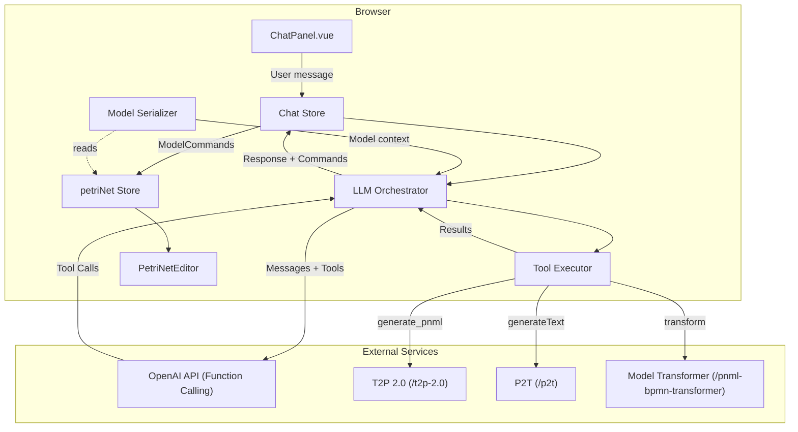
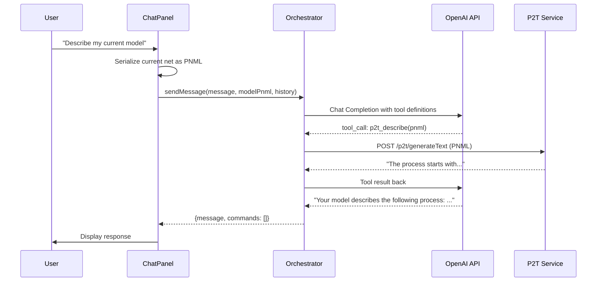
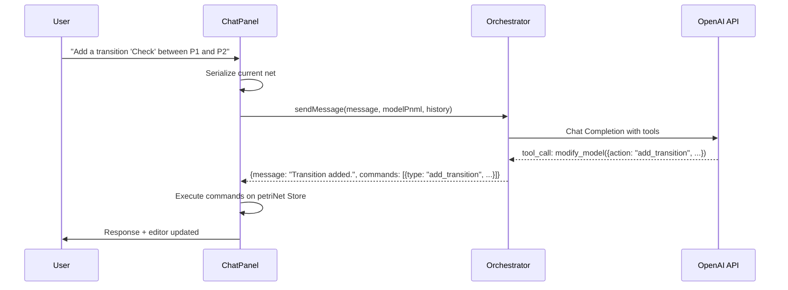
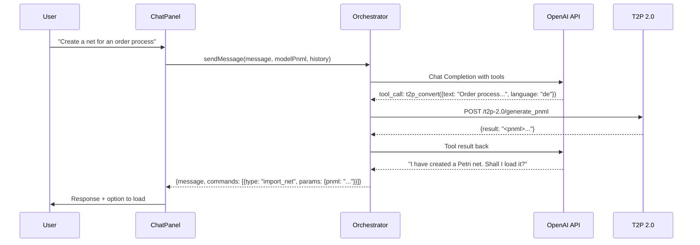
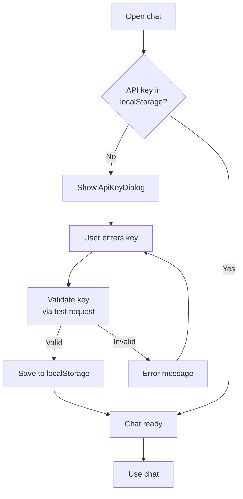

# Feature: NLP Chat Assistant

## Overview

A chat dialog directly in the WoPeD Next UI that acts as an LLM-orchestrated assistant. The LLM (OpenAI) decides via Function Calling / Tool Use which external APIs to call. All orchestration runs in the frontend — each user brings their own OpenAI API key. The chat understands the context of the current model and can:

- Convert text to Petri net (T2P)
- Describe the current model as text (P2T)
- Answer questions about the model (soundness, dead transitions, etc.)
- Provide modeling assistance
- Modify the model via chat instructions

This feature replaces the skipped `10-nlp-integration.md` from the migration with a more modern, LLM-based concept.

## Motivation

- **Modern NLP integration**: The old approach (static dual-pane dialog for T2P/P2T) is replaced by an interactive chat that is more flexible and natural
- **Leverage existing APIs**: T2P 2.0, P2T, and Model Transformer are already running as Docker services — the chat assistant orchestrates them intelligently
- **LLM as orchestrator**: Instead of letting the user decide which API they need, the LLM decides based on natural language
- **Model context**: The assistant knows the current model and can give context-aware answers
- **Modeling via language**: Users can modify the model via natural language — lower barrier to entry
- **No backend needed**: Through BYOK (Bring Your Own Key), there is no need for a central API key, eliminating the backend dependency for this feature

## Design

### Architecture



All LLM orchestration runs in the browser. The user enters their own OpenAI API key, which is stored in `localStorage`. No backend is needed for the chat.

### Decision: Frontend-Only Instead of Backend

| Criterion | Backend variant | Frontend-only (chosen) |
|-----------|-----------------|------------------------|
| API key | Central key on server | BYOK — user brings own key |
| Cost | Project costs | User pays themselves |
| Architecture | Backend route + orchestrator | Orchestrator directly in browser |
| Dependency | woped-next-service must be running | Only OpenAI + T2P/P2T reachable |
| Rate limiting | Server-side | Not needed (own key) |
| Complexity | More infrastructure | Fewer moving parts |

### Chat Flow: Describe Model (P2T)



### Chat Flow: Modify Model



### Chat Flow: Text to Petri Net (T2P)



### LLM Tool Definitions

The orchestrator registers the following tools with OpenAI Function Calling:

| Tool | Description | Example Trigger |
|------|-------------|-----------------|
| `t2p_convert` | Convert text to PNML (calls T2P 2.0 API) | "Create a net for an order process" |
| `p2t_describe` | PNML to natural text (calls P2T API) | "Describe my model" |
| `analyze_model` | Structural analysis (soundness, dead transitions, metrics) | "Is my net sound?" |
| `get_model_info` | Metadata (number of places/transitions/arcs, operators) | "How big is my net?" |
| `modify_model` | Generate modification command (add/remove/rename) | "Add a transition" |
| `help_modeling` | Modeling knowledge about Petri nets | "How do I model parallelism?" |

### Tool Example: `t2p_convert`

```typescript
{
  name: "t2p_convert",
  description: "Convert natural language text to a Petri net (PNML format) using the T2P 2.0 service",
  parameters: {
    type: "object",
    properties: {
      text: { type: "string", description: "Process description in natural language" },
      language: { type: "string", enum: ["en", "de"] }
    },
    required: ["text"]
  }
}
```

### Tool Example: `modify_model`

```typescript
{
  name: "modify_model",
  description: "Generate a command to modify the current Petri net model",
  parameters: {
    type: "object",
    properties: {
      action: { type: "string", enum: ["add_place", "add_transition", "add_arc", "remove_element", "rename_element", "set_tokens"] },
      params: {
        type: "object",
        properties: {
          name: { type: "string" },
          element_id: { type: "string" },
          source_id: { type: "string" },
          target_id: { type: "string" },
          tokens: { type: "number" },
          position: { type: "object", properties: { x: { type: "number" }, y: { type: "number" } } }
        }
      }
    },
    required: ["action", "params"]
  }
}
```

### Data Model

```typescript
// src/types/chat.ts

interface ChatMessage {
  role: 'user' | 'assistant'
  content: string
  timestamp: string
}

interface ModelCommand {
  type: 'add_place' | 'add_transition' | 'add_arc' | 'remove_element'
       | 'rename_element' | 'set_tokens' | 'import_net'
  params: Record<string, unknown>
}

interface ModelSummary {
  placesCount: number
  transitionsCount: number
  arcsCount: number
  operatorTypes: string[]
  hasSubprocesses: boolean
  elementNames: string[]
}

interface LLMConfig {
  apiKey: string
  model: string            // default: 'gpt-4o'
  maxTokens: number        // default: 4096
  temperature: number      // default: 0.7
}
```

### Components

**Frontend** (`src/`):

```
src/
  components/
    chat/
      ChatPanel.vue              -- Main component: chat window in the right panel
      ChatMessage.vue            -- Individual message (user/assistant)
      ChatInput.vue              -- Input field with send button
      ModelCommandPreview.vue    -- Preview of model changes before execution
      ApiKeyDialog.vue           -- Dialog for API key entry / management
  stores/
    chat.ts                      -- Chat history, sendMessage(), executeCommands()
  services/
    llmClient.ts                 -- OpenAI API wrapper (Chat Completion + Tools)
    chatOrchestrator.ts          -- Tool call loop: call LLM, execute tools, iterate
    toolExecutor.ts              -- Dispatch tool calls (T2P, P2T, etc.)
    tools/
      t2pTool.ts                 -- T2P 2.0 API client (fetch)
      p2tTool.ts                 -- P2T API client (fetch)
      analysisTool.ts            -- Model analysis (local based on PNML)
      modelInfoTool.ts           -- Model metadata (local from store)
      modifyTool.ts              -- Generate model modification commands
      helpTool.ts                -- Petri net knowledge base (static / prompt)
    modelSerializer.ts           -- Serialize current net to PNML/Summary
  types/
    chat.ts                      -- ChatMessage, ModelCommand, ModelSummary, LLMConfig
```

### API Key Management

The OpenAI API key is entered by the user themselves and stored locally:



- Key is stored in `localStorage` under `woped_openai_api_key`
- Settings dialog allows key change and model selection
- Validation: A short test request to OpenAI when saving
- Key is only sent directly to `api.openai.com` — never to our own servers

## Implementation

### Affected Files

**New files:**
- `src/types/chat.ts` — Chat types (ChatMessage, ModelCommand, LLMConfig etc.)
- `src/services/llmClient.ts` — OpenAI API client (Chat Completion + Function Calling)
- `src/services/chatOrchestrator.ts` — Tool call loop orchestration
- `src/services/toolExecutor.ts` — Tool dispatcher
- `src/services/tools/*.ts` — Individual tool implementations (6 tools)
- `src/services/modelSerializer.ts` — Model to PNML/Summary
- `src/components/chat/ChatPanel.vue` — Chat main component
- `src/components/chat/ChatMessage.vue` — Message display
- `src/components/chat/ChatInput.vue` — Input field
- `src/components/chat/ModelCommandPreview.vue` — Command preview
- `src/components/chat/ApiKeyDialog.vue` — API key entry
- `src/stores/chat.ts` — Chat Pinia Store

**Changed files:**
- `src/components/editor/PetriNetEditor.vue` — Integrate ChatPanel as tab in the right panel
- `infrastructure/webservices/000-https-woped.conf` — CORS headers for T2P/P2T (browser access)

### Prerequisite: T2P/P2T Browser Accessibility

The T2P and P2T services must be accessible from the browser. For this, the Apache configuration is extended with CORS headers:

```apache
# In 000-https-woped.conf — CORS for chat frontend
<Location /t2p-2.0>
    Header set Access-Control-Allow-Origin "*"
    Header set Access-Control-Allow-Methods "POST, OPTIONS"
    Header set Access-Control-Allow-Headers "Content-Type"
</Location>

<Location /p2t>
    Header set Access-Control-Allow-Origin "*"
    Header set Access-Control-Allow-Methods "POST, OPTIONS"
    Header set Access-Control-Allow-Headers "Content-Type"
</Location>
```

### Steps

1. Define chat types (`src/types/chat.ts`)
2. Implement OpenAI API client with Function Calling (`llmClient.ts`)
3. Implement tool definitions and tool executor (6 tools)
4. Chat orchestrator with tool call loop (`chatOrchestrator.ts`)
5. Pinia chat store (history, sendMessage, executeCommands)
6. API key dialog and localStorage management
7. ChatPanel, ChatMessage, ChatInput components
8. modelSerializer (current net to PNML/Summary for context)
9. ModelCommand execution on petriNet Store
10. Integration into PetriNetEditor as tab in the right panel
11. Apache CORS configuration for T2P/P2T

## UI/UX

### Chat Panel (collapsed)

```
┌──────────────────────────────────────────────────────────────────────┐
│ [Select] [Place] [Transition] [Arc]  │ [Undo] [Redo] │ [Avatar] [Chat]│
├──────────────────────────────────────────────────────────────────────┤
│                                      │ Properties / Token Game / ... │
│         Canvas                       │                               │
│                                      │                               │
└──────────────────────────────────────┴───────────────────────────────┘
```

### Chat Panel (expanded, right side)

```
┌──────────────────────────────────────┬───────────────────────────────┐
│                                      │ Chat                    [X]  │
│                                      │ ─────────────────────────── │
│         Canvas                       │ Bot: Hello! I can help you   │
│                                      │    with modeling.            │
│    (P1)───>[T1]───>(P2)             │                               │
│                                      │ You: Describe my model       │
│                                      │                               │
│                                      │ Bot: Your model has 2        │
│                                      │    places and 1 transition.  │
│                                      │    P1 has a token...         │
│                                      │                               │
│                                      │ You: Add a transition        │
│                                      │    "Check" after T1          │
│                                      │                               │
│                                      │ Bot: Transition "Check"      │
│                                      │    has been added.           │
│                                      │    [Show change]             │
│                                      │                               │
│                                      │ ┌───────────────────────────┐│
│                                      │ │ Type a message...      [>]││
│                                      │ └───────────────────────────┘│
└──────────────────────────────────────┴───────────────────────────────┘
```

### API Key Dialog (initial setup)

```
┌─────────────────────────────────────────┐
│  Set up OpenAI API Key                  │
│  ─────────────────────────────────────  │
│                                         │
│  To use the chat assistant,             │
│  enter your OpenAI API key.             │
│                                         │
│  API Key:                               │
│  ┌─────────────────────────────────┐    │
│  │ sk-...                          │    │
│  └─────────────────────────────────┘    │
│                                         │
│  Model:                                 │
│  ┌─────────────────────────────────┐    │
│  │ gpt-4o                      [v]│    │
│  └─────────────────────────────────┘    │
│                                         │
│  The key is only stored locally in      │
│  your browser and sent directly to      │
│  OpenAI — never to our servers.         │
│                                         │
│          [Cancel]  [Save]               │
└─────────────────────────────────────────┘
```

The chat panel opens as a tab alongside Properties/Token Game/Simulation in the right panel.

## Existing APIs (used, not newly built)

| Service | Endpoint | Input | Output |
|---------|----------|-------|--------|
| T2P 2.0 | `POST /t2p-2.0/generate_pnml` | JSON: `{text, api_key}` | JSON: `{result: "<pnml>"}` |
| T2P 2.0 | `POST /t2p-2.0/generate_bpmn` | JSON: `{text, api_key}` | JSON: `{result: "<bpmn>"}` |
| P2T | `POST /p2t/generateText` | Body: PNML/BPMN XML | Plain Text |
| P2T | `POST /p2t/generateTextLLM` | Body: XML + Query: `prompt`, `gptModel`, `provider` | Plain Text |
| Model Transformer | `POST /pnml-bpmn-transformer/transform` | XML | XML |

These APIs are called directly from the browser (via Apache Reverse Proxy with CORS).

## Deployment

### Apache CORS Configuration

T2P and P2T must be accessible from the browser. The Apache configuration is extended with CORS headers for these locations (see Implementation > Prerequisite).

### No Additional Env Variables Needed

Since the OpenAI API key comes from the user and the service URLs are accessible via the public domain, no server-side env variables are needed for the chat.

## Security

- **BYOK (Bring Your Own Key)** — Each user uses their own OpenAI API key
- **Key stored locally only** — API key is stored in `localStorage` and only sent to `api.openai.com`
- **No server contact** — The key never passes through our own servers
- **Model Commands**: Frontend validates commands before execution (only allowed actions)
- **Token limit**: Maximum for context size (PNML can be large — prefer ModelSummary)
- **CORS**: T2P/P2T endpoints allow cross-origin requests from the frontend

## Dependencies

### Frontend (additional)

```json
{
  "dependencies": {
    "openai": "^4.x"
  }
}
```

The `openai` npm package supports browser environments and is used directly in the frontend.

### Existing Services (must be reachable)

- T2P 2.0 — via Apache Proxy with CORS
- P2T — via Apache Proxy with CORS
- Model Transformer — via Apache Proxy with CORS

## Test Plan

| Test | Description |
|------|-------------|
| Unit | LLM client mock, tool executor, model serializer, chat store |
| Component | ChatPanel rendering, ApiKeyDialog validation, ChatInput |
| Tools | Test each tool individually: T2P conversion, P2T description, analysis, modify |
| Integration | Orchestrator with mocked OpenAI API, tool call loop |
| E2E | Full chat flow: enter key, send message, tool call, display response |
