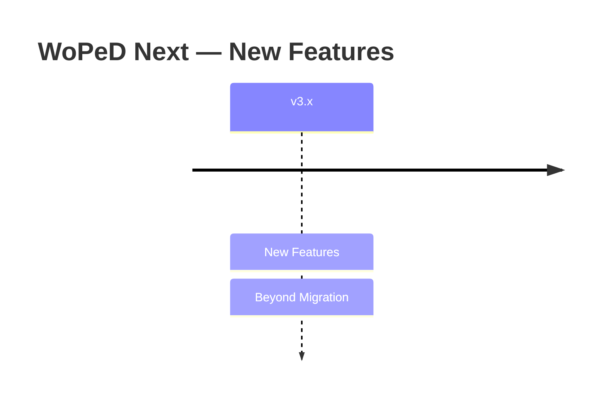

# New Features — Status & Overview

## Overview

Documentation of all newly developed features in WoPeD Next that go beyond the Java-WoPeD migration.

## Feature Status

| # | Feature | Status | Description |
|---|---------|--------|-------------|
| — | [Bugfixes & Improvements](./bugfixes-improvements.md) | 🚧 In Progress | Collection of bugfixes and minor improvements |
| **01** | [Discord Authentication](./01-discord-auth.md) | 🔜 Planned | Discord OAuth2 login, user overview, server invite |
| **02** | [AI Development Enablement](./02-ai-development-enablement.md) | 🔜 Planned | AGENTS.md, Cursor Skills, Issue Templates, MCP, CI, auto-mate |
| **03** | [NLP Chat Assistant](./03-nlp-chat.md) | 🔜 Planned | LLM-orchestrated chat, T2P/P2T integration, model modification via natural language |

Legend: ✅ Complete | ⚠️ Partial | 🔜 Planned | 🚧 In Progress | ⏸️ Deferred

## Changelog

*Changes to new features are documented here chronologically.*

## Feature Documents

| Document | Content |
|----------|---------|
| [00-features-overview.md](./00-features-overview.md) | Overview & guide |
| [bugfixes-improvements.md](./bugfixes-improvements.md) | Bugfixes & minor improvements |
| [01-discord-auth.md](./01-discord-auth.md) | Discord OAuth2 authentication |
| [02-ai-development-enablement.md](./02-ai-development-enablement.md) | AI-driven development enablement |
| [03-nlp-chat.md](./03-nlp-chat.md) | NLP chat assistant |

## Template for New Features

New feature documents follow the numbering convention `XX-feature-name.md` and the template in [00-features-overview.md](./00-features-overview.md#template). Long-lived collection documents (e.g. bugfixes) are unnumbered.
