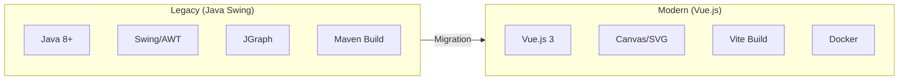
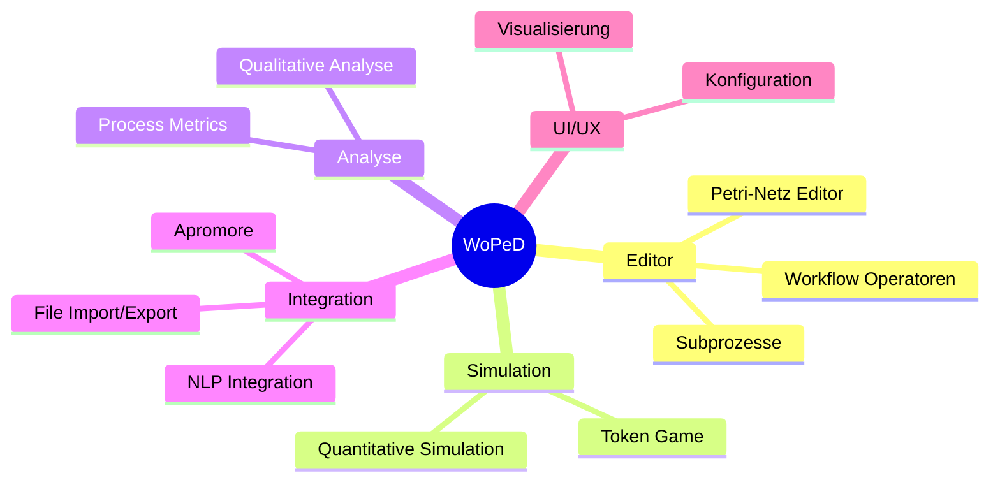
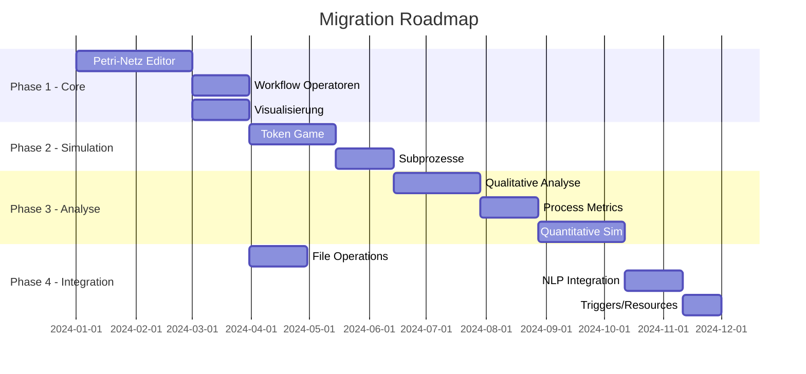

# WoPeD Migration Overview

## Projektüberblick

Migration von WoPeD (Workflow Petri Net Designer) von einer Java Swing Desktop-Anwendung zu einer modernen Vue.js Web-Anwendung.

## Feature-Kategorien

## Migrationsstrategie

## Feature-Dokumente

| # | Feature | Komplexität | Priorität |
|---|---------|-------------|-----------|
| [01](01-petri-net-editor.md) | Petri-Netz Editor | Hoch | P1 |
| [02](02-workflow-operators.md) | Workflow Operatoren | Mittel | P1 |
| [03](03-subprocess-support.md) | Subprozesse | Hoch | P2 |
| [04](04-token-game.md) | Token Game | Hoch | P2 |
| [05](05-visualization-layout.md) | Visualisierung & Layout | Mittel | P1 |
| [06](06-qualitative-analysis.md) | Qualitative Analyse | Hoch | P3 |
| [07](07-quantitative-simulation.md) | Quantitative Simulation | Hoch | P3 |
| [08](08-process-metrics.md) | Process Metrics | Mittel | P3 |
| [09](09-file-operations.md) | File Operations | Mittel | P1 |
| [10](10-nlp-integration.md) | NLP Integration | Mittel | P4 |
| [11](11-triggers-resources.md) | Triggers & Resources | Mittel | P3 |
| [12](12-configuration.md) | Konfiguration | Niedrig | P2 |

## Technologie-Mapping

| Legacy | Modern | Anmerkung |
|--------|--------|-----------|
| Java Swing | Vue.js 3 | UI Framework |
| JGraph | Canvas/SVG + D3.js | Graph-Rendering |
| JAXB | Native JSON | Datenserialisierung |
| Maven | npm/Vite | Build System |
| Properties Files | i18n (vue-i18n) | Internationalisierung |
| Swing Dialogs | Vue Components | Modale Dialoge |
| Desktop Storage | IndexedDB/LocalStorage | Persistenz |

## Architektur-Vergleich

## Risiken & Mitigationen

| Risiko | Impact | Mitigation |
|--------|--------|------------|
| Komplexe Algorithmen | Hoch | Schrittweise portieren, Unit Tests |
| Performance Canvas | Mittel | WebGL für große Netze |
| Browser-Kompatibilität | Niedrig | Moderne Browser targeten |
| Offline-Fähigkeit | Mittel | Service Worker + IndexedDB |
