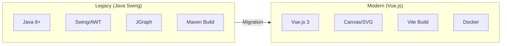
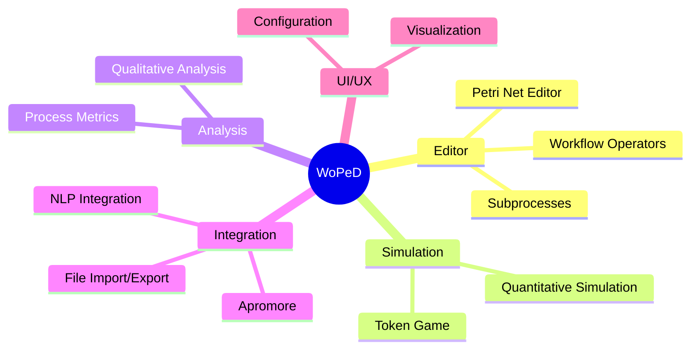
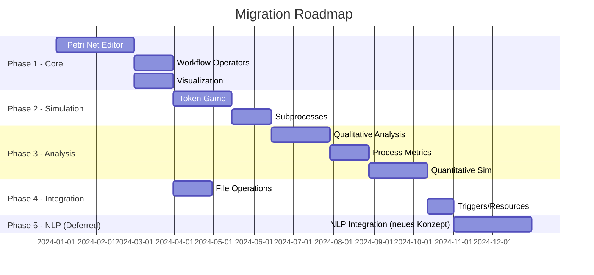
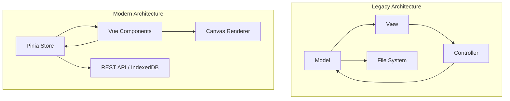

# WoPeD Migration Overview

## Project Overview

Migration of WoPeD (Workflow Petri Net Designer) from a Java Swing desktop application to a modern Vue.js web application.

## Feature Categories

## Migration Strategy

## Feature Documents

| # | Feature | Complexity | Priority |
|---|---------|------------|----------|
| [01](01-petri-net-editor.md) | Petri Net Editor | High | P1 |
| [02](02-workflow-operators.md) | Workflow Operators | Medium | P1 |
| [03](03-subprocess-support.md) | Subprocesses | High | P2 |
| [04](04-token-game.md) | Token Game | High | P2 |
| [05](05-visualization-layout.md) | Visualization & Layout | Medium | P1 |
| [06](06-qualitative-analysis.md) | Qualitative Analysis | High | P3 |
| [07](07-quantitative-simulation.md) | Quantitative Simulation | High | P3 |
| [08](08-process-metrics.md) | Process Metrics | Medium | P3 |
| [09](09-file-operations.md) | File Operations | Medium | P1 |
| [10](10-nlp-integration.md) | NLP Integration | Medium | P5 (Deferred — wird als letztes komplett neu konzipiert) |
| [11](11-triggers-resources.md) | Triggers & Resources | Medium | P3 |
| [12](12-configuration.md) | Configuration | Low | P2 |

## Technology Mapping

| Legacy | Modern | Notes |
|--------|--------|-------|
| Java Swing | Vue.js 3 | UI Framework |
| JGraph | Canvas/SVG + D3.js | Graph Rendering |
| JAXB | Native JSON | Data Serialization |
| Maven | npm/Vite | Build System |
| Properties Files | i18n (vue-i18n) | Internationalization |
| Swing Dialogs | Vue Components | Modal Dialogs |
| Desktop Storage | IndexedDB/LocalStorage | Persistence |

## Architecture Comparison

## Risks & Mitigations

| Risk | Impact | Mitigation |
|------|--------|------------|
| Complex Algorithms | High | Incremental porting, unit tests |
| Canvas Performance | Medium | WebGL for large nets |
| Browser Compatibility | Low | Target modern browsers |
| Offline Capability | Medium | Service Worker + IndexedDB |
