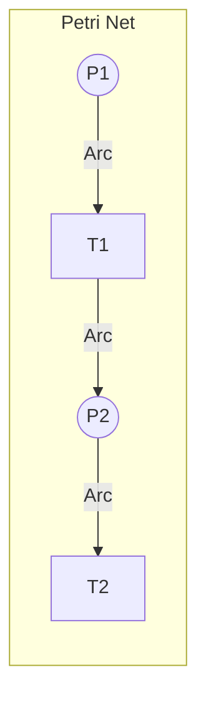
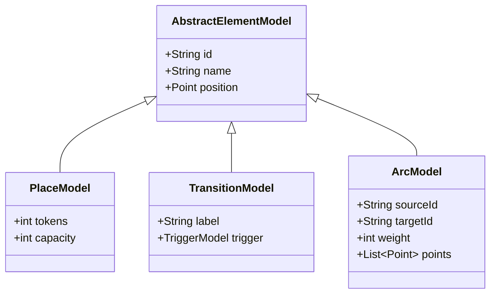
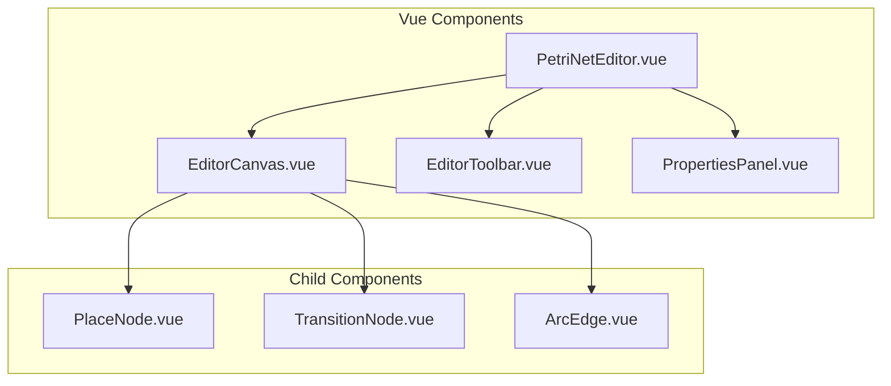
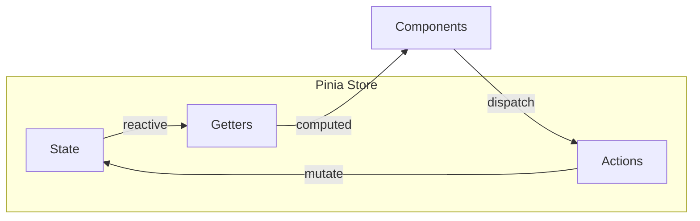
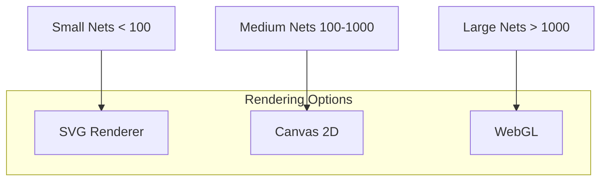
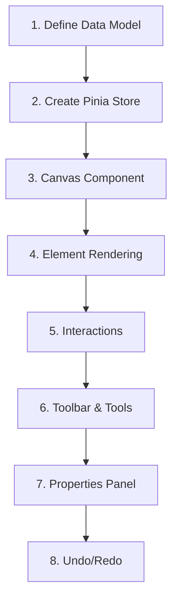

# Feature: Petri Net Editor

## Overview

Core feature for creating and editing Petri nets with places, transitions, and arcs.



## Legacy Implementation

### Affected Classes

```
WoPeD-Core/
├── AbstractGraph.java
├── PetriNetModelProcessor.java
├── ModelElementContainer.java
└── models/
    ├── PlaceModel.java
    ├── TransitionModel.java
    └── ArcModel.java

WoPeD-Editor/
├── controller/
│   └── vc/EditorVC.java
└── view/
    ├── PlaceView.java
    ├── TransitionView.java
    └── ArcView.java
```

### Data Model (Legacy)



## Modern Implementation

### Component Structure



### Data Model (Modern)

```typescript
// types/petri-net.ts
interface PetriNet {
  id: string
  name: string
  places: Place[]
  transitions: Transition[]
  arcs: Arc[]
}

interface Place {
  id: string
  name: string
  position: Position
  tokens: number
  capacity: number
}

interface Transition {
  id: string
  name: string
  position: Position
  label?: string
}

interface Arc {
  id: string
  sourceId: string
  targetId: string
  weight: number
  waypoints: Position[]
}

interface Position {
  x: number
  y: number
}
```

### State Management



```typescript
// stores/petriNet.ts
export const usePetriNetStore = defineStore('petriNet', {
  state: () => ({
    net: null as PetriNet | null,
    selectedElement: null,
    tool: 'select' as Tool,
    history: [] as PetriNet[]
  }),
  
  actions: {
    addPlace(position: Position) { ... },
    addTransition(position: Position) { ... },
    addArc(sourceId: string, targetId: string) { ... },
    deleteElement(id: string) { ... },
    undo() { ... },
    redo() { ... }
  }
})
```

## Rendering Strategy



### Recommendation: SVG + Canvas Hybrid

- **SVG** for interactive elements (drag & drop, click events)
- **Canvas** for performance-critical rendering
- **Library**: [Konva.js](https://konvajs.org/) or [Fabric.js](http://fabricjs.com/)

## Migration Steps



### Detailed Steps

1. **Define Data Model**
   - TypeScript interfaces
   - Validation with Zod

2. **Create Pinia Store**
   - CRUD operations
   - History for undo/redo

3. **Canvas Component**
   - Pan & zoom
   - Grid background

4. **Element Rendering**
   - Places as circles
   - Transitions as rectangles
   - Arcs as paths with arrows

5. **Interactions**
   - Drag & drop
   - Multi-selection
   - Context menu

6. **Toolbar & Tools**
   - Select, Place, Transition, Arc
   - Delete, Undo, Redo

7. **Properties Panel**
   - Edit element properties
   - Token count, labels

8. **Undo/Redo**
   - Command pattern
   - History stack

## UI Mockup

```
┌─────────────────────────────────────────────────────────────┐
│ [Select] [Place] [Transition] [Arc] │ [Undo] [Redo] [Zoom] │
├─────────────────────────────────────┬───────────────────────┤
│                                     │ Properties            │
│                                     │ ─────────────         │
│         Canvas                      │ Name: [Place1    ]    │
│                                     │ Tokens: [1       ]    │
│    (P1)───►[T1]───►(P2)            │ Capacity: [∞      ]   │
│                                     │                       │
│                                     │ [Delete]              │
└─────────────────────────────────────┴───────────────────────┘
```

## Dependencies

```json
{
  "dependencies": {
    "konva": "^9.0.0",
    "vue-konva": "^3.0.0",
    "pinia": "^2.1.0",
    "zod": "^3.22.0"
  }
}
```

## Test Plan

| Test | Description |
|------|-------------|
| Unit | Store actions, data model |
| Component | Rendering, interactions |
| E2E | Workflow: create, save, load net |
