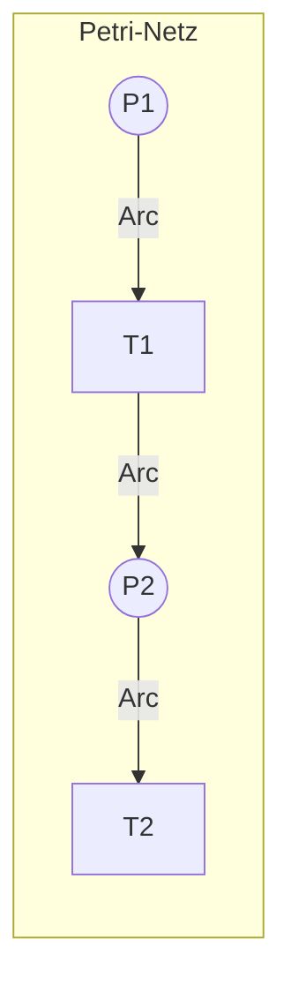
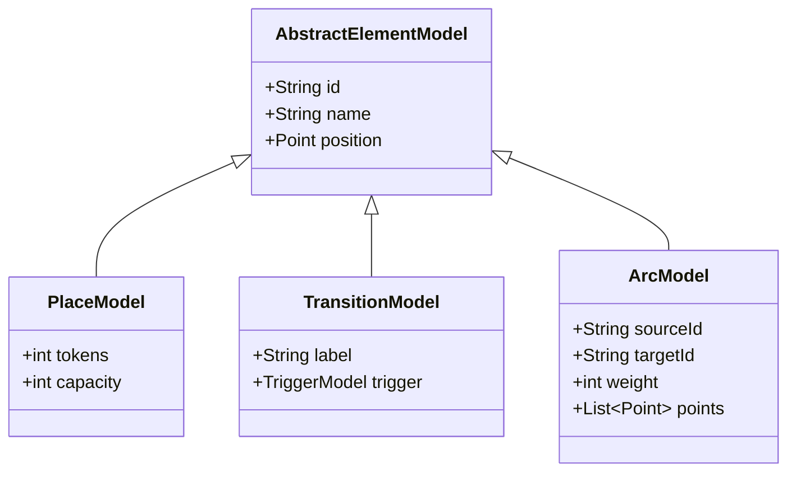
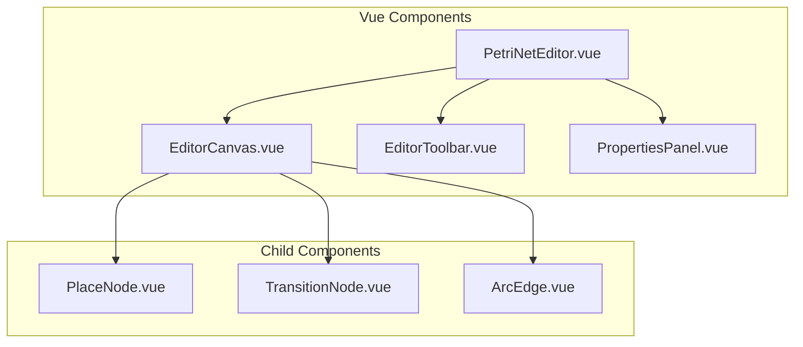
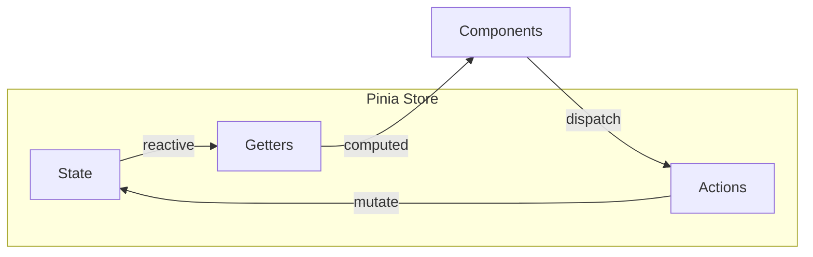
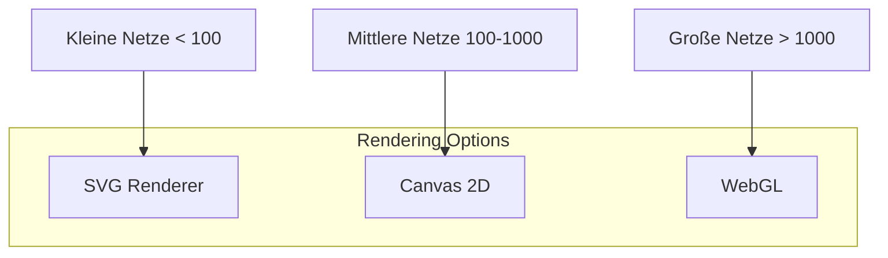
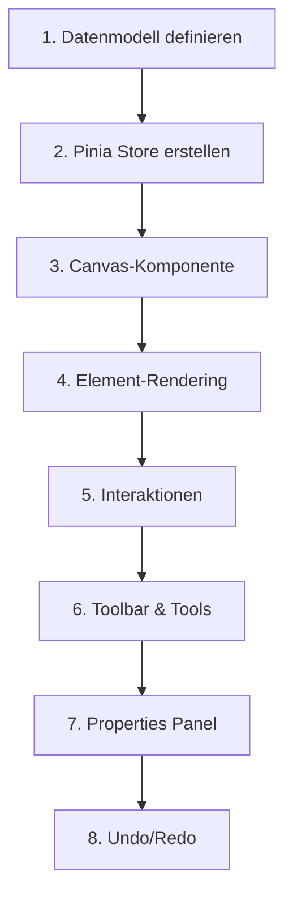

# Feature: Petri-Netz Editor

## Übersicht

Kern-Feature zum Erstellen und Bearbeiten von Petri-Netzen mit Stellen (Places), Transitionen und Kanten (Arcs).



## Legacy Implementation

### Betroffene Klassen

```
WoPeD-Core/
├── AbstractGraph.java
├── PetriNetModelProcessor.java
├── ModelElementContainer.java
└── models/
    ├── PlaceModel.java
    ├── TransitionModel.java
    └── ArcModel.java

WoPeD-Editor/
├── controller/
│   └── vc/EditorVC.java
└── view/
    ├── PlaceView.java
    ├── TransitionView.java
    └── ArcView.java
```

### Datenmodell (Legacy)



## Moderne Implementation

### Komponenten-Struktur



### Datenmodell (Modern)

```typescript
// types/petri-net.ts
interface PetriNet {
  id: string
  name: string
  places: Place[]
  transitions: Transition[]
  arcs: Arc[]
}

interface Place {
  id: string
  name: string
  position: Position
  tokens: number
  capacity: number
}

interface Transition {
  id: string
  name: string
  position: Position
  label?: string
}

interface Arc {
  id: string
  sourceId: string
  targetId: string
  weight: number
  waypoints: Position[]
}

interface Position {
  x: number
  y: number
}
```

### State Management



```typescript
// stores/petriNet.ts
export const usePetriNetStore = defineStore('petriNet', {
  state: () => ({
    net: null as PetriNet | null,
    selectedElement: null,
    tool: 'select' as Tool,
    history: [] as PetriNet[]
  }),
  
  actions: {
    addPlace(position: Position) { ... },
    addTransition(position: Position) { ... },
    addArc(sourceId: string, targetId: string) { ... },
    deleteElement(id: string) { ... },
    undo() { ... },
    redo() { ... }
  }
})
```

## Rendering-Strategie



### Empfehlung: SVG + Canvas Hybrid

- **SVG** für interaktive Elemente (Drag & Drop, Klick-Events)
- **Canvas** für Performance-kritisches Rendering
- **Bibliothek**: [Konva.js](https://konvajs.org/) oder [Fabric.js](http://fabricjs.com/)

## Migrationsschritte



### Detaillierte Schritte

1. **Datenmodell definieren**
   - TypeScript Interfaces
   - Validierung mit Zod

2. **Pinia Store erstellen**
   - CRUD Operations
   - History für Undo/Redo

3. **Canvas-Komponente**
   - Pan & Zoom
   - Grid-Hintergrund

4. **Element-Rendering**
   - Places als Kreise
   - Transitions als Rechtecke
   - Arcs als Pfade mit Pfeilen

5. **Interaktionen**
   - Drag & Drop
   - Multi-Selection
   - Kontextmenü

6. **Toolbar & Tools**
   - Select, Place, Transition, Arc
   - Delete, Undo, Redo

7. **Properties Panel**
   - Element-Eigenschaften editieren
   - Token-Anzahl, Labels

8. **Undo/Redo**
   - Command Pattern
   - History Stack

## UI-Mockup

```
┌─────────────────────────────────────────────────────────────┐
│ [Select] [Place] [Transition] [Arc] │ [Undo] [Redo] [Zoom] │
├─────────────────────────────────────┬───────────────────────┤
│                                     │ Properties            │
│                                     │ ─────────────         │
│         Canvas                      │ Name: [Place1    ]    │
│                                     │ Tokens: [1       ]    │
│    (P1)───►[T1]───►(P2)            │ Capacity: [∞      ]   │
│                                     │                       │
│                                     │ [Delete]              │
└─────────────────────────────────────┴───────────────────────┘
```

## Abhängigkeiten

```json
{
  "dependencies": {
    "konva": "^9.0.0",
    "vue-konva": "^3.0.0",
    "pinia": "^2.1.0",
    "zod": "^3.22.0"
  }
}
```

## Testplan

| Test | Beschreibung |
|------|--------------|
| Unit | Store-Actions, Datenmodell |
| Component | Rendering, Interaktionen |
| E2E | Workflow: Netz erstellen, speichern, laden |
