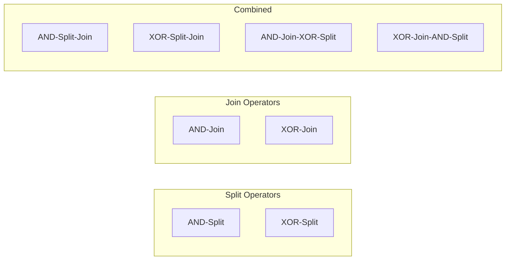
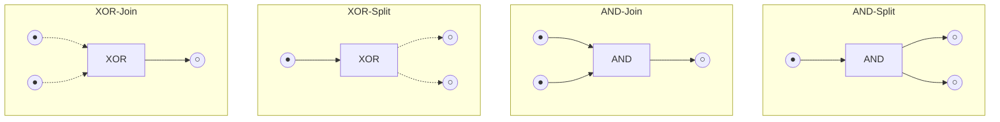
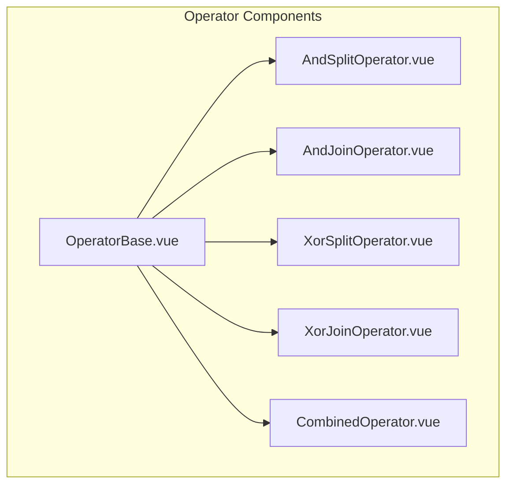
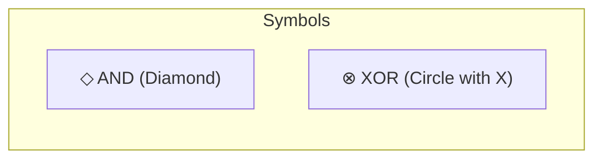
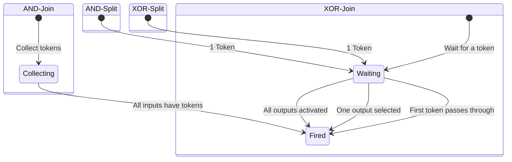
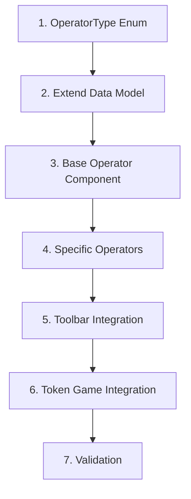

# Feature: Workflow Operators

## Overview

Special transitions for workflow nets: AND/XOR split and join operators.



## Operator Types



## Legacy Implementation

### Affected Classes

```
WoPeD-Core/
└── models/
    └── OperatorTransitionModel.java

WoPeD-Editor/
└── view/
    ├── TransAndSplitView.java
    ├── TransAndJoinView.java
    ├── TransXOrSplitView.java
    ├── TransXOrJoinView.java
    ├── TransAndSplitJoinView.java
    ├── TransXOrSplitJoinView.java
    ├── TransAndJoinXOrSplitView.java
    └── TransXOrJoinAndSplitView.java
```

### Operator Enum (Legacy)

```java
public enum OperatorType {
    AND_SPLIT,
    AND_JOIN,
    XOR_SPLIT,
    XOR_JOIN,
    AND_SPLIT_JOIN,
    XOR_SPLIT_JOIN,
    AND_JOIN_XOR_SPLIT,
    XOR_JOIN_AND_SPLIT
}
```

## Modern Implementation

### Data Model

```typescript
// types/operators.ts
enum OperatorType {
  AND_SPLIT = 'and-split',
  AND_JOIN = 'and-join',
  XOR_SPLIT = 'xor-split',
  XOR_JOIN = 'xor-join',
  AND_SPLIT_JOIN = 'and-split-join',
  XOR_SPLIT_JOIN = 'xor-split-join',
  AND_JOIN_XOR_SPLIT = 'and-join-xor-split',
  XOR_JOIN_AND_SPLIT = 'xor-join-and-split'
}

interface OperatorTransition extends Transition {
  operatorType: OperatorType
  innerPlaces?: Place[]  // For combined operators
}
```

### Component Architecture



### Visual Representation



```vue
<!-- components/operators/OperatorNode.vue -->
<template>
  <g :transform="`translate(${x}, ${y})`">
    <!-- AND: Diamond shape -->
    <polygon v-if="isAnd" 
      points="0,-20 20,0 0,20 -20,0" 
      :fill="fillColor" />
    
    <!-- XOR: Circle with X -->
    <g v-else>
      <circle r="20" :fill="fillColor" />
      <line x1="-10" y1="-10" x2="10" y2="10" />
      <line x1="10" y1="-10" x2="-10" y2="10" />
    </g>
    
    <!-- Split/Join indicators -->
    <text>{{ operatorLabel }}</text>
  </g>
</template>
```

### Token Semantics



## Migration Steps



### Detailed Steps

1. **OperatorType Enum**
   ```typescript
   // Define all 8 operator types
   ```

2. **Extend Data Model**
   - OperatorTransition interface
   - Inner places for combined operators

3. **Base Operator Component**
   - Shared logic
   - Props: type, position, selected

4. **Specific Operators**
   - Different SVG shapes
   - AND = diamond, XOR = circle with X

5. **Toolbar Integration**
   - Operator selection dropdown
   - Keyboard shortcuts

6. **Token Game Integration**
   - AND: Synchronization
   - XOR: Selection

7. **Validation**
   - Check correct connections
   - Error messages

## UI Mockup - Operator Selection

```
┌─────────────────────────────────┐
│ Add Operator:                   │
├─────────────────────────────────┤
│ ◇ AND-Split                     │
│ ◇ AND-Join                      │
│ ⊗ XOR-Split                     │
│ ⊗ XOR-Join                      │
├─────────────────────────────────┤
│ Combined:                       │
│ ◇◇ AND-Split-Join               │
│ ⊗⊗ XOR-Split-Join               │
│ ◇⊗ AND-Join-XOR-Split           │
│ ⊗◇ XOR-Join-AND-Split           │
└─────────────────────────────────┘
```

## Test Plan

| Test | Description |
|------|-------------|
| Unit | Operator types, semantics |
| Visual | Correct rendering of all 8 types |
| Integration | Token flow through operators |
