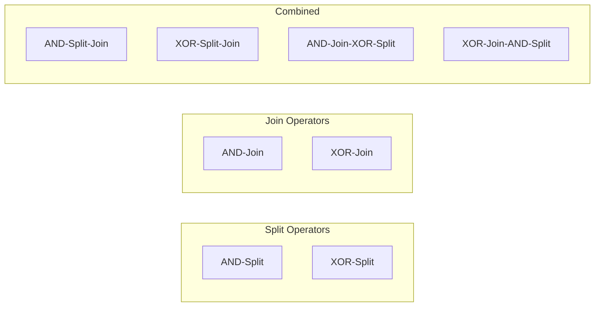
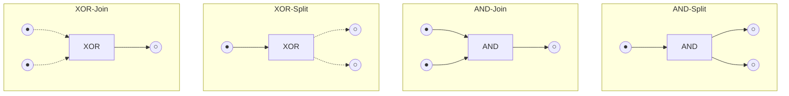
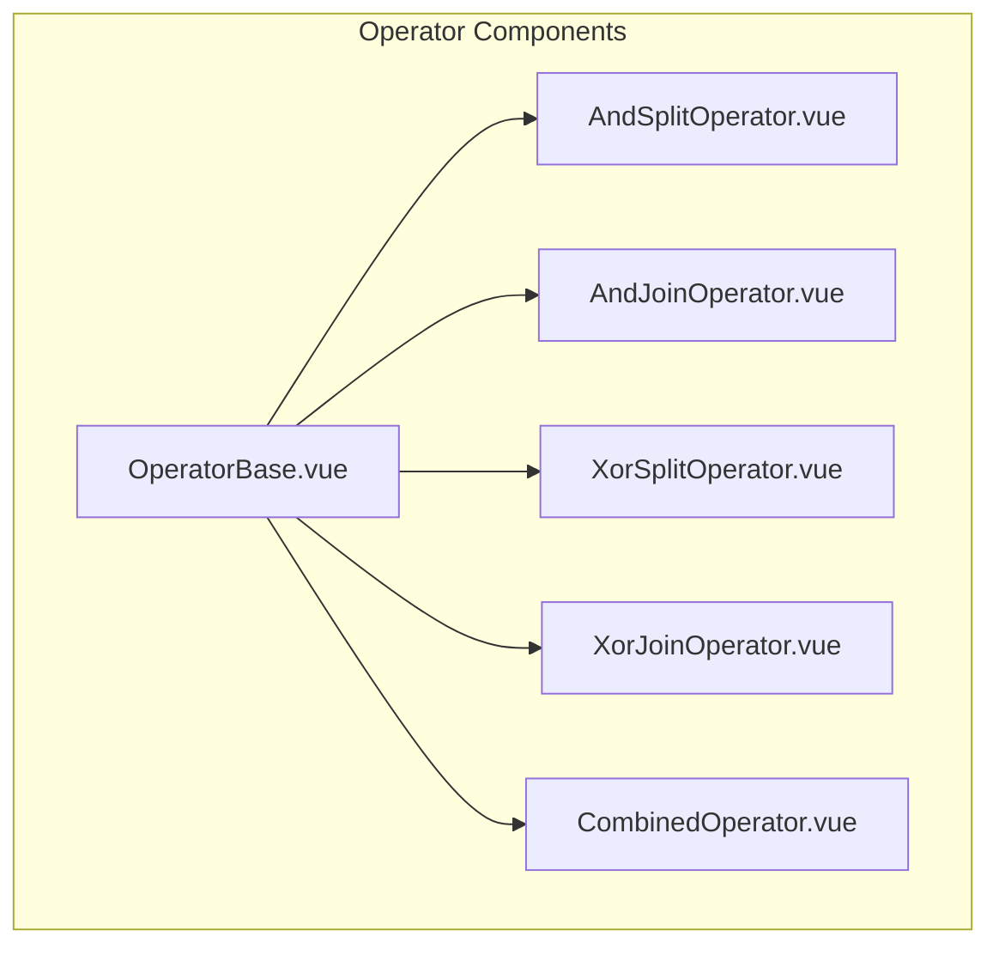
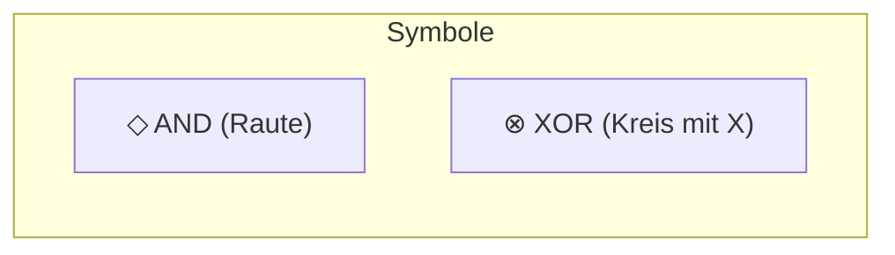
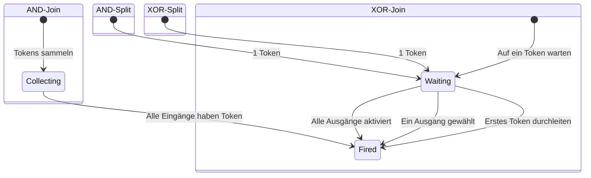
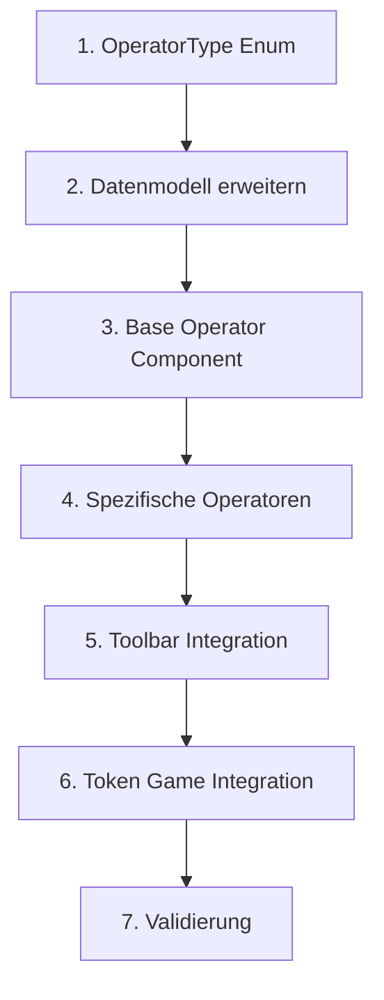

# Feature: Workflow Operatoren

## Übersicht

Spezielle Transitionen für Workflow-Netze: AND/XOR Split und Join Operatoren.



## Operator-Typen



## Legacy Implementation

### Betroffene Klassen

```
WoPeD-Core/
└── models/
    └── OperatorTransitionModel.java

WoPeD-Editor/
└── view/
    ├── TransAndSplitView.java
    ├── TransAndJoinView.java
    ├── TransXOrSplitView.java
    ├── TransXOrJoinView.java
    ├── TransAndSplitJoinView.java
    ├── TransXOrSplitJoinView.java
    ├── TransAndJoinXOrSplitView.java
    └── TransXOrJoinAndSplitView.java
```

### Operator-Enum (Legacy)

```java
public enum OperatorType {
    AND_SPLIT,
    AND_JOIN,
    XOR_SPLIT,
    XOR_JOIN,
    AND_SPLIT_JOIN,
    XOR_SPLIT_JOIN,
    AND_JOIN_XOR_SPLIT,
    XOR_JOIN_AND_SPLIT
}
```

## Moderne Implementation

### Datenmodell

```typescript
// types/operators.ts
enum OperatorType {
  AND_SPLIT = 'and-split',
  AND_JOIN = 'and-join',
  XOR_SPLIT = 'xor-split',
  XOR_JOIN = 'xor-join',
  AND_SPLIT_JOIN = 'and-split-join',
  XOR_SPLIT_JOIN = 'xor-split-join',
  AND_JOIN_XOR_SPLIT = 'and-join-xor-split',
  XOR_JOIN_AND_SPLIT = 'xor-join-and-split'
}

interface OperatorTransition extends Transition {
  operatorType: OperatorType
  innerPlaces?: Place[]  // Für combined operators
}
```

### Komponenten-Architektur



### Visuelle Darstellung



```vue
<!-- components/operators/OperatorNode.vue -->
<template>
  <g :transform="`translate(${x}, ${y})`">
    <!-- AND: Diamond shape -->
    <polygon v-if="isAnd" 
      points="0,-20 20,0 0,20 -20,0" 
      :fill="fillColor" />
    
    <!-- XOR: Circle with X -->
    <g v-else>
      <circle r="20" :fill="fillColor" />
      <line x1="-10" y1="-10" x2="10" y2="10" />
      <line x1="10" y1="-10" x2="-10" y2="10" />
    </g>
    
    <!-- Split/Join indicators -->
    <text>{{ operatorLabel }}</text>
  </g>
</template>
```

### Token-Semantik



## Migrationsschritte



### Detaillierte Schritte

1. **OperatorType Enum**
   ```typescript
   // Alle 8 Operator-Typen definieren
   ```

2. **Datenmodell erweitern**
   - OperatorTransition Interface
   - Inner Places für Combined Operators

3. **Base Operator Component**
   - Gemeinsame Logik
   - Props: type, position, selected

4. **Spezifische Operatoren**
   - Unterschiedliche SVG-Shapes
   - AND = Raute, XOR = Kreis mit X

5. **Toolbar Integration**
   - Operator-Auswahl Dropdown
   - Schnelltasten

6. **Token Game Integration**
   - AND: Synchronisation
   - XOR: Auswahl

7. **Validierung**
   - Korrekte Verbindungen prüfen
   - Fehlermeldungen

## UI-Mockup Operator-Auswahl

```
┌─────────────────────────────────┐
│ Operator einfügen:              │
├─────────────────────────────────┤
│ ◇ AND-Split                     │
│ ◇ AND-Join                      │
│ ⊗ XOR-Split                     │
│ ⊗ XOR-Join                      │
├─────────────────────────────────┤
│ Combined:                       │
│ ◇◇ AND-Split-Join               │
│ ⊗⊗ XOR-Split-Join               │
│ ◇⊗ AND-Join-XOR-Split           │
│ ⊗◇ XOR-Join-AND-Split           │
└─────────────────────────────────┘
```

## Testplan

| Test | Beschreibung |
|------|--------------|
| Unit | Operator-Typen, Semantik |
| Visual | Korrekte Darstellung aller 8 Typen |
| Integration | Token-Fluss durch Operatoren |
