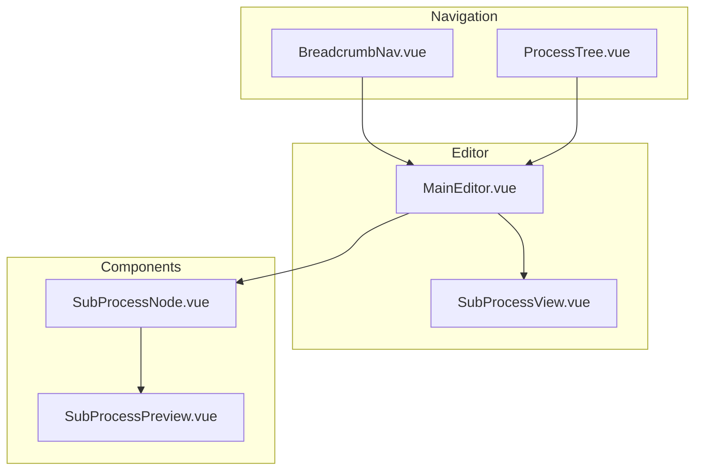
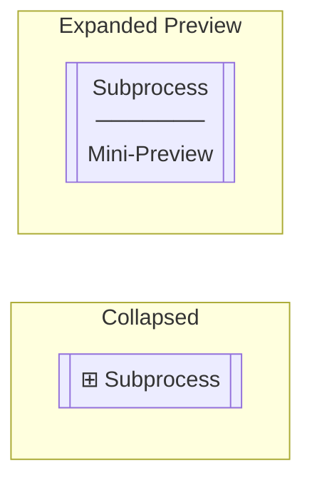
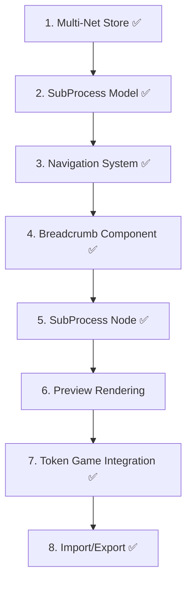
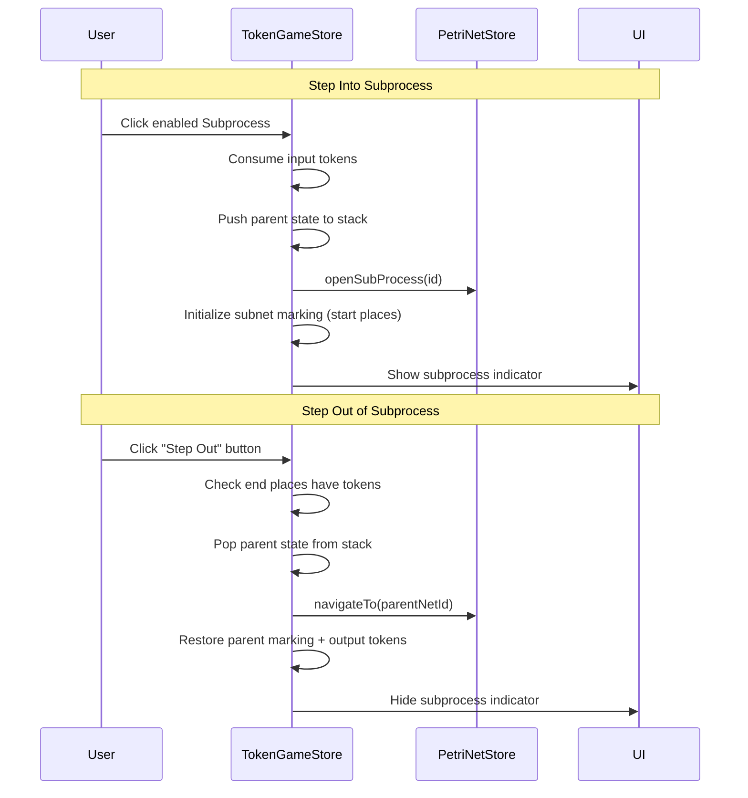

# Feature: Subprocesses

## Overview

Hierarchical modeling through embedded subprocesses (subprocess/subnets).

```mermaid
graph TD
    subgraph Main Process
        P1((Start)) --> T1[Task 1]
        T1 --> SUB[["Subprocess"]]
        SUB --> T2[Task 2]
        T2 --> P2((End))
    end
    
    subgraph Subprocess Content
        SP1((●)) --> ST1[Sub Task]
        ST1 --> SP2((○))
    end
    
    SUB -.->|contains| Subprocess Content
```

## Legacy Implementation

### Affected Classes

```
WoPeD-Core/
└── models/
    └── SubProcessModel.java

WoPeD-Editor/
├── view/
│   └── SubProcessView.java
└── controller/
    └── TokenGameController.java (subprocess navigation)
```

### Data Structure (Legacy)

```java
public class SubProcessModel extends TransitionModel {
    private PetriNetModelProcessor subNet;
    private String subNetId;
    
    public void openSubNet() { ... }
    public void closeSubNet() { ... }
}
```

## Modern Implementation

### Data Model

```typescript
// types/subprocess.ts
interface SubProcess extends Transition {
  type: 'subprocess'
  subNetId: string
  collapsed: boolean
}

interface PetriNet {
  id: string
  name: string
  parentId?: string  // For hierarchy
  places: Place[]
  transitions: (Transition | SubProcess)[]
  arcs: Arc[]
}

// Store for multiple nets
interface PetriNetStore {
  nets: Map<string, PetriNet>
  activeNetId: string
  breadcrumb: string[]  // Navigation history
}
```

### Component Architecture



### Interaction Flow


### State Management

```typescript
// stores/petriNet.ts
export const usePetriNetStore = defineStore('petriNet', {
  state: () => ({
    nets: new Map<string, PetriNet>(),
    activeNetId: 'main',
    breadcrumb: ['main']
  }),
  
  getters: {
    activeNet: (state) => state.nets.get(state.activeNetId),
    canGoBack: (state) => state.breadcrumb.length > 1,
    currentPath: (state) => state.breadcrumb.map(id => 
      state.nets.get(id)?.name
    )
  },
  
  actions: {
    openSubProcess(subProcessId: string) {
      const subprocess = this.findSubProcess(subProcessId)
      if (subprocess) {
        this.breadcrumb.push(this.activeNetId)
        this.activeNetId = subprocess.subNetId
      }
    },
    
    goBack() {
      if (this.breadcrumb.length > 1) {
        this.activeNetId = this.breadcrumb.pop()!
      }
    },
    
    createSubProcess(position: Position): SubProcess {
      const subNet: PetriNet = {
        id: generateId(),
        name: 'New Subprocess',
        parentId: this.activeNetId,
        places: [],
        transitions: [],
        arcs: []
      }
      this.nets.set(subNet.id, subNet)
      
      return {
        id: generateId(),
        type: 'subprocess',
        name: 'Subprocess',
        position,
        subNetId: subNet.id,
        collapsed: true
      }
    }
  }
})
```

### Visual Representation



```vue
<!-- components/SubProcessNode.vue -->
<template>
  <g :transform="`translate(${x}, ${y})`">
    <!-- Outer frame with double line -->
    <rect 
      :width="width" :height="height"
      rx="5" ry="5"
      class="subprocess-outer" />
    <rect 
      :width="width - 6" :height="height - 6"
      x="3" y="3"
      rx="3" ry="3"
      class="subprocess-inner" />
    
    <!-- Label -->
    <text :y="20" text-anchor="middle">
      {{ subprocess.name }}
    </text>
    
    <!-- Preview (when expanded) -->
    <foreignObject v-if="showPreview" :y="30">
      <SubProcessPreview :netId="subprocess.subNetId" />
    </foreignObject>
    
    <!-- Expand Icon -->
    <text 
      :x="width - 15" :y="15" 
      class="expand-icon"
      @click="openSubProcess">
      ⊞
    </text>
  </g>
</template>
```

## Migration Steps



### Detailed Steps

1. **Multi-Net Store** ✅
   - `nets: Record<string, PetriNet>` for multiple PetriNets
   - `parentId` for parent-child relationships
   - `breadcrumb` array for navigation history

2. **SubProcess Model** ✅
   - `SubProcess` interface extends Transition
   - `subNetId` reference to SubNet
   - `collapsed` for display mode

3. **Navigation System** ✅
   - `openSubProcess()` action
   - `goBack()` and `navigateTo()` actions
   - Breadcrumb state management

4. **Breadcrumb Component** ✅
   - `BreadcrumbNav.vue` with clickable path display
   - Back button
   - Current net name display

5. **SubProcess Node** ✅
   - `SubProcessNode.vue` with double border
   - Double-click to open in editor mode
   - Single-click in token game for step-into
   - Enabled highlighting in token game

6. **Preview Rendering** ⏳
   - Miniature view (TODO)
   - Optionally activatable

7. **Token Game Integration** ✅
   - **Step Into**: Click on enabled subprocess
     - Tokens consumed from input places
     - Navigation into subprocess
     - Start places receive tokens
   - **Step Out**: Button in TokenGameControls
     - Checks if end places have tokens
     - Tokens consumed from end places
     - Navigation back to parent
     - Output places receive tokens
   - Subprocess stack for nested navigation
   - UI indicator for current subprocess context

8. **Import/Export** ✅
   - Nested PNML structure
   - Reference integrity

## UI Mockup

```
┌─────────────────────────────────────────────────────────────┐
│ 📍 Main Process > Order Processing > Payment               │
├─────────────────────────────────────────────────────────────┤
│                                                             │
│    ┌─────────────────────┐                                 │
│    │ ╔═════════════════╗ │                                 │
│    │ ║   Subprocess    ║ │  ← Double-click to open        │
│    │ ║   ─────────     ║ │                                 │
│    │ ║   [Preview]     ║ │                                 │
│    │ ╚═════════════════╝ │                                 │
│    └─────────────────────┘                                 │
│                                                             │
└─────────────────────────────────────────────────────────────┘
```

## Token Game Integration (Step Into / Step Out)



### Implemented Features

- **Start-Place Detection**: Places without incoming arcs
- **End-Place Detection**: Places without outgoing arcs
- **Subprocess Stack**: Enables nested subprocess navigation
- **Enabled-State Highlighting**: Subprocesses highlighted green when enabled
- **Deadlock Detection**: Also considers enabled subprocesses

### TokenGameState Extensions

```typescript
interface SubprocessStackEntry {
  parentNetId: string
  subprocessId: string
  parentMarking: Marking
  parentHistory: Marking[]
  parentHistoryIndex: number
}

interface TokenGameState {
  // ... existing fields
  enabledSubprocesses: string[]
  subprocessStack: SubprocessStackEntry[]
}
```

## Test Plan

| Test | Description |
|------|-------------|
| Unit | Store navigation, hierarchy, token game step in/out |
| Component | Breadcrumb, SubProcess Node, TokenGameControls |
| Integration | Open/close, token flow through subprocess |
| E2E | Create complete hierarchy, navigate & token game |
