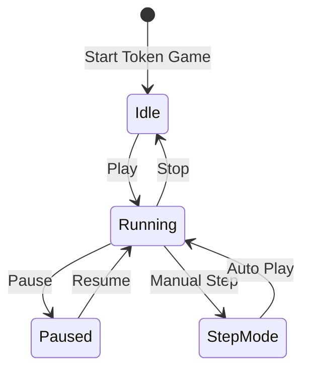
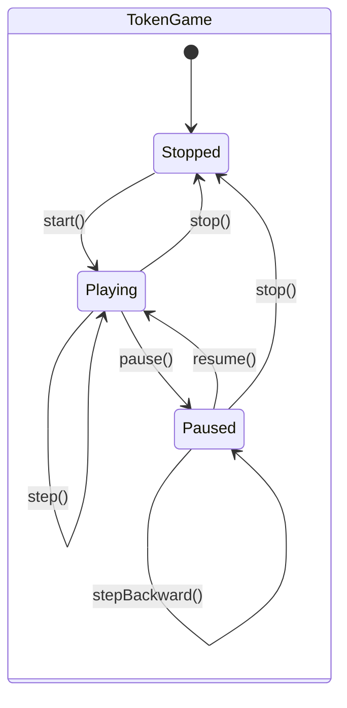
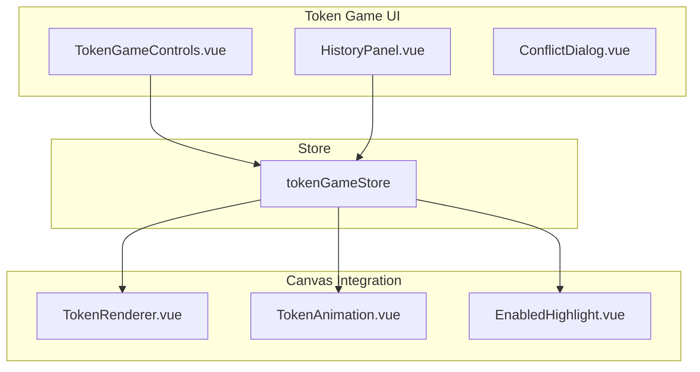
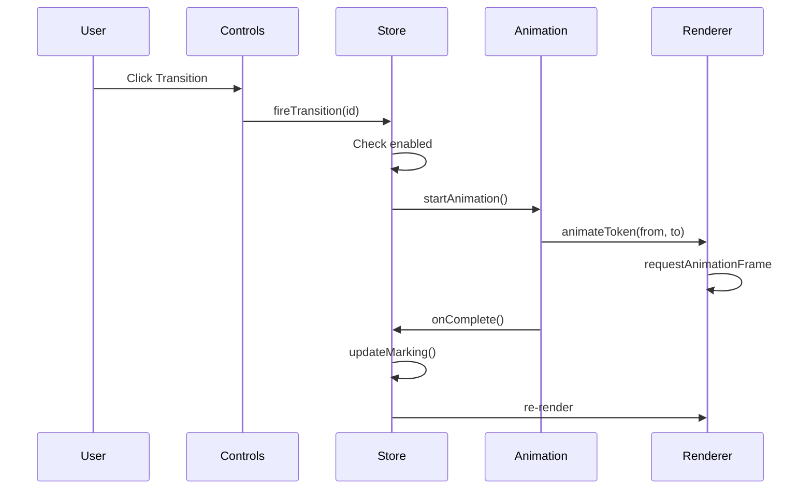
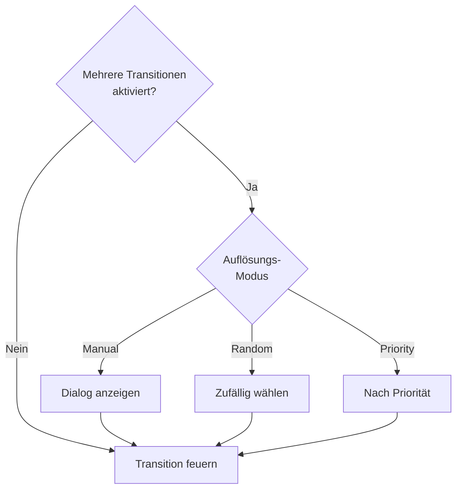
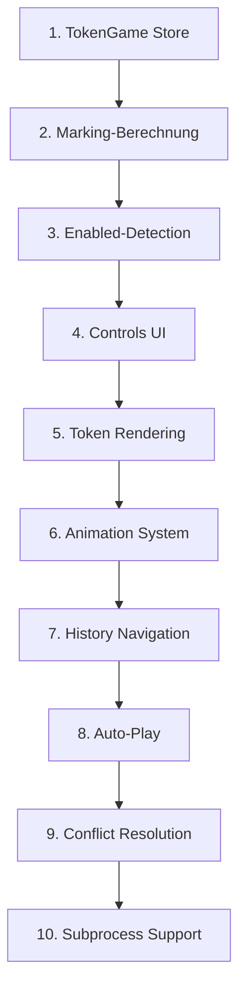

# Feature: Token Game

## Übersicht

Interaktive Simulation der Token-Bewegung durch das Petri-Netz zur Visualisierung der Prozessausführung.



## Legacy Implementation

### Betroffene Klassen

```
WoPeD-Editor/
└── controller/
    ├── TokenGameController.java
    ├── TokenGameSession.java
    └── TokenGameRunnableObject.java

WoPeD-Core/
└── models/
    └── TokenModel.java
```

### Features (Legacy)

- Step Forward / Backward
- Auto-Play mit konfigurierbarem Delay
- History Navigation
- Subprocess Step-Into / Step-Out
- Konflikt-Auflösung bei XOR

## Moderne Implementation

### State Machine



### Datenmodell

```typescript
// types/tokenGame.ts
interface TokenGameState {
  status: 'stopped' | 'playing' | 'paused'
  marking: Marking
  history: Marking[]
  historyIndex: number
  enabledTransitions: string[]
  autoPlayDelay: number
  conflictResolution: 'manual' | 'random' | 'priority'
}

interface Marking {
  timestamp: number
  tokens: Map<string, number>  // placeId -> token count
  firedTransition?: string
}

interface TokenAnimation {
  fromPlaceId: string
  toPlaceId: string
  transitionId: string
  progress: number  // 0-1
}
```

### Komponenten-Architektur



### Store Implementation

```typescript
// stores/tokenGame.ts
export const useTokenGameStore = defineStore('tokenGame', {
  state: (): TokenGameState => ({
    status: 'stopped',
    marking: { timestamp: 0, tokens: new Map() },
    history: [],
    historyIndex: -1,
    enabledTransitions: [],
    autoPlayDelay: 1000,
    conflictResolution: 'manual'
  }),
  
  getters: {
    canStepForward: (state) => 
      state.historyIndex < state.history.length - 1,
    canStepBackward: (state) => 
      state.historyIndex > 0,
    isTransitionEnabled: (state) => (transitionId: string) =>
      state.enabledTransitions.includes(transitionId),
    tokensAt: (state) => (placeId: string) =>
      state.marking.tokens.get(placeId) ?? 0
  },
  
  actions: {
    start() {
      const petriNet = usePetriNetStore()
      this.marking = this.getInitialMarking(petriNet.activeNet)
      this.history = [this.marking]
      this.historyIndex = 0
      this.updateEnabledTransitions()
      this.status = 'paused'
    },
    
    async fireTransition(transitionId: string) {
      if (!this.enabledTransitions.includes(transitionId)) return
      
      // Animation starten
      await this.animateTokens(transitionId)
      
      // Marking aktualisieren
      this.marking = this.computeNewMarking(transitionId)
      
      // History erweitern
      this.history = this.history.slice(0, this.historyIndex + 1)
      this.history.push(this.marking)
      this.historyIndex++
      
      this.updateEnabledTransitions()
    },
    
    stepForward() {
      if (this.canStepForward) {
        this.historyIndex++
        this.marking = this.history[this.historyIndex]
        this.updateEnabledTransitions()
      }
    },
    
    stepBackward() {
      if (this.canStepBackward) {
        this.historyIndex--
        this.marking = this.history[this.historyIndex]
        this.updateEnabledTransitions()
      }
    },
    
    async autoPlay() {
      this.status = 'playing'
      while (this.status === 'playing' && this.enabledTransitions.length > 0) {
        const transition = this.selectTransition()
        await this.fireTransition(transition)
        await sleep(this.autoPlayDelay)
      }
      this.status = 'paused'
    }
  }
})
```

### Token Animation



```vue
<!-- components/TokenAnimation.vue -->
<template>
  <g v-for="anim in activeAnimations" :key="anim.id">
    <circle
      :cx="interpolate(anim.from.x, anim.to.x, anim.progress)"
      :cy="interpolate(anim.from.y, anim.to.y, anim.progress)"
      r="5"
      class="token animated"
    />
  </g>
</template>

<script setup>
const interpolate = (from, to, t) => from + (to - from) * easeInOut(t)
</script>
```

### Konflikt-Auflösung



## Migrationsschritte



## UI-Mockup

```
┌─────────────────────────────────────────────────────────────┐
│ Token Game                                    [X] Close     │
├─────────────────────────────────────────────────────────────┤
│                                                             │
│  [◀◀] [◀] [▶ Play] [■ Stop] [▶] [▶▶]    Speed: [====○] 1s │
│                                                             │
├─────────────────────────────────────────────────────────────┤
│                                                             │
│      (●)───────►[T1]───────►( )                            │
│       ↑          ↓↓          ↓                              │
│       │    (animiertes Token)│                              │
│       │          ↓↓          ↓                              │
│      ( )◄───────[T2]◄───────(●)                            │
│                                                             │
├─────────────────────────────────────────────────────────────┤
│ History: Step 3/5  │  Enabled: T1, T2  │  Tokens: 2        │
└─────────────────────────────────────────────────────────────┘
```

## Testplan

| Test | Beschreibung |
|------|--------------|
| Unit | Marking-Berechnung, Enabled-Detection |
| Animation | Smooth Token-Bewegung |
| Integration | History, Undo/Redo |
| E2E | Komplette Simulation durchspielen |
