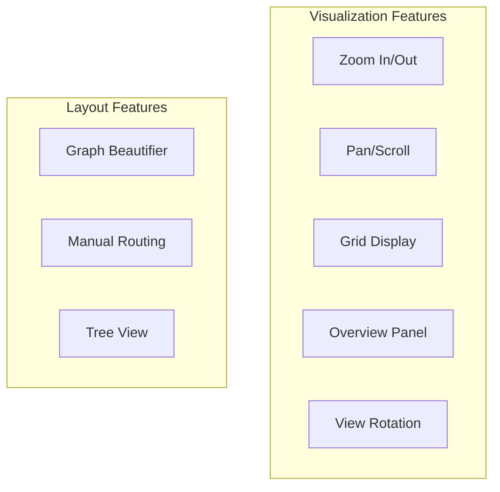
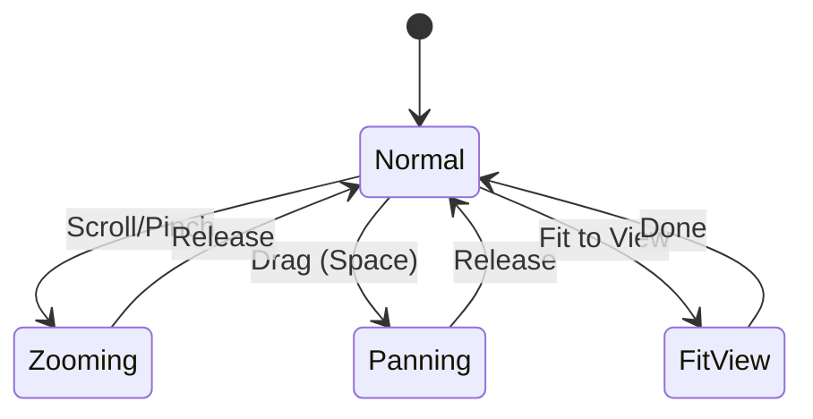
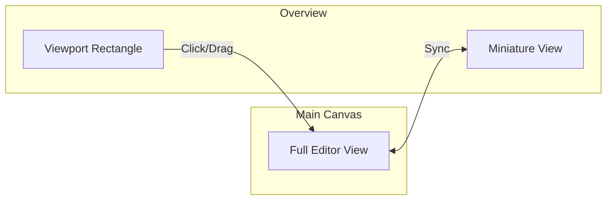
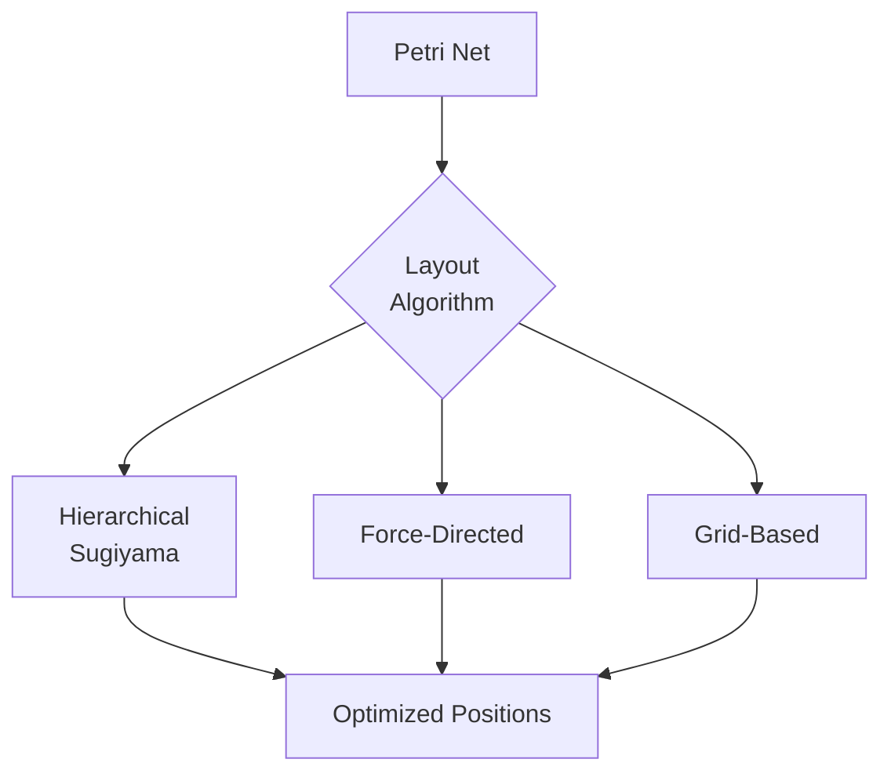
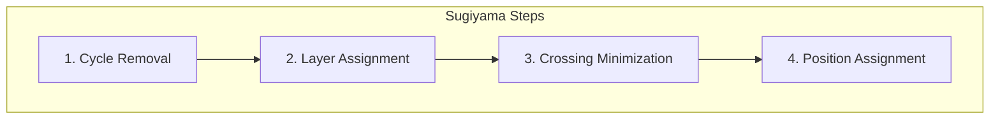
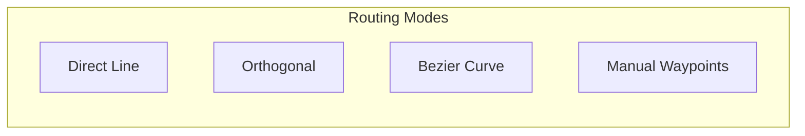
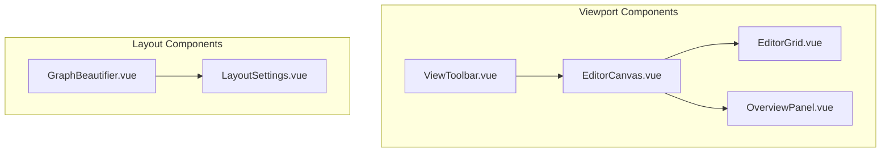
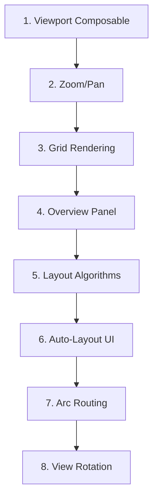

# Feature: Visualization & Layout

## Overview

Features for displaying and automatically arranging Petri nets.



## Legacy Implementation

### Affected Classes

```
WoPeD-Editor/
├── graphbeautifier/
│   ├── AdvancedDialog.java
│   ├── SGYGraph.java
│   └── SGYElement.java
├── gui/
│   └── OverviewPanel.java
└── orientation/
    └── ViewRotation.java
```

## Modern Implementation

### Zoom & Pan



```typescript
// composables/useViewport.ts
interface Viewport {
  x: number
  y: number
  zoom: number
  minZoom: number
  maxZoom: number
}

export function useViewport() {
  const viewport = reactive<Viewport>({
    x: 0,
    y: 0,
    zoom: 1,
    minZoom: 0.1,
    maxZoom: 5
  })
  
  const zoomIn = () => {
    viewport.zoom = Math.min(viewport.zoom * 1.2, viewport.maxZoom)
  }
  
  const zoomOut = () => {
    viewport.zoom = Math.max(viewport.zoom / 1.2, viewport.minZoom)
  }
  
  const fitToView = (bounds: Rect) => {
    // Calculate optimal zoom and position
  }
  
  const pan = (dx: number, dy: number) => {
    viewport.x += dx / viewport.zoom
    viewport.y += dy / viewport.zoom
  }
  
  return { viewport, zoomIn, zoomOut, fitToView, pan }
}
```

### Overview Panel



```vue
<!-- components/OverviewPanel.vue -->
<template>
  <div class="overview-panel">
    <canvas 
      ref="overviewCanvas"
      @mousedown="startDrag"
      @mousemove="onDrag"
      @mouseup="endDrag"
    />
    <!-- Viewport indicator -->
    <div 
      class="viewport-rect"
      :style="viewportStyle"
    />
  </div>
</template>
```

### Graph Beautifier (Auto-Layout)



#### Layout Algorithms

```typescript
// utils/layout/index.ts
interface LayoutOptions {
  algorithm: 'hierarchical' | 'force' | 'grid'
  direction: 'LR' | 'TB' | 'RL' | 'BT'
  nodeSpacing: number
  rankSpacing: number
}

export function autoLayout(net: PetriNet, options: LayoutOptions): PetriNet {
  switch (options.algorithm) {
    case 'hierarchical':
      return sugiyamaLayout(net, options)
    case 'force':
      return forceDirectedLayout(net, options)
    case 'grid':
      return gridLayout(net, options)
  }
}
```

#### Sugiyama Layout



```typescript
// utils/layout/sugiyama.ts
function sugiyamaLayout(net: PetriNet, options: LayoutOptions): PetriNet {
  // 1. Temporarily remove cycles
  const acyclic = removeCycles(net)
  
  // 2. Assign layers (longest path)
  const layers = assignLayers(acyclic)
  
  // 3. Minimize crossings (barycenter)
  const ordered = minimizeCrossings(layers)
  
  // 4. Calculate X/Y positions
  return assignPositions(ordered, options)
}
```

### Arc Routing



```typescript
// utils/routing.ts
interface ArcRouting {
  mode: 'direct' | 'orthogonal' | 'bezier' | 'manual'
  waypoints: Position[]
}

function routeArc(
  source: Position, 
  target: Position, 
  mode: ArcRouting['mode']
): Position[] {
  switch (mode) {
    case 'direct':
      return [source, target]
    case 'orthogonal':
      return orthogonalRoute(source, target)
    case 'bezier':
      return bezierRoute(source, target)
    case 'manual':
      return [] // User-defined
  }
}
```

### Grid System

```vue
<!-- components/EditorGrid.vue -->
<template>
  <defs>
    <pattern 
      id="grid" 
      :width="gridSize" 
      :height="gridSize" 
      patternUnits="userSpaceOnUse"
    >
      <path 
        :d="`M ${gridSize} 0 L 0 0 0 ${gridSize}`"
        fill="none"
        stroke="#e0e0e0"
        stroke-width="0.5"
      />
    </pattern>
  </defs>
  <rect width="100%" height="100%" fill="url(#grid)" />
</template>
```

## Component Overview



## Migration Steps



## UI Mockup

```
┌─────────────────────────────────────────────────────────────┐
│ [🔍+] [🔍-] [Fit] [Grid ☑] [Snap ☑] │ [Auto Layout ▼]     │
├────────────────────────────────────┬────────────────────────┤
│                                    │ ┌──────────────────┐   │
│                                    │ │    Overview      │   │
│        Main Canvas                 │ │  ┌────┐          │   │
│        (Zoomable, Pannable)        │ │  │    │ ←Viewport│   │
│                                    │ │  └────┘          │   │
│                                    │ └──────────────────┘   │
│                                    │                        │
│    ┌─grid─────────────────────┐   │ Layout Options:        │
│    │ ○ ─── □ ─── ○            │   │ [Hierarchical ▼]       │
│    │       │                   │   │ Direction: [LR ▼]     │
│    │       ○                   │   │ Spacing: [50]         │
│    └───────────────────────────┘   │ [Apply]               │
│                                    │                        │
└────────────────────────────────────┴────────────────────────┘
```

## Dependencies

```json
{
  "dependencies": {
    "dagre": "^0.8.5",
    "d3-force": "^3.0.0"
  }
}
```

## Test Plan

| Test | Description |
|------|-------------|
| Unit | Viewport calculations, layout algorithms |
| Visual | Grid rendering, zoom levels |
| Integration | Overview sync, auto-layout |
| Performance | Large nets (1000+ elements) |
