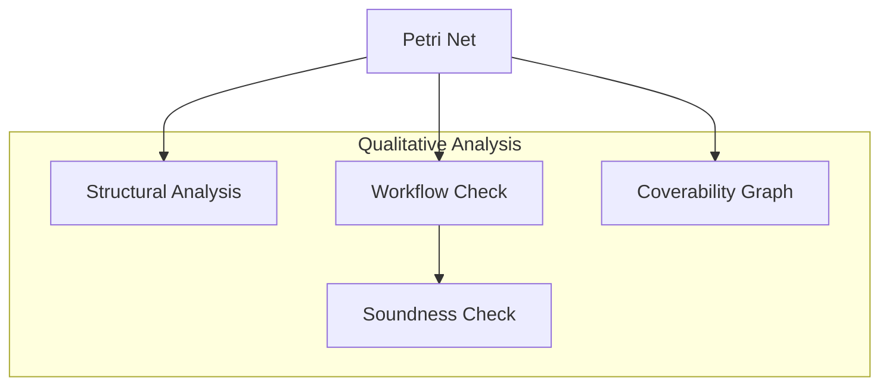
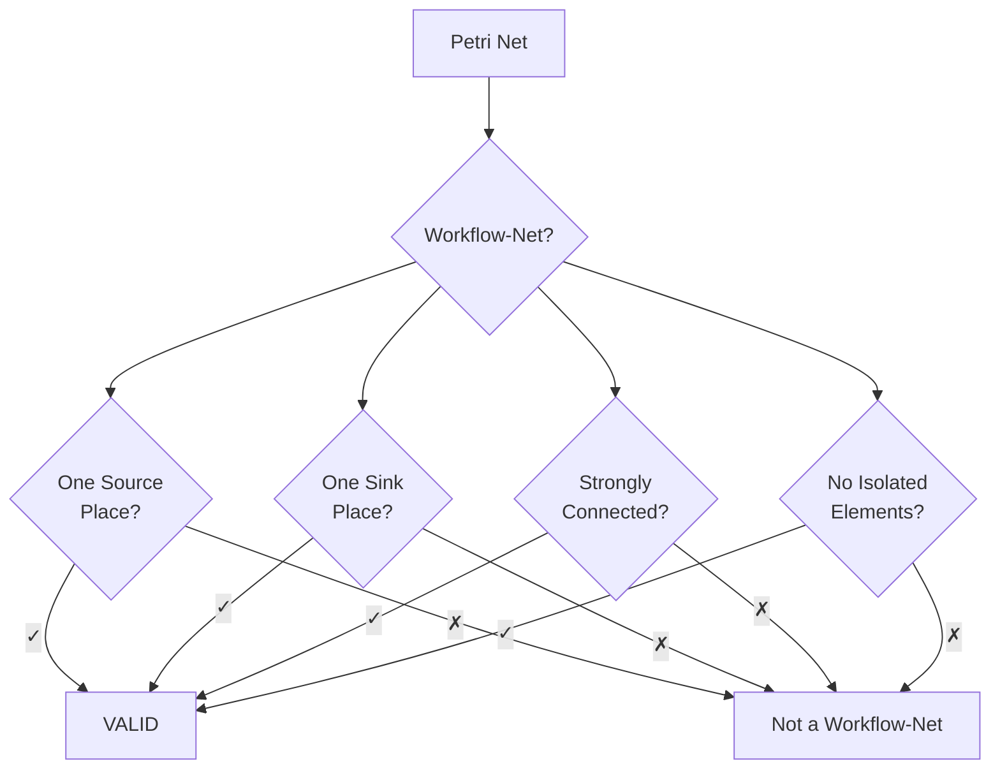
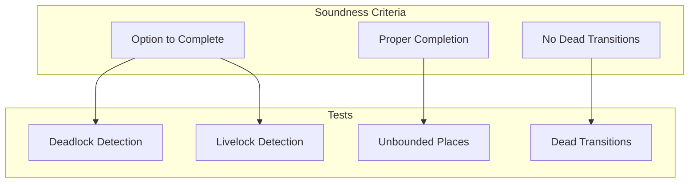
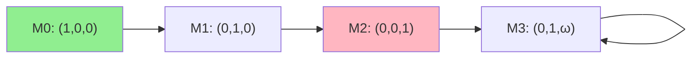
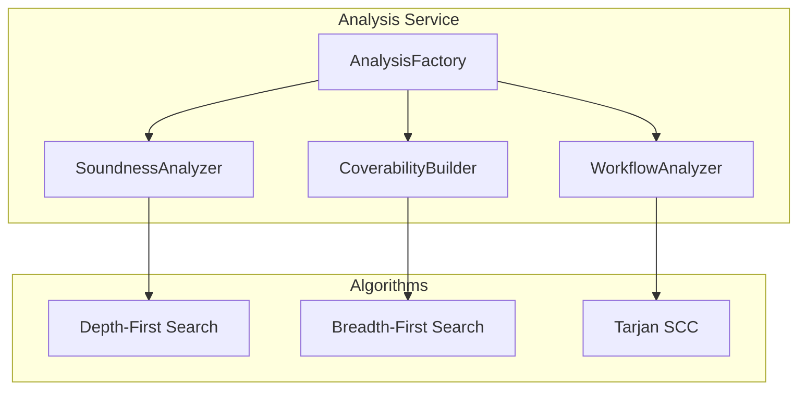
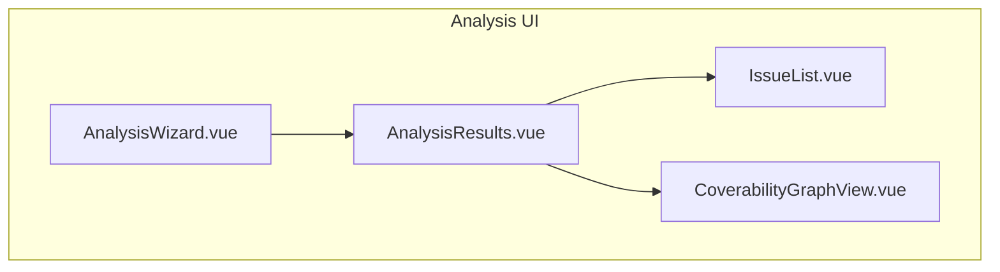
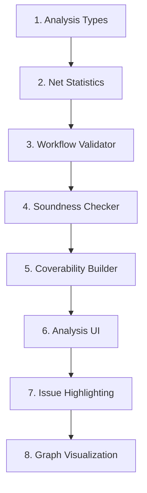

# Feature: Qualitative Analysis

## Overview

Structural and semantic analysis of workflow nets to verify correctness and soundness.



## Legacy Implementation

### Affected Classes

```
WoPeD-QualAnalysis/
├── service/
│   ├── QualAnalysisServiceFactory.java
│   ├── QualanalysisServiceImplement.java
│   └── interfaces/
│       ├── IWorkflowCheck.java
│       ├── ISoundnessCheck.java
│       └── INetStatistics.java
├── structure/
│   ├── StructuralAnalysis.java
│   └── NetAlgorithms.java
├── soundness/
│   ├── SoundnessCheckImplement.java
│   ├── DeadTransitionTest.java
│   └── NonLiveTransitionTest.java
└── coverabilitygraph/
    ├── CoverabilityGraph.java
    └── CoverabilityGraphModel.java
```

## Analysis Types

### 1. Workflow-Net Validation



### 2. Soundness Check



### 3. Coverability Graph



## Modern Implementation

### Data Model

```typescript
// types/analysis.ts
interface AnalysisResult {
  timestamp: Date
  type: 'workflow' | 'soundness' | 'structural'
  valid: boolean
  issues: AnalysisIssue[]
  statistics: NetStatistics
}

interface AnalysisIssue {
  severity: 'error' | 'warning' | 'info'
  code: string
  message: string
  affectedElements: string[]
}

interface NetStatistics {
  places: number
  transitions: number
  arcs: number
  operators: number
  sourcePlaces: string[]
  sinkPlaces: string[]
  stronglyConnected: boolean
  freeChoice: boolean
}

interface CoverabilityNode {
  id: string
  marking: Map<string, number | 'omega'>
  parent?: string
  firedTransition?: string
}

interface CoverabilityGraph {
  nodes: CoverabilityNode[]
  edges: { from: string; to: string; label: string }[]
  bounded: boolean
  deadlocks: string[]
}
```

### Service Architecture



```typescript
// services/analysis/workflowAnalyzer.ts
export class WorkflowAnalyzer {
  analyze(net: PetriNet): AnalysisResult {
    const issues: AnalysisIssue[] = []
    
    // Source Place Check
    const sources = this.findSourcePlaces(net)
    if (sources.length !== 1) {
      issues.push({
        severity: 'error',
        code: 'WF001',
        message: `Expected 1 source place, found ${sources.length}`,
        affectedElements: sources
      })
    }
    
    // Sink Place Check
    const sinks = this.findSinkPlaces(net)
    if (sinks.length !== 1) {
      issues.push({
        severity: 'error',
        code: 'WF002',
        message: `Expected 1 sink place, found ${sinks.length}`,
        affectedElements: sinks
      })
    }
    
    // Connectivity Check
    if (!this.isStronglyConnected(net)) {
      issues.push({
        severity: 'error',
        code: 'WF003',
        message: 'Net is not strongly connected',
        affectedElements: this.getDisconnectedElements(net)
      })
    }
    
    return {
      timestamp: new Date(),
      type: 'workflow',
      valid: issues.filter(i => i.severity === 'error').length === 0,
      issues,
      statistics: this.computeStatistics(net)
    }
  }
}
```

### Coverability Graph Builder

```typescript
// services/analysis/coverabilityBuilder.ts
export class CoverabilityBuilder {
  build(net: PetriNet, initialMarking: Marking): CoverabilityGraph {
    const nodes: CoverabilityNode[] = []
    const edges: CoverabilityGraph['edges'] = []
    const visited = new Map<string, CoverabilityNode>()
    const queue: CoverabilityNode[] = []
    
    // Initial node
    const initial: CoverabilityNode = {
      id: 'M0',
      marking: new Map(initialMarking.tokens)
    }
    nodes.push(initial)
    queue.push(initial)
    visited.set(this.markingKey(initial.marking), initial)
    
    while (queue.length > 0) {
      const current = queue.shift()!
      const enabled = this.getEnabledTransitions(net, current.marking)
      
      for (const transition of enabled) {
        const newMarking = this.fire(net, current.marking, transition)
        
        // Omega check for unboundedness
        this.checkOmega(newMarking, nodes, current)
        
        const key = this.markingKey(newMarking)
        let targetNode = visited.get(key)
        
        if (!targetNode) {
          targetNode = {
            id: `M${nodes.length}`,
            marking: newMarking,
            parent: current.id,
            firedTransition: transition
          }
          nodes.push(targetNode)
          queue.push(targetNode)
          visited.set(key, targetNode)
        }
        
        edges.push({
          from: current.id,
          to: targetNode.id,
          label: transition
        })
      }
    }
    
    return {
      nodes,
      edges,
      bounded: !this.hasOmega(nodes),
      deadlocks: this.findDeadlocks(nodes, net)
    }
  }
}
```

### UI Components



```vue
<!-- components/analysis/AnalysisResults.vue -->
<template>
  <div class="analysis-results">
    <header>
      <h2>{{ result.type }} Analysis</h2>
      <Badge :variant="result.valid ? 'success' : 'error'">
        {{ result.valid ? 'Valid' : 'Invalid' }}
      </Badge>
    </header>
    
    <section class="statistics">
      <StatCard label="Places" :value="result.statistics.places" />
      <StatCard label="Transitions" :value="result.statistics.transitions" />
      <StatCard label="Arcs" :value="result.statistics.arcs" />
    </section>
    
    <section class="issues">
      <IssueList :issues="result.issues" @highlight="highlightElement" />
    </section>
  </div>
</template>
```

## Migration Steps



## UI Mockup

```
┌─────────────────────────────────────────────────────────────┐
│ Qualitative Analysis                          [Run ▶]      │
├─────────────────────────────────────────────────────────────┤
│ ┌─────────────────┐ ┌─────────────────┐ ┌─────────────────┐│
│ │ Workflow Check  │ │ Soundness Check │ │ Coverability    ││
│ │      ✓ Valid    │ │      ✗ Invalid  │ │    ⚠ Unbounded  ││
│ └─────────────────┘ └─────────────────┘ └─────────────────┘│
├─────────────────────────────────────────────────────────────┤
│ Issues (2)                                                  │
│ ┌─────────────────────────────────────────────────────────┐│
│ │ ✗ ERROR: Dead transition found: T3                [Show]││
│ │ ⚠ WARN: Place P5 is unbounded                    [Show]││
│ └─────────────────────────────────────────────────────────┘│
├─────────────────────────────────────────────────────────────┤
│ Coverability Graph                              [Expand]    │
│ ┌─────────────────────────────────────────────────────────┐│
│ │   (M0)──T1──►(M1)──T2──►(M2)                           ││
│ │                    │                                     ││
│ │                    T3                                    ││
│ │                    ▼                                     ││
│ │                  (M3)◄─────────┐                        ││
│ │                    └────T4─────┘                        ││
│ └─────────────────────────────────────────────────────────┘│
└─────────────────────────────────────────────────────────────┘
```

## Test Plan

| Test | Description |
|------|-------------|
| Unit | Algorithms (SCC, reachability) |
| Integration | Complete analysis pipeline |
| Regression | Validate known test nets |
