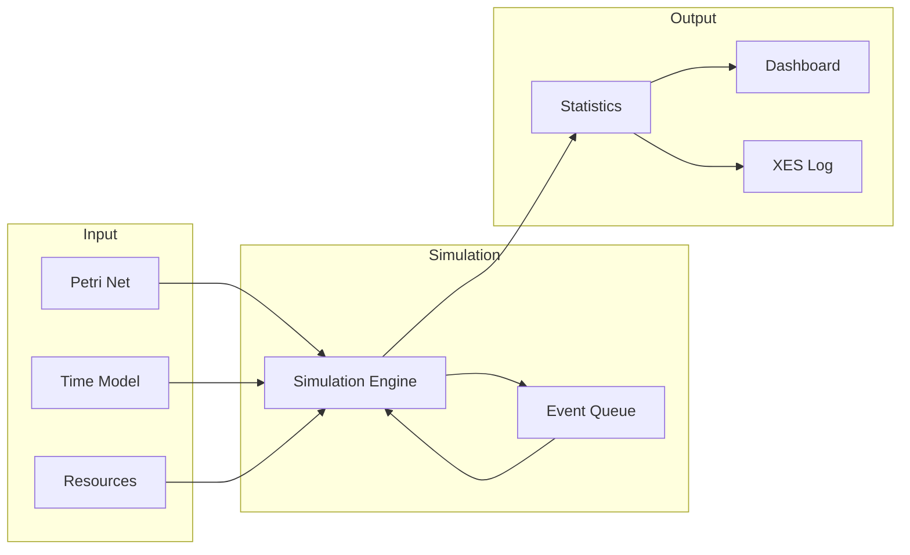
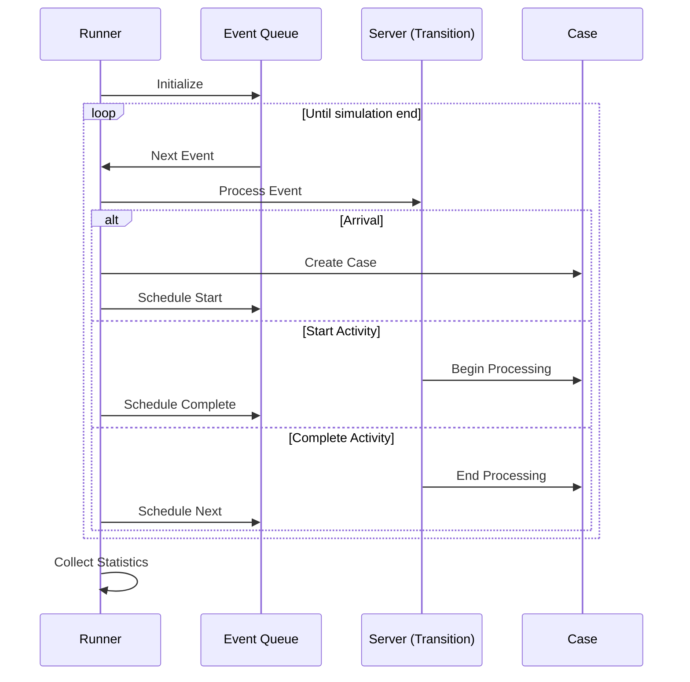
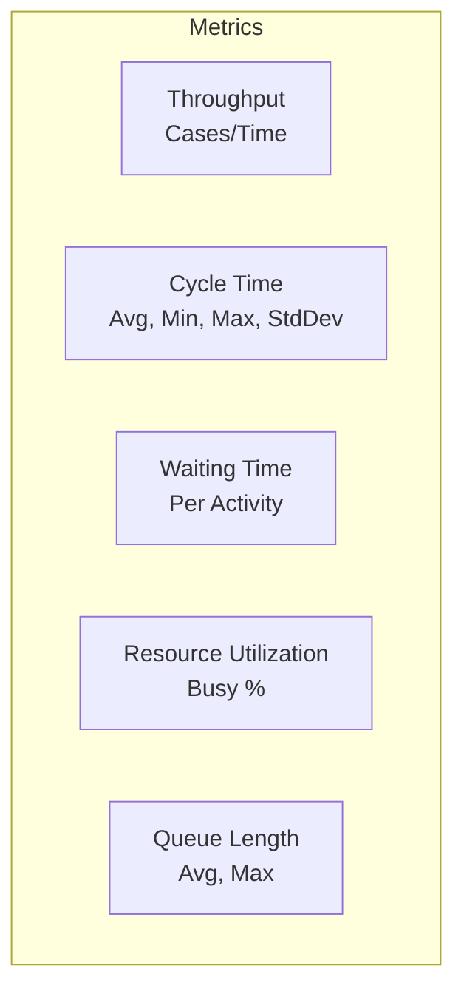
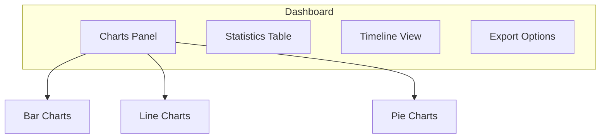
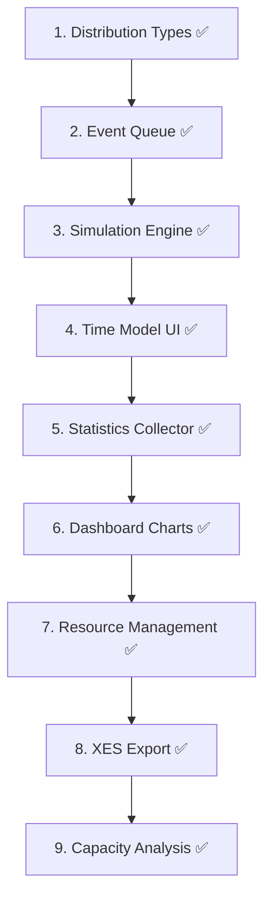

# Feature: Quantitative Simulation

## Overview

Discrete event simulation for analyzing throughput times, resource utilization, and capacity planning.



## Legacy Implementation

### Affected Classes

```
WoPeD-QuantAnalysis/
├── sim/
│   ├── SimRunner.java
│   ├── SimGraph.java
│   ├── SimCase.java
│   ├── SimServer.java
│   ├── SimDistribution.java
│   └── SimLog.java
├── model/
│   ├── TimeModel.java
│   └── ResourceStats.java
├── gui/
│   ├── QuantitativeSimulationDialog.java
│   └── CapacityAnalysisDialog.java
└── dashboard/
    ├── DashboardRunner.java
    └── ThinServer.java
```

## Modern Implementation

### Data Model

```typescript
// types/simulation.ts
interface SimulationConfig {
  arrivalRate: number
  simulationTime: number
  warmupTime: number
  replications: number
  seed?: number
}

interface TimeModel {
  transitionTimes: Map<string, Distribution>
  defaultTime: Distribution
}

interface Distribution {
  type: 'constant' | 'exponential' | 'normal' | 'uniform'
  params: number[]
}

interface SimulationResult {
  cases: SimCase[]
  statistics: SimStatistics
  resourceUtilization: ResourceUtilization[]
  throughput: number
  avgCycleTime: number
}

interface SimCase {
  id: string
  startTime: number
  endTime: number
  events: SimEvent[]
  completed: boolean
}

interface SimEvent {
  time: number
  type: 'arrive' | 'start' | 'complete' | 'depart'
  transitionId: string
  caseId: string
}
```

### Simulation Engine



```typescript
// services/simulation/simulationEngine.ts
export class SimulationEngine {
  private eventQueue: PriorityQueue<SimEvent>
  private currentTime: number = 0
  private cases: Map<string, SimCase> = new Map()
  private rng: RandomGenerator
  
  constructor(
    private net: PetriNet,
    private config: SimulationConfig,
    private timeModel: TimeModel
  ) {
    this.eventQueue = new PriorityQueue((a, b) => a.time - b.time)
    this.rng = new RandomGenerator(config.seed)
  }
  
  run(): SimulationResult {
    this.initialize()
    
    while (this.eventQueue.size > 0) {
      const event = this.eventQueue.pop()!
      
      if (event.time > this.config.simulationTime) break
      
      this.currentTime = event.time
      this.processEvent(event)
    }
    
    return this.collectResults()
  }
  
  private processEvent(event: SimEvent) {
    switch (event.type) {
      case 'arrive':
        this.handleArrival(event)
        break
      case 'start':
        this.handleStart(event)
        break
      case 'complete':
        this.handleComplete(event)
        break
      case 'depart':
        this.handleDeparture(event)
        break
    }
  }
  
  private handleArrival(event: SimEvent) {
    const caseObj: SimCase = {
      id: `case-${this.cases.size}`,
      startTime: this.currentTime,
      endTime: 0,
      events: [event],
      completed: false
    }
    this.cases.set(caseObj.id, caseObj)
    
    // Schedule first activity
    const firstTransition = this.getFirstEnabledTransition()
    if (firstTransition) {
      this.scheduleStart(caseObj.id, firstTransition)
    }
    
    // Schedule next arrival
    const interArrivalTime = this.sampleDistribution(
      { type: 'exponential', params: [1 / this.config.arrivalRate] }
    )
    this.eventQueue.push({
      time: this.currentTime + interArrivalTime,
      type: 'arrive',
      transitionId: '',
      caseId: ''
    })
  }
  
  private sampleDistribution(dist: Distribution): number {
    switch (dist.type) {
      case 'constant':
        return dist.params[0]
      case 'exponential':
        return -Math.log(1 - this.rng.random()) * dist.params[0]
      case 'normal':
        return this.boxMuller(dist.params[0], dist.params[1])
      case 'uniform':
        return dist.params[0] + this.rng.random() * (dist.params[1] - dist.params[0])
    }
  }
}
```

### Statistics Collection



```typescript
// services/simulation/statisticsCollector.ts
export class StatisticsCollector {
  computeStatistics(result: SimulationResult): SimStatistics {
    const completedCases = result.cases.filter(c => c.completed)
    const cycleTimes = completedCases.map(c => c.endTime - c.startTime)
    
    return {
      throughput: completedCases.length / result.simulationTime,
      cycleTime: {
        avg: mean(cycleTimes),
        min: Math.min(...cycleTimes),
        max: Math.max(...cycleTimes),
        stdDev: standardDeviation(cycleTimes)
      },
      completionRate: completedCases.length / result.cases.length,
      casesStarted: result.cases.length,
      casesCompleted: completedCases.length
    }
  }
}
```

### Dashboard Component



```vue
<!-- components/simulation/SimulationDashboard.vue -->
<template>
  <div class="simulation-dashboard">
    <header>
      <h2>Simulation Results</h2>
      <div class="actions">
        <Button @click="exportXES">Export XES</Button>
        <Button @click="exportCSV">Export CSV</Button>
      </div>
    </header>
    
    <div class="metrics-grid">
      <MetricCard 
        title="Throughput" 
        :value="stats.throughput" 
        unit="cases/hour" 
      />
      <MetricCard 
        title="Avg Cycle Time" 
        :value="stats.cycleTime.avg" 
        unit="minutes" 
      />
      <MetricCard 
        title="Completion Rate" 
        :value="stats.completionRate * 100" 
        unit="%" 
      />
    </div>
    
    <div class="charts">
      <LineChart 
        title="Throughput over Time" 
        :data="throughputData" 
      />
      <BarChart 
        title="Activity Times" 
        :data="activityData" 
      />
      <PieChart 
        title="Resource Utilization" 
        :data="utilizationData" 
      />
    </div>
  </div>
</template>
```

### XES Export

```typescript
// services/simulation/xesExporter.ts
export class XESExporter {
  export(result: SimulationResult): string {
    const events = result.cases.flatMap(c => 
      c.events.map(e => ({
        caseId: c.id,
        activity: e.transitionId,
        timestamp: new Date(e.time * 1000).toISOString(),
        lifecycle: this.mapLifecycle(e.type)
      }))
    )
    
    return this.generateXML(events)
  }
  
  private generateXML(events: any[]): string {
    return `<?xml version="1.0" encoding="UTF-8"?>
<log xes.version="1.0">
  ${this.groupByCases(events).map(c => `
  <trace>
    <string key="concept:name" value="${c.caseId}"/>
    ${c.events.map(e => `
    <event>
      <string key="concept:name" value="${e.activity}"/>
      <date key="time:timestamp" value="${e.timestamp}"/>
      <string key="lifecycle:transition" value="${e.lifecycle}"/>
    </event>`).join('')}
  </trace>`).join('')}
</log>`
  }
}
```

## Migration Steps



### Implemented Features

1. **Distribution Types** ✅ - `src/types/simulation.ts`
   - Constant, Exponential, Normal, Uniform, Triangular
   
2. **Priority Queue** ✅ - `src/utils/priorityQueue.ts`
   - Min-heap based event queue
   
3. **Simulation Engine** ✅ - `src/services/simulation/SimulationEngine.ts`
   - Discrete event simulation
   - Arrival/Start/Complete/Depart events
   - Marking-based transition activation
   
4. **Time Model UI** ✅ - `src/components/simulation/TimeModelConfig.vue`
   - Configurable default distribution
   - Per-transition time configuration
   
5. **Statistics Collector** ✅
   - Throughput, cycle time, completion rate
   - Activity statistics with utilization
   - Percentiles (P90, P95)
   
6. **Dashboard Charts** ✅
   - SVG-based visualization
   - Utilization bars
   
7. **Resource Management** ✅
   - Resource definition and allocation
   - Utilization tracking
   
8. **XES Export** ✅ - `src/services/simulation/XESExporter.ts`
   - Standard XES format for process mining tools

9. **Capacity Analysis** ✅
   - Bottleneck detection
   - Utilization analysis

## UI Mockup

```
┌─────────────────────────────────────────────────────────────┐
│ Quantitative Simulation                                     │
├─────────────────────────────────────────────────────────────┤
│ Configuration                                               │
│ ┌─────────────────────────────────────────────────────────┐│
│ │ Arrival Rate: [10   ] cases/hour                        ││
│ │ Simulation:   [1000 ] time units                        ││
│ │ Warmup:       [100  ] time units                        ││
│ │ Replications: [5    ]                                   ││
│ └─────────────────────────────────────────────────────────┘│
│                                            [Run Simulation] │
├─────────────────────────────────────────────────────────────┤
│ Results                                                     │
│ ┌───────────┬───────────┬───────────┬───────────┐          │
│ │Throughput │ Cycle Time│ Completed │ Utilization│          │
│ │  8.5/hr   │  45 min   │   850     │    72%     │          │
│ └───────────┴───────────┴───────────┴───────────┘          │
│                                                             │
│ ┌─────────────────────────────────────────────────────────┐│
│ │     📈 Throughput over Time                             ││
│ │   ▄▄▄                                                   ││
│ │  ▄████▄▄▄▄▄▄▄▄▄▄▄▄▄▄▄▄▄▄▄                              ││
│ │ ▄███████████████████████████                            ││
│ └─────────────────────────────────────────────────────────┘│
└─────────────────────────────────────────────────────────────┘
```

## Dependencies

No additional charting dependencies. Charts are rendered using custom inline SVG
in `SimulationCharts.vue` (utilization bars, cycle-time histogram, activity
counts). This keeps the bundle lean and avoids the ≈200 kB overhead of chart.js.

> **Note:** The original plan listed `chart.js` and `vue-chartjs`. These were
> replaced by lightweight SVG-based charts that are sufficient for the
> simulation result visualizations.

## Test Plan

| Test | Description |
|------|-------------|
| Unit | Distribution sampling, event processing |
| Integration | Full simulation run |
| Validation | Known models against analytical solutions |
| Performance | Large simulations (100k+ events) |
