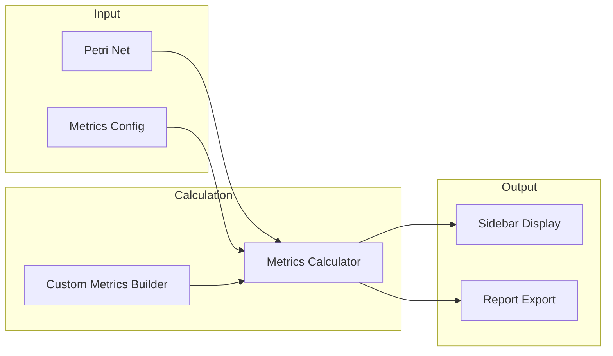
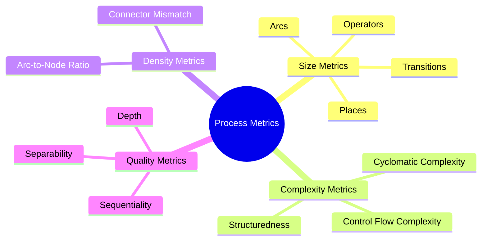
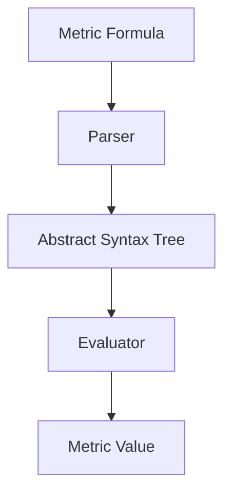
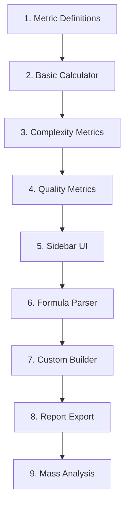

# Feature: Process Metrics

## Overview

Calculation and display of process metrics for evaluating model quality and complexity.



## Standard Metrics



## Legacy Implementation

### Affected Classes

```
WoPeD-ProcessMetrics/
├── metricsCalculation/
│   ├── MetricsCalculator.java
│   └── MetricsInterpreter.java
├── builder/
│   ├── MetricsBuilder.java
│   └── MetricsBuilderPanel.java
├── sidebar/
│   └── SideBar.java
├── formalGrammar/
│   └── metricsGrammar.g
└── jbpt/
    └── RPSTHandler.java
```

## Modern Implementation

### Data Model

```typescript
// types/metrics.ts
interface MetricDefinition {
  id: string
  name: string
  description: string
  category: 'size' | 'complexity' | 'density' | 'quality'
  formula?: string
  threshold?: {
    good: number
    warning: number
    bad: number
  }
}

interface MetricResult {
  metricId: string
  value: number
  rating: 'good' | 'warning' | 'bad' | 'neutral'
  details?: string
}

interface MetricsReport {
  timestamp: Date
  netId: string
  metrics: MetricResult[]
  summary: {
    totalMetrics: number
    good: number
    warning: number
    bad: number
  }
}
```

### Standard Metrics Definitions

```typescript
// constants/metrics.ts
export const STANDARD_METRICS: MetricDefinition[] = [
  // Size Metrics
  {
    id: 'places',
    name: 'Number of Places',
    category: 'size',
    description: 'Total count of places in the net'
  },
  {
    id: 'transitions',
    name: 'Number of Transitions',
    category: 'size',
    description: 'Total count of transitions in the net'
  },
  {
    id: 'arcs',
    name: 'Number of Arcs',
    category: 'size',
    description: 'Total count of arcs in the net'
  },
  
  // Complexity Metrics
  {
    id: 'cyclomaticComplexity',
    name: 'Cyclomatic Complexity',
    category: 'complexity',
    description: 'CC = Arcs - Nodes + 2',
    formula: 'arcs - (places + transitions) + 2',
    threshold: { good: 10, warning: 20, bad: 30 }
  },
  {
    id: 'controlFlowComplexity',
    name: 'Control Flow Complexity',
    category: 'complexity',
    description: 'Sum of split/join complexities',
    threshold: { good: 5, warning: 10, bad: 20 }
  },
  
  // Density Metrics
  {
    id: 'density',
    name: 'Arc Density',
    category: 'density',
    description: 'Arcs / (Places × Transitions)',
    threshold: { good: 0.5, warning: 0.7, bad: 0.9 }
  },
  {
    id: 'connectorMismatch',
    name: 'Connector Mismatch',
    category: 'density',
    description: 'Abs(AND-splits - AND-joins) + Abs(XOR-splits - XOR-joins)',
    threshold: { good: 0, warning: 2, bad: 5 }
  },
  
  // Quality Metrics
  {
    id: 'separability',
    name: 'Separability',
    category: 'quality',
    description: 'Ratio of cut vertices to total nodes',
    threshold: { good: 0.3, warning: 0.5, bad: 0.7 }
  },
  {
    id: 'sequentiality',
    name: 'Sequentiality',
    category: 'quality',
    description: 'Ratio of nodes on sequential paths',
    threshold: { good: 0.7, warning: 0.5, bad: 0.3 }
  }
]
```

### Metrics Calculator

```typescript
// services/metrics/metricsCalculator.ts
export class MetricsCalculator {
  calculate(net: PetriNet): MetricsReport {
    const results: MetricResult[] = []
    
    // Size Metrics
    results.push(this.calculateSizeMetrics(net))
    
    // Complexity Metrics
    results.push(this.calculateComplexityMetrics(net))
    
    // Density Metrics
    results.push(this.calculateDensityMetrics(net))
    
    // Quality Metrics
    results.push(this.calculateQualityMetrics(net))
    
    return {
      timestamp: new Date(),
      netId: net.id,
      metrics: results.flat(),
      summary: this.summarize(results.flat())
    }
  }
  
  private calculateComplexityMetrics(net: PetriNet): MetricResult[] {
    const nodes = net.places.length + net.transitions.length
    const arcs = net.arcs.length
    
    // Cyclomatic Complexity
    const cc = arcs - nodes + 2
    
    // Control Flow Complexity
    const operators = net.transitions.filter(t => 'operatorType' in t)
    const cfc = operators.reduce((sum, op) => {
      return sum + this.getOperatorComplexity(op)
    }, 0)
    
    return [
      this.createResult('cyclomaticComplexity', cc),
      this.createResult('controlFlowComplexity', cfc)
    ]
  }
  
  private createResult(metricId: string, value: number): MetricResult {
    const definition = STANDARD_METRICS.find(m => m.id === metricId)!
    
    return {
      metricId,
      value,
      rating: this.getRating(value, definition.threshold)
    }
  }
  
  private getRating(
    value: number, 
    threshold?: MetricDefinition['threshold']
  ): MetricResult['rating'] {
    if (!threshold) return 'neutral'
    if (value <= threshold.good) return 'good'
    if (value <= threshold.warning) return 'warning'
    return 'bad'
  }
}
```

### Custom Metrics Builder



```typescript
// services/metrics/customMetricsBuilder.ts
interface CustomMetric extends MetricDefinition {
  formula: string
}

export class CustomMetricsBuilder {
  private parser: FormulaParser
  
  createMetric(formula: string, name: string): CustomMetric {
    // Parse and validate formula
    const ast = this.parser.parse(formula)
    this.validate(ast)
    
    return {
      id: `custom_${Date.now()}`,
      name,
      description: `Custom metric: ${formula}`,
      category: 'custom' as any,
      formula
    }
  }
  
  evaluate(metric: CustomMetric, net: PetriNet): number {
    const context = this.buildContext(net)
    return this.parser.evaluate(metric.formula, context)
  }
  
  private buildContext(net: PetriNet): Record<string, number> {
    return {
      places: net.places.length,
      transitions: net.transitions.length,
      arcs: net.arcs.length,
      andSplits: this.countOperators(net, 'and-split'),
      andJoins: this.countOperators(net, 'and-join'),
      xorSplits: this.countOperators(net, 'xor-split'),
      xorJoins: this.countOperators(net, 'xor-join'),
      // ... more variables
    }
  }
}
```

### Sidebar Component

```vue
<!-- components/metrics/MetricsSidebar.vue -->
<template>
  <aside class="metrics-sidebar">
    <header>
      <h3>Process Metrics</h3>
      <Button size="sm" @click="refresh">Refresh</Button>
    </header>
    
    <div class="metrics-list">
      <section v-for="category in categories" :key="category">
        <h4>{{ categoryLabels[category] }}</h4>
        
        <MetricItem
          v-for="metric in getMetricsByCategory(category)"
          :key="metric.metricId"
          :metric="metric"
          :definition="getDefinition(metric.metricId)"
        />
      </section>
    </div>
    
    <footer>
      <Button @click="showBuilder">Custom Metric</Button>
      <Button @click="exportReport">Export</Button>
    </footer>
  </aside>
</template>

<script setup>
const categories = ['size', 'complexity', 'density', 'quality']

const categoryLabels = {
  size: 'Size Metrics',
  complexity: 'Complexity Metrics',
  density: 'Density Metrics',
  quality: 'Quality Metrics'
}
</script>
```

```vue
<!-- components/metrics/MetricItem.vue -->
<template>
  <div class="metric-item" :class="metric.rating">
    <div class="metric-header">
      <span class="name">{{ definition.name }}</span>
      <span class="value">{{ formatValue(metric.value) }}</span>
    </div>
    
    <div class="metric-bar">
      <div 
        class="metric-fill" 
        :style="{ width: normalizedWidth + '%' }"
      />
    </div>
    
    <Tooltip>{{ definition.description }}</Tooltip>
  </div>
</template>
```

## Migration Steps



## UI Mockup

```
┌────────────────────────┐
│ Process Metrics    [↻] │
├────────────────────────┤
│ SIZE                   │
│ ├─ Places        12    │
│ ├─ Transitions   8     │
│ └─ Arcs          25    │
│                        │
│ COMPLEXITY             │
│ ├─ Cyclomatic    ██░ 7 │
│ └─ CFC           █░░ 3 │
│                        │
│ DENSITY                │
│ ├─ Arc Density   ██░.26│
│ └─ Mismatch      ░░░ 0 │
│                        │
│ QUALITY                │
│ ├─ Separability  ██░.35│
│ └─ Sequentiality ███.72│
├────────────────────────┤
│ [+ Custom] [Export]    │
└────────────────────────┘
```

## Test Plan

| Test | Description |
|------|-------------|
| Unit | Metrics calculations |
| Parser | Formula parsing & evaluation |
| Integration | Real-time updates |
| Validation | Compare against legacy values |
