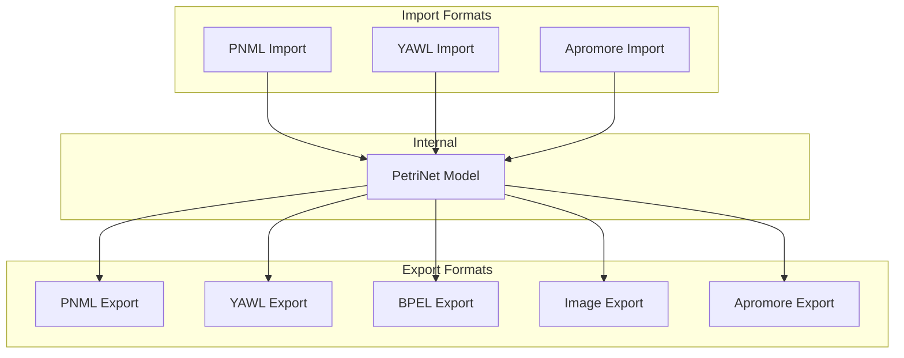
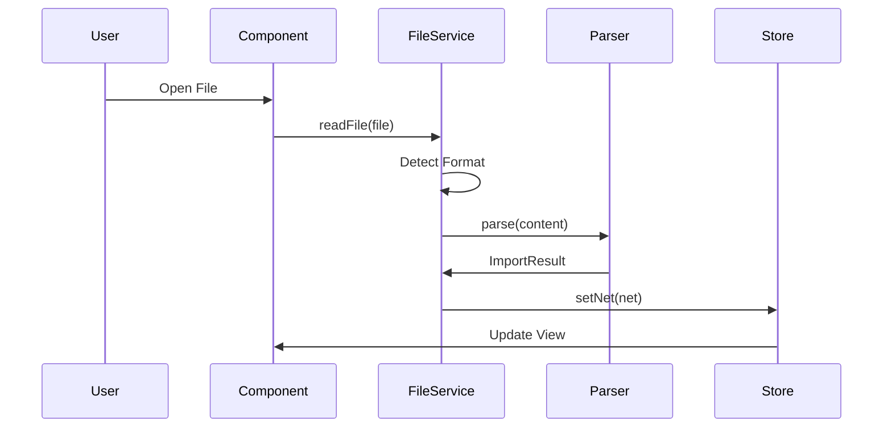
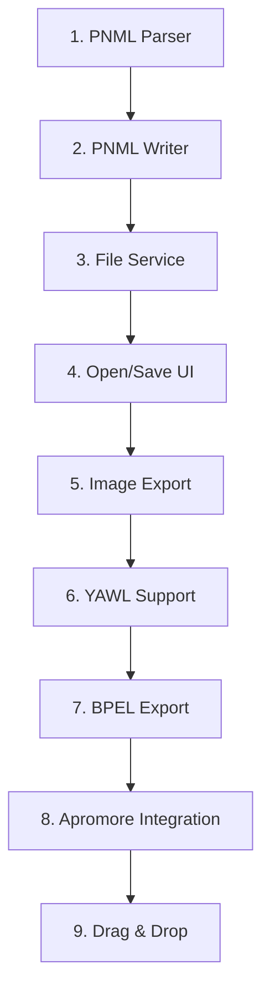

# Feature: File Operations

## Übersicht

Import und Export von Petri-Netzen in verschiedenen Formaten.



## Legacy Implementation

### Betroffene Klassen

```
WoPeD-FileInterface/
├── PNMLImport.java
├── PNMLExport.java
├── yawl/
│   ├── YawlImport.java
│   └── YawlExport.java
├── apromore/
│   ├── ApromoreImportFrame.java
│   └── ApromoreExportFrame.java
└── WoPeDToYAWL/

WoPeD-BPELExport/
├── BPEL.java
└── BpelParserModel.java

WoPeD-BeanPnml/
└── pnml_wf.xsd
```

## Formate

### PNML (Petri Net Markup Language)

```xml
<?xml version="1.0" encoding="UTF-8"?>
<pnml>
  <net id="net1" type="http://www.pnml.org/version-2009/grammar/ptnet">
    <place id="p1">
      <name><text>Start</text></name>
      <initialMarking><text>1</text></initialMarking>
      <graphics><position x="100" y="100"/></graphics>
    </place>
    <transition id="t1">
      <name><text>Task 1</text></name>
      <graphics><position x="200" y="100"/></graphics>
    </transition>
    <arc id="a1" source="p1" target="t1"/>
  </net>
</pnml>
```

### YAWL

```xml
<?xml version="1.0" encoding="UTF-8"?>
<specificationSet>
  <specification uri="example">
    <decomposition id="Net" isRootNet="true" xsi:type="NetFactsType">
      <inputCondition id="start"/>
      <task id="task1">
        <name>Task 1</name>
        <flowsInto><nextElementRef id="end"/></flowsInto>
      </task>
      <outputCondition id="end"/>
    </decomposition>
  </specification>
</specificationSet>
```

## Moderne Implementation

### Datenmodell

```typescript
// types/fileFormats.ts
type FileFormat = 'pnml' | 'yawl' | 'bpel' | 'json' | 'svg' | 'png'

interface ImportResult {
  success: boolean
  net?: PetriNet
  errors: ImportError[]
  warnings: string[]
}

interface ImportError {
  line?: number
  message: string
  element?: string
}

interface ExportOptions {
  format: FileFormat
  includeLayout: boolean
  includeMetadata: boolean
}
```

### PNML Parser/Writer

```typescript
// services/file/pnmlParser.ts
export class PNMLParser {
  parse(xml: string): ImportResult {
    const errors: ImportError[] = []
    const warnings: string[] = []
    
    try {
      const doc = new DOMParser().parseFromString(xml, 'text/xml')
      
      // Check for parse errors
      const parseError = doc.querySelector('parsererror')
      if (parseError) {
        return {
          success: false,
          errors: [{ message: 'Invalid XML: ' + parseError.textContent }],
          warnings: []
        }
      }
      
      const netElement = doc.querySelector('net')
      if (!netElement) {
        return {
          success: false,
          errors: [{ message: 'No <net> element found' }],
          warnings: []
        }
      }
      
      const net: PetriNet = {
        id: netElement.getAttribute('id') || generateId(),
        name: this.getName(netElement),
        places: this.parsePlaces(netElement, errors),
        transitions: this.parseTransitions(netElement, errors),
        arcs: this.parseArcs(netElement, errors)
      }
      
      return { success: errors.length === 0, net, errors, warnings }
    } catch (e) {
      return {
        success: false,
        errors: [{ message: `Parse error: ${e.message}` }],
        warnings: []
      }
    }
  }
  
  private parsePlaces(net: Element, errors: ImportError[]): Place[] {
    return Array.from(net.querySelectorAll('place')).map(p => {
      const pos = p.querySelector('graphics > position')
      return {
        id: p.getAttribute('id') || generateId(),
        name: this.getTextContent(p, 'name > text'),
        position: {
          x: parseFloat(pos?.getAttribute('x') || '0'),
          y: parseFloat(pos?.getAttribute('y') || '0')
        },
        tokens: parseInt(this.getTextContent(p, 'initialMarking > text') || '0'),
        capacity: -1
      }
    })
  }
}
```

```typescript
// services/file/pnmlWriter.ts
export class PNMLWriter {
  write(net: PetriNet, options: ExportOptions): string {
    const doc = document.implementation.createDocument(null, 'pnml', null)
    const pnml = doc.documentElement
    
    const netEl = doc.createElement('net')
    netEl.setAttribute('id', net.id)
    netEl.setAttribute('type', 'http://www.pnml.org/version-2009/grammar/ptnet')
    
    // Places
    for (const place of net.places) {
      netEl.appendChild(this.createPlaceElement(doc, place, options))
    }
    
    // Transitions
    for (const transition of net.transitions) {
      netEl.appendChild(this.createTransitionElement(doc, transition, options))
    }
    
    // Arcs
    for (const arc of net.arcs) {
      netEl.appendChild(this.createArcElement(doc, arc))
    }
    
    pnml.appendChild(netEl)
    
    return new XMLSerializer().serializeToString(doc)
  }
  
  private createPlaceElement(
    doc: Document, 
    place: Place, 
    options: ExportOptions
  ): Element {
    const el = doc.createElement('place')
    el.setAttribute('id', place.id)
    
    // Name
    const name = doc.createElement('name')
    const nameText = doc.createElement('text')
    nameText.textContent = place.name
    name.appendChild(nameText)
    el.appendChild(name)
    
    // Initial Marking
    if (place.tokens > 0) {
      const marking = doc.createElement('initialMarking')
      const markingText = doc.createElement('text')
      markingText.textContent = place.tokens.toString()
      marking.appendChild(markingText)
      el.appendChild(marking)
    }
    
    // Graphics (Position)
    if (options.includeLayout) {
      const graphics = doc.createElement('graphics')
      const position = doc.createElement('position')
      position.setAttribute('x', place.position.x.toString())
      position.setAttribute('y', place.position.y.toString())
      graphics.appendChild(position)
      el.appendChild(graphics)
    }
    
    return el
  }
}
```

### Image Export

```typescript
// services/file/imageExporter.ts
export class ImageExporter {
  async exportSVG(net: PetriNet): Promise<string> {
    // Render to off-screen SVG
    const svg = this.renderToSVG(net)
    return new XMLSerializer().serializeToString(svg)
  }
  
  async exportPNG(net: PetriNet, scale: number = 2): Promise<Blob> {
    const svg = this.renderToSVG(net)
    const svgData = new XMLSerializer().serializeToString(svg)
    const svgBlob = new Blob([svgData], { type: 'image/svg+xml' })
    const url = URL.createObjectURL(svgBlob)
    
    const img = new Image()
    await new Promise(resolve => {
      img.onload = resolve
      img.src = url
    })
    
    const canvas = document.createElement('canvas')
    canvas.width = img.width * scale
    canvas.height = img.height * scale
    
    const ctx = canvas.getContext('2d')!
    ctx.scale(scale, scale)
    ctx.drawImage(img, 0, 0)
    
    URL.revokeObjectURL(url)
    
    return new Promise(resolve => {
      canvas.toBlob(blob => resolve(blob!), 'image/png')
    })
  }
}
```

### File Service



```typescript
// services/file/fileService.ts
export class FileService {
  private parsers = {
    pnml: new PNMLParser(),
    yawl: new YAWLParser(),
    json: new JSONParser()
  }
  
  private writers = {
    pnml: new PNMLWriter(),
    yawl: new YAWLWriter(),
    bpel: new BPELWriter(),
    json: new JSONWriter()
  }
  
  async import(file: File): Promise<ImportResult> {
    const content = await file.text()
    const format = this.detectFormat(file.name, content)
    
    const parser = this.parsers[format]
    if (!parser) {
      return {
        success: false,
        errors: [{ message: `Unsupported format: ${format}` }],
        warnings: []
      }
    }
    
    return parser.parse(content)
  }
  
  async export(net: PetriNet, options: ExportOptions): Promise<Blob> {
    const writer = this.writers[options.format]
    const content = writer.write(net, options)
    
    const mimeType = this.getMimeType(options.format)
    return new Blob([content], { type: mimeType })
  }
  
  private detectFormat(filename: string, content: string): FileFormat {
    const ext = filename.split('.').pop()?.toLowerCase()
    
    if (ext === 'pnml' || content.includes('<pnml')) return 'pnml'
    if (ext === 'yawl' || content.includes('<specificationSet')) return 'yawl'
    if (ext === 'json') return 'json'
    
    return 'pnml' // Default
  }
}
```

### UI-Komponenten

```vue
<!-- components/file/FileDialog.vue -->
<template>
  <Dialog v-model:open="isOpen">
    <DialogContent>
      <Tabs v-model="activeTab">
        <TabsList>
          <TabsTrigger value="open">Open</TabsTrigger>
          <TabsTrigger value="save">Save</TabsTrigger>
          <TabsTrigger value="export">Export</TabsTrigger>
        </TabsList>
        
        <TabsContent value="open">
          <DropZone @drop="handleFileDrop">
            <p>Drop file here or click to browse</p>
            <p class="hint">Supports: PNML, YAWL, JSON</p>
          </DropZone>
          
          <div v-if="importResult?.errors.length">
            <Alert variant="error">
              <p v-for="error in importResult.errors">
                {{ error.message }}
              </p>
            </Alert>
          </div>
        </TabsContent>
        
        <TabsContent value="export">
          <RadioGroup v-model="exportFormat">
            <RadioItem value="pnml">PNML</RadioItem>
            <RadioItem value="svg">SVG Image</RadioItem>
            <RadioItem value="png">PNG Image</RadioItem>
          </RadioGroup>
          
          <Checkbox v-model="includeLayout">
            Include Layout
          </Checkbox>
          
          <Button @click="handleExport">Export</Button>
        </TabsContent>
      </Tabs>
    </DialogContent>
  </Dialog>
</template>
```

## Migrationsschritte



## UI-Mockup

```
┌─────────────────────────────────────────────────────────────┐
│ File                                              [X]       │
├─────────────────────────────────────────────────────────────┤
│ [Open] [Save] [Export]                                      │
├─────────────────────────────────────────────────────────────┤
│                                                             │
│    ┌─────────────────────────────────────────────────┐     │
│    │                                                   │     │
│    │     📁 Drop file here                            │     │
│    │        or click to browse                        │     │
│    │                                                   │     │
│    │     Supports: PNML, YAWL, JSON                  │     │
│    │                                                   │     │
│    └─────────────────────────────────────────────────┘     │
│                                                             │
│ Recent Files:                                               │
│ ├─ process1.pnml                              [Open]       │
│ ├─ workflow.yawl                              [Open]       │
│ └─ example.pnml                               [Open]       │
│                                                             │
└─────────────────────────────────────────────────────────────┘
```

## Testplan

| Test | Beschreibung |
|------|--------------|
| Unit | Parser für jedes Format |
| Roundtrip | Import → Export → Import = gleich |
| Compatibility | Legacy WoPeD Dateien |
| Error Handling | Ungültige Dateien |
