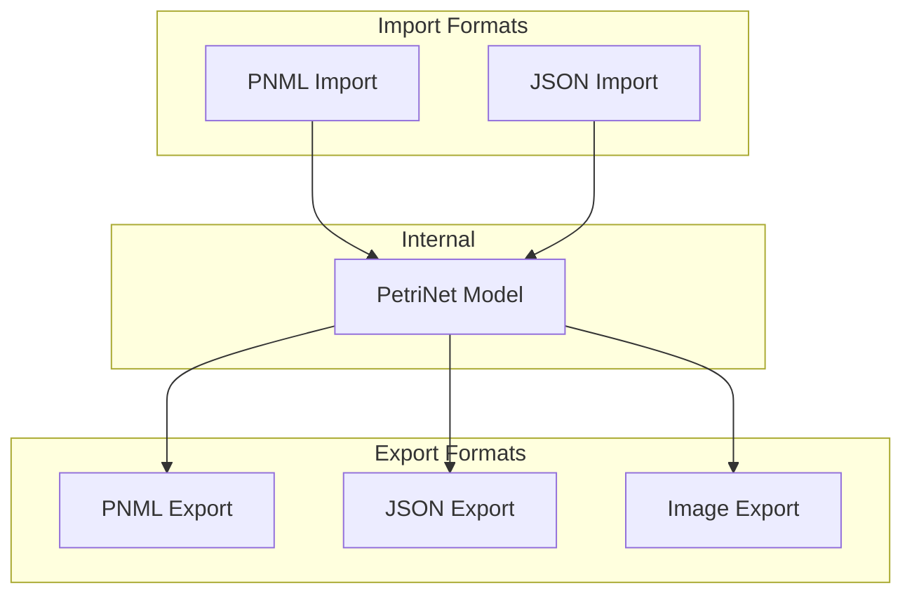
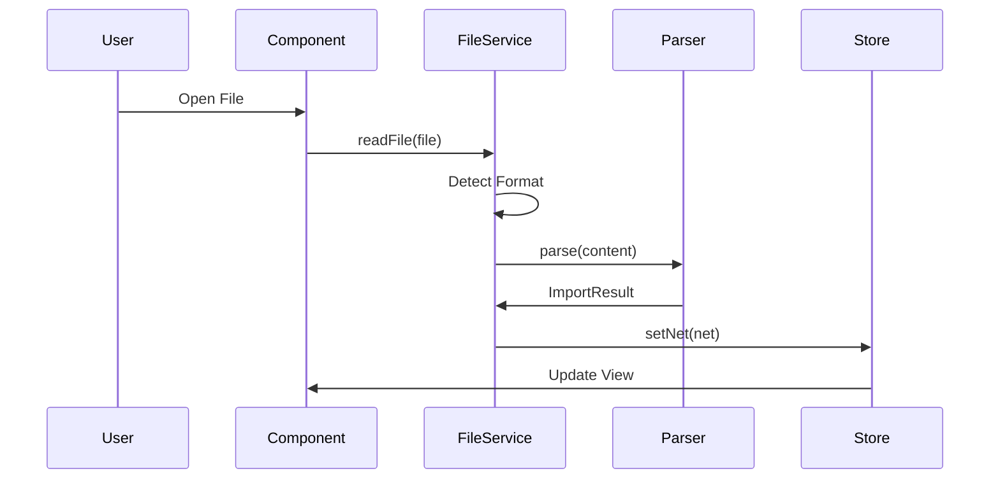
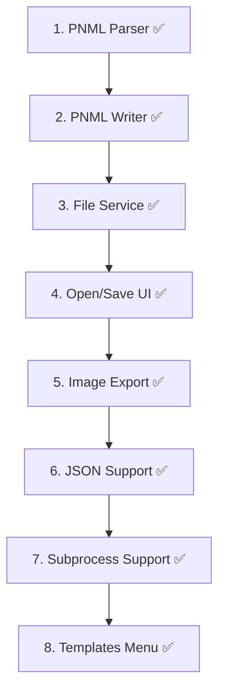

# Feature: File Operations

## Overview

Import and export of Petri nets in various formats.



## Legacy Implementation

### Affected Classes

```
WoPeD-FileInterface/
├── PNMLImport.java
├── PNMLExport.java
├── yawl/
│   ├── YawlImport.java
│   └── YawlExport.java
└── apromore/
    ├── ApromoreImportFrame.java
    └── ApromoreExportFrame.java

WoPeD-BeanPnml/
└── pnml_wf.xsd
```

## Formats

### PNML (Petri Net Markup Language)

```xml
<?xml version="1.0" encoding="UTF-8"?>
<pnml>
  <net id="net1" type="http://www.pnml.org/version-2009/grammar/ptnet">
    <place id="p1">
      <name><text>Start</text></name>
      <initialMarking><text>1</text></initialMarking>
      <graphics><position x="100" y="100"/></graphics>
    </place>
    <transition id="t1">
      <name><text>Task 1</text></name>
      <graphics><position x="200" y="100"/></graphics>
    </transition>
    <arc id="a1" source="p1" target="t1"/>
  </net>
</pnml>
```

### JSON

```json
{
  "id": "net1",
  "name": "Example Net",
  "places": [
    { "id": "p1", "name": "Start", "position": { "x": 100, "y": 100 }, "tokens": 1 }
  ],
  "transitions": [
    { "id": "t1", "name": "Task 1", "position": { "x": 200, "y": 100 } }
  ],
  "arcs": [
    { "id": "a1", "sourceId": "p1", "targetId": "t1", "weight": 1 }
  ]
}
```

## Modern Implementation

### Data Model

```typescript
// types/fileFormats.ts
type FileFormat = 'pnml' | 'json' | 'svg' | 'png'

interface ImportResult {
  success: boolean
  net?: PetriNet
  subNets?: Record<string, PetriNet>
  errors: ImportError[]
  warnings: string[]
}

interface ImportError {
  line?: number
  message: string
  element?: string
}

interface ExportOptions {
  format: FileFormat
  includeLayout: boolean
  includeMetadata: boolean
}
```

### PNML Parser/Writer

```typescript
// services/file/pnmlParser.ts
export class PNMLParser {
  parse(xml: string): ImportResult {
    const errors: ImportError[] = []
    const warnings: string[] = []
    
    try {
      const doc = new DOMParser().parseFromString(xml, 'text/xml')
      
      // Check for parse errors
      const parseError = doc.querySelector('parsererror')
      if (parseError) {
        return {
          success: false,
          errors: [{ message: 'Invalid XML: ' + parseError.textContent }],
          warnings: []
        }
      }
      
      const netElement = doc.querySelector('net')
      if (!netElement) {
        return {
          success: false,
          errors: [{ message: 'No <net> element found' }],
          warnings: []
        }
      }
      
      const net: PetriNet = {
        id: netElement.getAttribute('id') || generateId(),
        name: this.getName(netElement),
        places: this.parsePlaces(netElement, errors),
        transitions: this.parseTransitions(netElement, errors),
        arcs: this.parseArcs(netElement, errors)
      }
      
      return { success: errors.length === 0, net, errors, warnings }
    } catch (e) {
      return {
        success: false,
        errors: [{ message: `Parse error: ${e.message}` }],
        warnings: []
      }
    }
  }
  
  private parsePlaces(net: Element, errors: ImportError[]): Place[] {
    return Array.from(net.querySelectorAll('place')).map(p => {
      const pos = p.querySelector('graphics > position')
      return {
        id: p.getAttribute('id') || generateId(),
        name: this.getTextContent(p, 'name > text'),
        position: {
          x: parseFloat(pos?.getAttribute('x') || '0'),
          y: parseFloat(pos?.getAttribute('y') || '0')
        },
        tokens: parseInt(this.getTextContent(p, 'initialMarking > text') || '0'),
        capacity: -1
      }
    })
  }
}
```

```typescript
// services/file/pnmlWriter.ts
export class PNMLWriter {
  write(net: PetriNet, options: ExportOptions): string {
    const doc = document.implementation.createDocument(null, 'pnml', null)
    const pnml = doc.documentElement
    
    const netEl = doc.createElement('net')
    netEl.setAttribute('id', net.id)
    netEl.setAttribute('type', 'http://www.pnml.org/version-2009/grammar/ptnet')
    
    // Places
    for (const place of net.places) {
      netEl.appendChild(this.createPlaceElement(doc, place, options))
    }
    
    // Transitions
    for (const transition of net.transitions) {
      netEl.appendChild(this.createTransitionElement(doc, transition, options))
    }
    
    // Arcs
    for (const arc of net.arcs) {
      netEl.appendChild(this.createArcElement(doc, arc))
    }
    
    pnml.appendChild(netEl)
    
    return new XMLSerializer().serializeToString(doc)
  }
}
```

### Image Export

```typescript
// services/file/imageExporter.ts
export class ImageExporter {
  async exportSVG(net: PetriNet): Promise<string> {
    // Render to off-screen SVG
    const svg = this.renderToSVG(net)
    return new XMLSerializer().serializeToString(svg)
  }
  
  async exportPNG(net: PetriNet, scale: number = 2): Promise<Blob> {
    const svg = this.renderToSVG(net)
    const svgData = new XMLSerializer().serializeToString(svg)
    const svgBlob = new Blob([svgData], { type: 'image/svg+xml' })
    const url = URL.createObjectURL(svgBlob)
    
    const img = new Image()
    await new Promise(resolve => {
      img.onload = resolve
      img.src = url
    })
    
    const canvas = document.createElement('canvas')
    canvas.width = img.width * scale
    canvas.height = img.height * scale
    
    const ctx = canvas.getContext('2d')!
    ctx.scale(scale, scale)
    ctx.drawImage(img, 0, 0)
    
    URL.revokeObjectURL(url)
    
    return new Promise(resolve => {
      canvas.toBlob(blob => resolve(blob!), 'image/png')
    })
  }
}
```

### File Service



```typescript
// services/file/fileService.ts
export class FileService {
  private parsers = {
    pnml: new PNMLParser(),
    json: new JSONParser()
  }
  
  private writers = {
    pnml: new PNMLWriter(),
    json: new JSONWriter()
  }
  
  async import(file: File): Promise<ImportResult> {
    const content = await file.text()
    const format = this.detectFormat(file.name, content)
    
    const parser = this.parsers[format]
    if (!parser) {
      return {
        success: false,
        errors: [{ message: `Unsupported format: ${format}` }],
        warnings: []
      }
    }
    
    return parser.parse(content)
  }
  
  async export(net: PetriNet, options: ExportOptions): Promise<Blob> {
    const writer = this.writers[options.format]
    const content = writer.write(net, options)
    
    const mimeType = this.getMimeType(options.format)
    return new Blob([content], { type: mimeType })
  }
  
  private detectFormat(filename: string, content: string): FileFormat {
    const ext = filename.split('.').pop()?.toLowerCase()
    
    if (ext === 'pnml' || content.includes('<pnml')) return 'pnml'
    if (ext === 'json') return 'json'
    
    return 'pnml' // Default
  }
}
```

## Migration Steps



### Implemented Features

- **PNML Import/Export** ✅ - Full support with layout and subprocesses
- **JSON Import/Export** ✅ - Custom format with complete model support
- **Image Export** ✅ - SVG and PNG export
- **Templates** ✅ - 10 educational example nets
- **Recent Files** ✅ - Track recently opened files
- **Drag & Drop** ✅ - Drop files onto editor

## UI Mockup

```
┌─────────────────────────────────────────────────────────────┐
│ File                                              [X]       │
├─────────────────────────────────────────────────────────────┤
│ [Open] [Save] [Export]                                      │
├─────────────────────────────────────────────────────────────┤
│                                                             │
│    ┌─────────────────────────────────────────────────┐     │
│    │                                                   │     │
│    │     📁 Drop file here                            │     │
│    │        or click to browse                        │     │
│    │                                                   │     │
│    │     Supports: PNML, JSON                        │     │
│    │                                                   │     │
│    └─────────────────────────────────────────────────┘     │
│                                                             │
│ Recent Files:                                               │
│ ├─ process1.pnml                              [Open]       │
│ ├─ workflow.json                              [Open]       │
│ └─ example.pnml                               [Open]       │
│                                                             │
└─────────────────────────────────────────────────────────────┘
```

## Test Plan

| Test | Description |
|------|-------------|
| Unit | Parser for each format |
| Roundtrip | Import → Export → Import = equal |
| Compatibility | Legacy WoPeD files |
| Error Handling | Invalid files |
