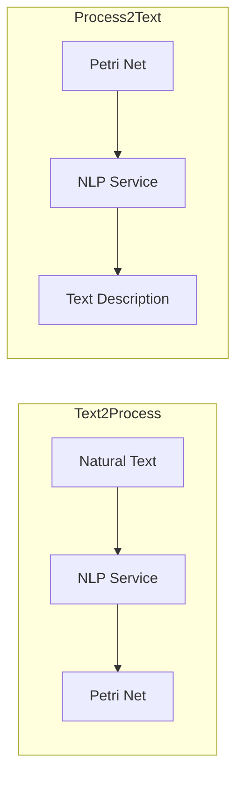
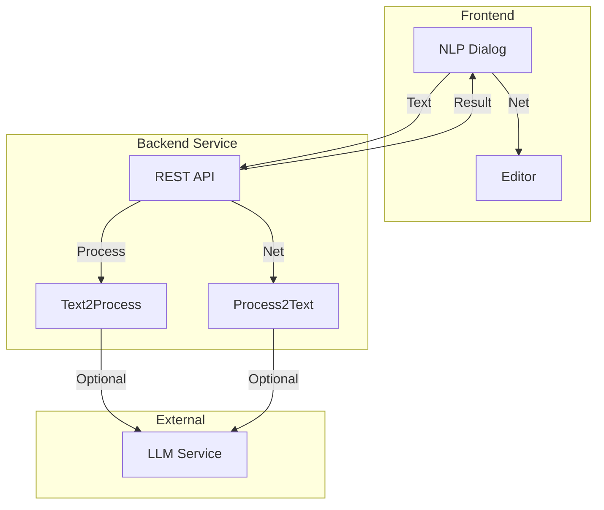
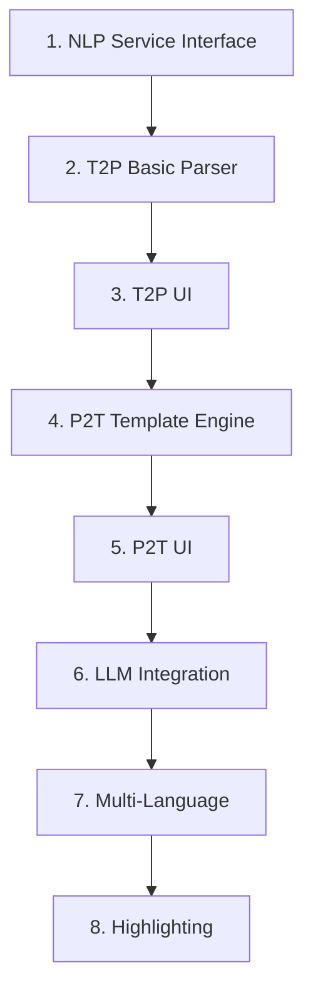

# Feature: NLP Integration

## Overview

Natural Language Processing for converting between Petri nets and natural language.



## Status

**⏸️ Deferred** — Dieses Feature wird als letztes implementiert. Der hier dokumentierte Ansatz (Legacy T2P/P2T Services, LLM-basiert) wird **komplett überarbeitet und durch ein neues Konzept ersetzt**. Die unten stehende Spezifikation dient nur noch als Referenz für den Legacy-Stand und ist **nicht mehr die Ziel-Architektur**.

> **Hinweis:** Alle anderen Features (01–11) müssen abgeschlossen sein, bevor die NLP-Integration begonnen wird. Der neue Ansatz wird in einem separaten Konzeptdokument erarbeitet.

## Legacy Implementation

### Affected Classes

```
WoPeD-FileInterface/
├── t2p/
│   └── T2PUI.java
└── p2t/
    └── P2TUI.java
```

### External Services

- Text2Process (T2P): Converts text to BPMN/Petri net
- Process2Text (P2T): Generates natural language description

## Modern Implementation

### Architecture



### Data Model

```typescript
// types/nlp.ts
interface T2PRequest {
  text: string
  language: 'en' | 'de'
  options: {
    includeSubprocesses: boolean
    autoLayout: boolean
  }
}

interface T2PResponse {
  success: boolean
  net?: PetriNet
  confidence: number
  warnings: string[]
  mappings: TextToElementMapping[]
}

interface TextToElementMapping {
  textSpan: { start: number; end: number }
  elementId: string
  elementType: 'place' | 'transition' | 'operator'
}

interface P2TRequest {
  net: PetriNet
  language: 'en' | 'de'
  style: 'formal' | 'informal' | 'technical'
  detail: 'brief' | 'normal' | 'detailed'
}

interface P2TResponse {
  success: boolean
  text: string
  sections: TextSection[]
}

interface TextSection {
  title: string
  content: string
  relatedElements: string[]
}
```

### Text2Process Service

```typescript
// services/nlp/text2Process.ts
export class Text2ProcessService {
  private apiUrl: string
  
  async convert(request: T2PRequest): Promise<T2PResponse> {
    // Option 1: External Service
    if (this.useExternalService) {
      return this.callExternalT2P(request)
    }
    
    // Option 2: Local LLM-based processing
    return this.processWithLLM(request)
  }
  
  private async processWithLLM(request: T2PRequest): Promise<T2PResponse> {
    const prompt = this.buildT2PPrompt(request.text, request.language)
    
    const response = await this.llmService.complete(prompt)
    const parsed = this.parseT2PResponse(response)
    
    return {
      success: true,
      net: parsed.net,
      confidence: parsed.confidence,
      warnings: parsed.warnings,
      mappings: parsed.mappings
    }
  }
  
  private buildT2PPrompt(text: string, language: string): string {
    return `
      Analyze the following process description and extract a Petri net structure.
      
      Text (${language}):
      "${text}"
      
      Return a JSON object with:
      - places: array of { id, name, tokens }
      - transitions: array of { id, name, type }
      - arcs: array of { source, target }
      
      Identify:
      - Activities → Transitions
      - States/Conditions → Places
      - Parallel execution → AND-split/join
      - Exclusive choices → XOR-split/join
    `
  }
}
```

### Process2Text Service

```typescript
// services/nlp/process2Text.ts
export class Process2TextService {
  async generate(request: P2TRequest): Promise<P2TResponse> {
    const analysis = this.analyzeNet(request.net)
    
    // Option 1: Template-based generation
    if (request.style === 'formal') {
      return this.generateFromTemplates(analysis, request)
    }
    
    // Option 2: LLM-based generation
    return this.generateWithLLM(analysis, request)
  }
  
  private analyzeNet(net: PetriNet): NetAnalysis {
    return {
      startPlace: this.findStartPlace(net),
      endPlace: this.findEndPlace(net),
      paths: this.extractPaths(net),
      parallelBlocks: this.findParallelBlocks(net),
      choiceBlocks: this.findChoiceBlocks(net),
      loops: this.findLoops(net)
    }
  }
  
  private async generateWithLLM(
    analysis: NetAnalysis, 
    request: P2TRequest
  ): Promise<P2TResponse> {
    const prompt = this.buildP2TPrompt(analysis, request)
    const response = await this.llmService.complete(prompt)
    
    return {
      success: true,
      text: response,
      sections: this.extractSections(response)
    }
  }
}
```

## Migration Steps



## UI Mockup

```
┌─────────────────────────────────────────────────────────────┐
│ Text to Process                                   [X]       │
├─────────────────────────────────────────────────────────────┤
│ ┌─────────────────────────┐ ┌─────────────────────────────┐│
│ │ Process Description     │ │ Preview                     ││
│ │ ─────────────────────── │ │                             ││
│ │                         │ │    (●)───►[Order]───►( )   ││
│ │ When a customer places  │ │             │               ││
│ │ an order, it needs to   │ │            AND              ││
│ │ be validated. Then,     │ │           /   \             ││
│ │ payment and shipping    │ │    [Pay]       [Ship]       ││
│ │ happen in parallel...   │ │           \   /             ││
│ │                         │ │            AND              ││
│ │                         │ │             │               ││
│ │                         │ │         [Complete]          ││
│ │                         │ │             │               ││
│ │                         │ │            (●)              ││
│ └─────────────────────────┘ └─────────────────────────────┘│
│                                                             │
│ Language: [English ▼]  [☑ Auto-Layout]                     │
│                                                             │
│                        [Cancel] [Convert] [Insert]          │
└─────────────────────────────────────────────────────────────┘
```

## Test Plan

| Test | Description |
|------|-------------|
| Unit | Template engine, parser |
| Integration | Roundtrip T2P → P2T |
| Quality | Comprehensibility of generated texts |
| Multi-Lang | German and English output |
