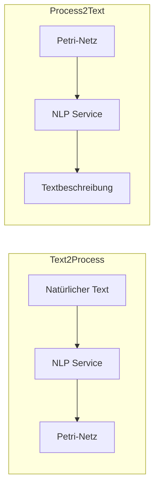
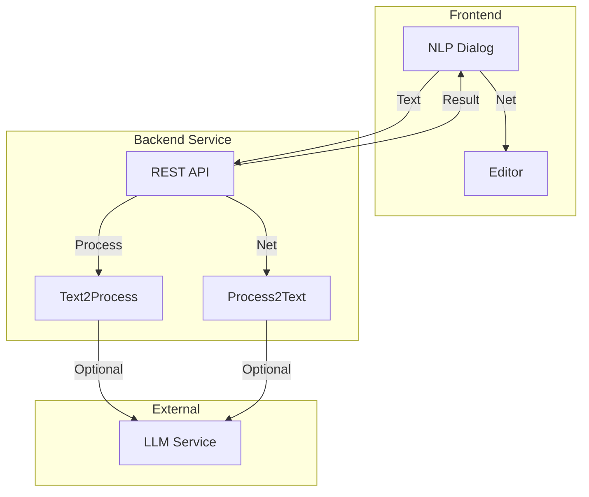
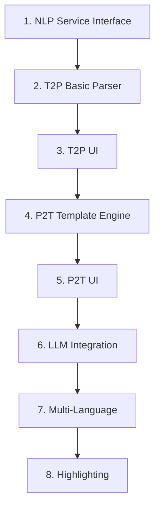

# Feature: NLP Integration

## Übersicht

Natural Language Processing zur Konvertierung zwischen Petri-Netzen und natürlicher Sprache.



## Legacy Implementation

### Betroffene Klassen

```
WoPeD-FileInterface/
├── t2p/
│   └── T2PUI.java
└── p2t/
    └── P2TUI.java
```

### Externe Services

- Text2Process (T2P): Konvertiert Text zu BPMN/Petri-Netz
- Process2Text (P2T): Generiert natürlichsprachliche Beschreibung

## Moderne Implementation

### Architektur



### Datenmodell

```typescript
// types/nlp.ts
interface T2PRequest {
  text: string
  language: 'en' | 'de'
  options: {
    includeSubprocesses: boolean
    autoLayout: boolean
  }
}

interface T2PResponse {
  success: boolean
  net?: PetriNet
  confidence: number
  warnings: string[]
  mappings: TextToElementMapping[]
}

interface TextToElementMapping {
  textSpan: { start: number; end: number }
  elementId: string
  elementType: 'place' | 'transition' | 'operator'
}

interface P2TRequest {
  net: PetriNet
  language: 'en' | 'de'
  style: 'formal' | 'informal' | 'technical'
  detail: 'brief' | 'normal' | 'detailed'
}

interface P2TResponse {
  success: boolean
  text: string
  sections: TextSection[]
}

interface TextSection {
  title: string
  content: string
  relatedElements: string[]
}
```

### Text2Process Service

```typescript
// services/nlp/text2Process.ts
export class Text2ProcessService {
  private apiUrl: string
  
  async convert(request: T2PRequest): Promise<T2PResponse> {
    // Option 1: External Service
    if (this.useExternalService) {
      return this.callExternalT2P(request)
    }
    
    // Option 2: Local LLM-based processing
    return this.processWithLLM(request)
  }
  
  private async processWithLLM(request: T2PRequest): Promise<T2PResponse> {
    const prompt = this.buildT2PPrompt(request.text, request.language)
    
    const response = await this.llmService.complete(prompt)
    const parsed = this.parseT2PResponse(response)
    
    return {
      success: true,
      net: parsed.net,
      confidence: parsed.confidence,
      warnings: parsed.warnings,
      mappings: parsed.mappings
    }
  }
  
  private buildT2PPrompt(text: string, language: string): string {
    return `
      Analyze the following process description and extract a Petri net structure.
      
      Text (${language}):
      "${text}"
      
      Return a JSON object with:
      - places: array of { id, name, tokens }
      - transitions: array of { id, name, type }
      - arcs: array of { source, target }
      
      Identify:
      - Activities → Transitions
      - States/Conditions → Places
      - Parallel execution → AND-split/join
      - Exclusive choices → XOR-split/join
    `
  }
}
```

### Process2Text Service

```typescript
// services/nlp/process2Text.ts
export class Process2TextService {
  async generate(request: P2TRequest): Promise<P2TResponse> {
    const analysis = this.analyzeNet(request.net)
    
    // Option 1: Template-based generation
    if (request.style === 'formal') {
      return this.generateFromTemplates(analysis, request)
    }
    
    // Option 2: LLM-based generation
    return this.generateWithLLM(analysis, request)
  }
  
  private analyzeNet(net: PetriNet): NetAnalysis {
    return {
      startPlace: this.findStartPlace(net),
      endPlace: this.findEndPlace(net),
      paths: this.extractPaths(net),
      parallelBlocks: this.findParallelBlocks(net),
      choiceBlocks: this.findChoiceBlocks(net),
      loops: this.findLoops(net)
    }
  }
  
  private async generateWithLLM(
    analysis: NetAnalysis, 
    request: P2TRequest
  ): Promise<P2TResponse> {
    const prompt = this.buildP2TPrompt(analysis, request)
    const response = await this.llmService.complete(prompt)
    
    return {
      success: true,
      text: response,
      sections: this.extractSections(response)
    }
  }
  
  private generateFromTemplates(
    analysis: NetAnalysis, 
    request: P2TRequest
  ): P2TResponse {
    const templates = this.loadTemplates(request.language)
    const sections: TextSection[] = []
    
    // Introduction
    sections.push({
      title: templates.intro.title,
      content: templates.intro.format(analysis.startPlace.name),
      relatedElements: [analysis.startPlace.id]
    })
    
    // Main flow
    for (const path of analysis.paths) {
      sections.push(this.generatePathDescription(path, templates))
    }
    
    // Parallel blocks
    for (const block of analysis.parallelBlocks) {
      sections.push({
        title: templates.parallel.title,
        content: templates.parallel.format(block.branches),
        relatedElements: block.elements
      })
    }
    
    return {
      success: true,
      text: sections.map(s => s.content).join('\n\n'),
      sections
    }
  }
}
```

### UI-Komponenten

```vue
<!-- components/nlp/Text2ProcessDialog.vue -->
<template>
  <Dialog v-model:open="isOpen">
    <DialogContent class="max-w-3xl">
      <DialogHeader>
        <DialogTitle>Text to Process</DialogTitle>
      </DialogHeader>
      
      <div class="grid grid-cols-2 gap-4">
        <!-- Input -->
        <div>
          <Label>Process Description</Label>
          <Textarea 
            v-model="inputText"
            rows="10"
            placeholder="Describe your process..."
          />
          
          <div class="options">
            <Select v-model="language">
              <SelectItem value="en">English</SelectItem>
              <SelectItem value="de">Deutsch</SelectItem>
            </Select>
            
            <Checkbox v-model="autoLayout">
              Auto-Layout
            </Checkbox>
          </div>
        </div>
        
        <!-- Preview -->
        <div>
          <Label>Preview</Label>
          <div class="preview-container">
            <MiniPetriNetView 
              v-if="result?.net" 
              :net="result.net" 
            />
            <div v-else class="placeholder">
              Preview will appear here
            </div>
          </div>
          
          <div v-if="result?.warnings.length" class="warnings">
            <Alert v-for="w in result.warnings" variant="warning">
              {{ w }}
            </Alert>
          </div>
        </div>
      </div>
      
      <DialogFooter>
        <Button variant="outline" @click="isOpen = false">
          Cancel
        </Button>
        <Button @click="convert" :disabled="!inputText">
          Convert
        </Button>
        <Button 
          v-if="result?.net" 
          @click="insertNet"
        >
          Insert into Editor
        </Button>
      </DialogFooter>
    </DialogContent>
  </Dialog>
</template>
```

```vue
<!-- components/nlp/Process2TextDialog.vue -->
<template>
  <Dialog v-model:open="isOpen">
    <DialogContent class="max-w-3xl">
      <DialogHeader>
        <DialogTitle>Process to Text</DialogTitle>
      </DialogHeader>
      
      <div class="options-bar">
        <Select v-model="language">
          <SelectItem value="en">English</SelectItem>
          <SelectItem value="de">Deutsch</SelectItem>
        </Select>
        
        <Select v-model="style">
          <SelectItem value="formal">Formal</SelectItem>
          <SelectItem value="informal">Informal</SelectItem>
          <SelectItem value="technical">Technical</SelectItem>
        </Select>
        
        <Select v-model="detail">
          <SelectItem value="brief">Brief</SelectItem>
          <SelectItem value="normal">Normal</SelectItem>
          <SelectItem value="detailed">Detailed</SelectItem>
        </Select>
      </div>
      
      <div class="result">
        <div v-if="loading" class="loading">
          <Spinner /> Generating...
        </div>
        
        <div v-else-if="result" class="text-output">
          <section v-for="section in result.sections">
            <h4>{{ section.title }}</h4>
            <p 
              @mouseenter="highlightElements(section.relatedElements)"
              @mouseleave="clearHighlight"
            >
              {{ section.content }}
            </p>
          </section>
        </div>
      </div>
      
      <DialogFooter>
        <Button @click="generate">Generate</Button>
        <Button @click="copyToClipboard">Copy</Button>
        <Button @click="exportAsDoc">Export</Button>
      </DialogFooter>
    </DialogContent>
  </Dialog>
</template>
```

## Migrationsschritte



## UI-Mockup

```
┌─────────────────────────────────────────────────────────────┐
│ Text to Process                                   [X]       │
├─────────────────────────────────────────────────────────────┤
│ ┌─────────────────────────┐ ┌─────────────────────────────┐│
│ │ Process Description     │ │ Preview                     ││
│ │ ─────────────────────── │ │                             ││
│ │                         │ │    (●)───►[Order]───►( )   ││
│ │ When a customer places  │ │             │               ││
│ │ an order, it needs to   │ │            AND              ││
│ │ be validated. Then,     │ │           /   \             ││
│ │ payment and shipping    │ │    [Pay]       [Ship]       ││
│ │ happen in parallel...   │ │           \   /             ││
│ │                         │ │            AND              ││
│ │                         │ │             │               ││
│ │                         │ │         [Complete]          ││
│ │                         │ │             │               ││
│ │                         │ │            (●)              ││
│ └─────────────────────────┘ └─────────────────────────────┘│
│                                                             │
│ Language: [English ▼]  [☑ Auto-Layout]                     │
│                                                             │
│                        [Cancel] [Convert] [Insert]          │
└─────────────────────────────────────────────────────────────┘
```

## Testplan

| Test | Beschreibung |
|------|--------------|
| Unit | Template Engine, Parser |
| Integration | Roundtrip T2P → P2T |
| Quality | Verständlichkeit der generierten Texte |
| Multi-Lang | Deutsche und englische Ausgabe |
