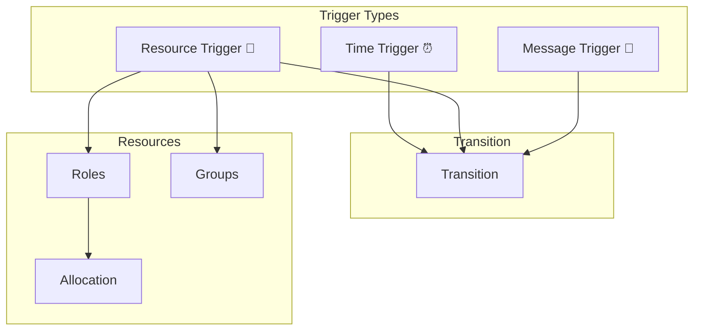
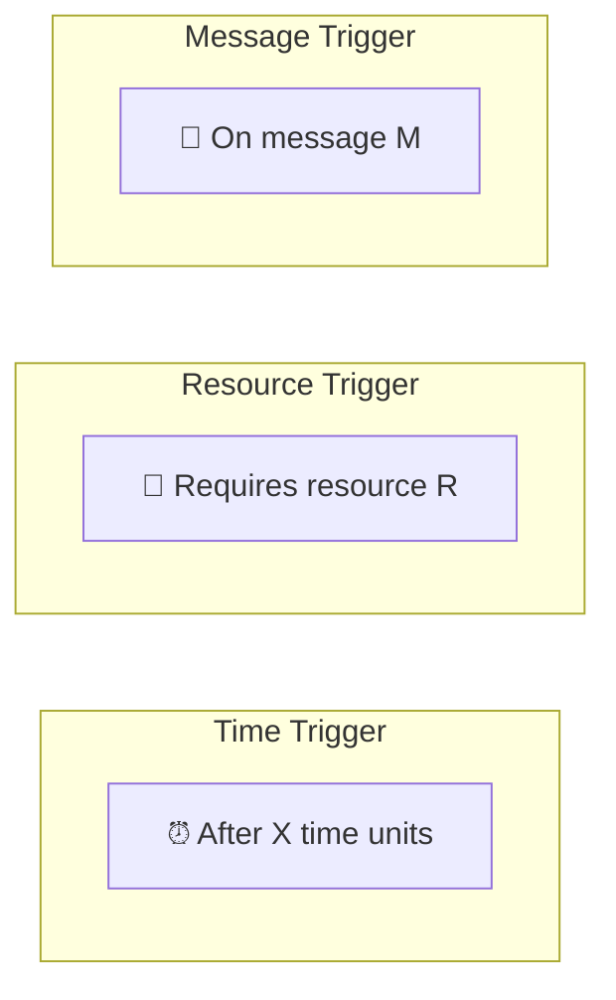
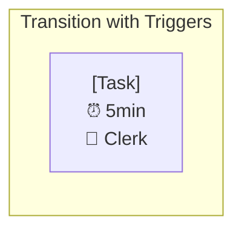
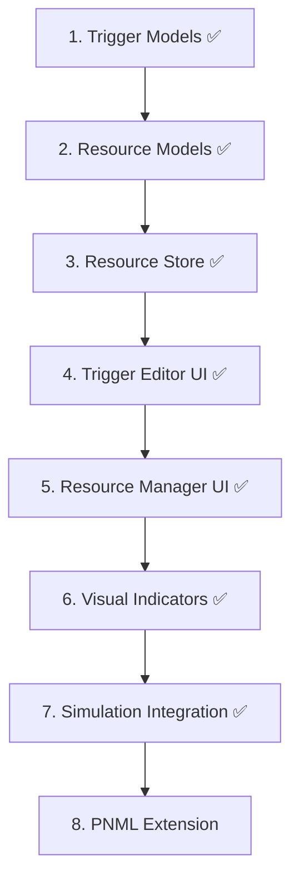

# Feature: Triggers & Resources

## Overview

Extension of transitions with triggers (time, resources, messages) and resource management.



## Legacy Implementation

### Affected Classes

```
WoPeD-Core/
└── models/
    ├── TriggerModel.java
    ├── ResourceModel.java
    └── ResourceClassModel.java

WoPeD-Editor/
└── view/
    ├── TriggerTimeView.java
    ├── TriggerResView.java
    └── TriggerExtView.java

WoPeD-QuantAnalysis/
└── resourcealloc/
    ├── ResourceAllocation.java
    └── ResourceUtilization.java
```

## Trigger Types



## Modern Implementation

### Data Model

```typescript
// types/triggers.ts
type TriggerType = 'time' | 'resource' | 'message'

interface Trigger {
  id: string
  type: TriggerType
  transitionId: string
}

interface TimeTrigger extends Trigger {
  type: 'time'
  delay: number
  timeUnit: 'seconds' | 'minutes' | 'hours' | 'days'
  distribution?: Distribution
}

interface ResourceTrigger extends Trigger {
  type: 'resource'
  resourceId: string
  quantity: number
  role?: string
}

interface MessageTrigger extends Trigger {
  type: 'message'
  messageType: string
  source?: string
  correlation?: string
}

// types/resources.ts
interface Resource {
  id: string
  name: string
  type: 'human' | 'machine' | 'system'
  capacity: number
  cost?: number
  availability?: Schedule
}

interface ResourceRole {
  id: string
  name: string
  resources: string[]  // Resource IDs
}

interface ResourceGroup {
  id: string
  name: string
  roles: string[]  // Role IDs
}

interface ResourceAllocation {
  transitionId: string
  resourceId: string
  quantity: number
  duration?: number
}
```

### Extended Transition Model

```typescript
// types/petri-net.ts (extended)
interface Transition {
  id: string
  name: string
  position: Position
  label?: string
  triggers?: Trigger[]
  resourceRequirements?: ResourceRequirement[]
}

interface ResourceRequirement {
  roleId?: string
  resourceId?: string
  quantity: number
  optional: boolean
}
```

### Resource Store

```typescript
// stores/resources.ts
export const useResourceStore = defineStore('resources', {
  state: () => ({
    resources: [] as Resource[],
    roles: [] as ResourceRole[],
    groups: [] as ResourceGroup[],
    allocations: [] as ResourceAllocation[]
  }),
  
  getters: {
    getResourcesByRole: (state) => (roleId: string) => {
      const role = state.roles.find(r => r.id === roleId)
      return state.resources.filter(r => role?.resources.includes(r.id))
    },
    
    getResourceUtilization: (state) => (resourceId: string) => {
      const allocations = state.allocations.filter(
        a => a.resourceId === resourceId
      )
      const resource = state.resources.find(r => r.id === resourceId)
      
      const allocated = allocations.reduce((sum, a) => sum + a.quantity, 0)
      return allocated / (resource?.capacity ?? 1)
    }
  },
  
  actions: {
    addResource(resource: Omit<Resource, 'id'>) {
      this.resources.push({ ...resource, id: generateId() })
    },
    
    assignToTransition(transitionId: string, requirement: ResourceRequirement) {
      const petriNet = usePetriNetStore()
      const transition = petriNet.getTransition(transitionId)
      
      if (transition) {
        transition.resourceRequirements = [
          ...(transition.resourceRequirements ?? []),
          requirement
        ]
      }
    }
  }
})
```

### Trigger Components

```vue
<!-- components/triggers/TriggerEditor.vue -->
<template>
  <div class="trigger-editor">
    <Tabs v-model="activeType">
      <TabsList>
        <TabsTrigger value="time">
          <Clock class="icon" /> Time
        </TabsTrigger>
        <TabsTrigger value="resource">
          <User class="icon" /> Resource
        </TabsTrigger>
        <TabsTrigger value="message">
          <Mail class="icon" /> Message
        </TabsTrigger>
      </TabsList>
      
      <TabsContent value="time">
        <TimeTriggerForm 
          v-model="timeTrigger"
          @save="saveTrigger"
        />
      </TabsContent>
      
      <TabsContent value="resource">
        <ResourceTriggerForm 
          v-model="resourceTrigger"
          :resources="resources"
          :roles="roles"
          @save="saveTrigger"
        />
      </TabsContent>
      
      <TabsContent value="message">
        <MessageTriggerForm 
          v-model="messageTrigger"
          @save="saveTrigger"
        />
      </TabsContent>
    </Tabs>
  </div>
</template>
```

### Visual Representation in Editor



```vue
<!-- components/editor/TransitionNode.vue (extended) -->
<template>
  <g :transform="`translate(${x}, ${y})`">
    <!-- Base Rectangle -->
    <rect :width="width" :height="height" class="transition" />
    
    <!-- Label -->
    <text :y="height/2">{{ transition.name }}</text>
    
    <!-- Trigger Icons -->
    <g class="triggers" :transform="`translate(${width + 5}, 0)`">
      <g v-if="hasTimeTrigger" class="time-trigger">
        <circle r="8" fill="#FFC107" />
        <text>⏰</text>
      </g>
      
      <g v-if="hasResourceTrigger" :transform="`translate(0, 20)`">
        <circle r="8" fill="#4CAF50" />
        <text>👤</text>
      </g>
      
      <g v-if="hasMessageTrigger" :transform="`translate(0, 40)`">
        <circle r="8" fill="#2196F3" />
        <text>📨</text>
      </g>
    </g>
  </g>
</template>
```

## Migration Steps



## UI Mockup

```
┌─────────────────────────────────────────────────────────────┐
│ Resource Management                             [+ New]     │
├─────────────────────────────────────────────────────────────┤
│ [Resources] [Roles] [Allocation]                            │
├─────────────────────────────────────────────────────────────┤
│ Name          │ Type    │ Capacity  │ Utilization          │
│───────────────┼─────────┼───────────┼─────────────────────│
│ Clerk         │ Human   │ 5         │ ████████░░ 80%      │
│ Manager       │ Human   │ 2         │ ██████░░░░ 60%      │
│ Scanner       │ Machine │ 3         │ ████░░░░░░ 40%      │
│ API Service   │ System  │ ∞         │ █░░░░░░░░░ 10%      │
└─────────────────────────────────────────────────────────────┘

┌─────────────────────────────────────────────────────────────┐
│ Trigger for "Review"                            [X]         │
├─────────────────────────────────────────────────────────────┤
│ [⏰ Time] [👤 Resource] [📨 Message]                        │
├─────────────────────────────────────────────────────────────┤
│                                                             │
│ Resource:  [Clerk ▼]                                        │
│ Quantity:  [1        ]                                      │
│ Optional:  [ ]                                              │
│                                                             │
│                                  [Cancel] [Save]            │
└─────────────────────────────────────────────────────────────┘
```

## Test Plan

| Test | Description |
|------|-------------|
| Unit | Trigger validation, allocation |
| Integration | Simulation with resources |
| UI | Trigger editor, resource manager |
