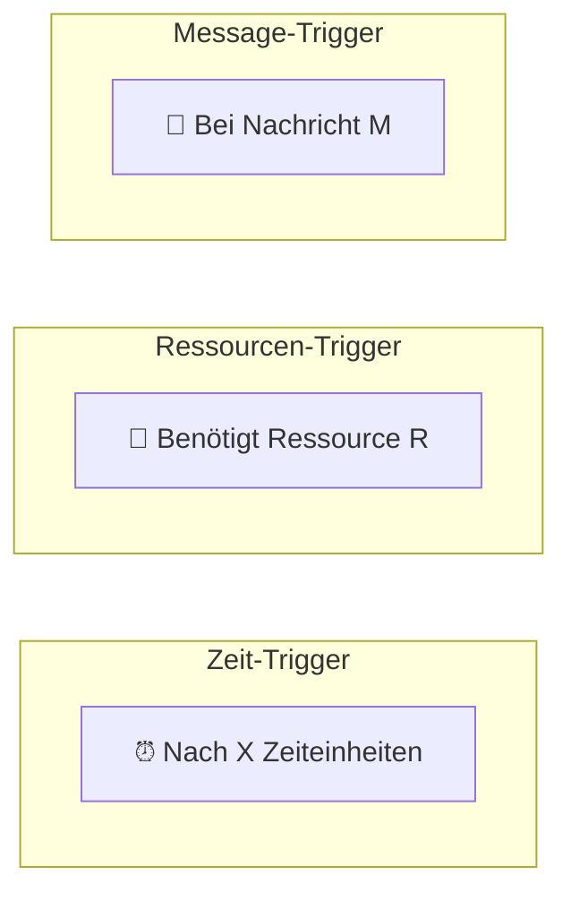
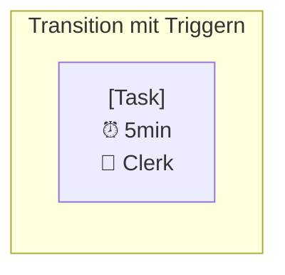
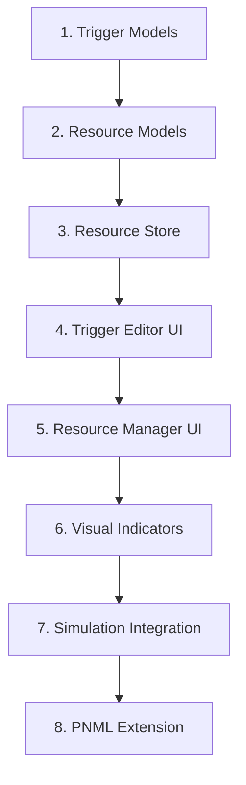

# Feature: Triggers & Resources

## Übersicht

Erweiterung von Transitionen um Trigger (Zeit, Ressourcen, Nachrichten) und Ressourcenmanagement.


## Legacy Implementation

### Betroffene Klassen

```
WoPeD-Core/
└── models/
    ├── TriggerModel.java
    ├── ResourceModel.java
    └── ResourceClassModel.java

WoPeD-Editor/
└── view/
    ├── TriggerTimeView.java
    ├── TriggerResView.java
    └── TriggerExtView.java

WoPeD-QuantAnalysis/
└── resourcealloc/
    ├── ResourceAllocation.java
    └── ResourceUtilization.java
```

## Trigger-Typen



## Moderne Implementation

### Datenmodell

```typescript
// types/triggers.ts
type TriggerType = 'time' | 'resource' | 'message'

interface Trigger {
  id: string
  type: TriggerType
  transitionId: string
}

interface TimeTrigger extends Trigger {
  type: 'time'
  delay: number
  timeUnit: 'seconds' | 'minutes' | 'hours' | 'days'
  distribution?: Distribution
}

interface ResourceTrigger extends Trigger {
  type: 'resource'
  resourceId: string
  quantity: number
  role?: string
}

interface MessageTrigger extends Trigger {
  type: 'message'
  messageType: string
  source?: string
  correlation?: string
}

// types/resources.ts
interface Resource {
  id: string
  name: string
  type: 'human' | 'machine' | 'system'
  capacity: number
  cost?: number
  availability?: Schedule
}

interface ResourceRole {
  id: string
  name: string
  resources: string[]  // Resource IDs
}

interface ResourceGroup {
  id: string
  name: string
  roles: string[]  // Role IDs
}

interface ResourceAllocation {
  transitionId: string
  resourceId: string
  quantity: number
  duration?: number
}
```

### Erweitertes Transition-Modell

```typescript
// types/petri-net.ts (erweitert)
interface Transition {
  id: string
  name: string
  position: Position
  label?: string
  triggers?: Trigger[]
  resourceRequirements?: ResourceRequirement[]
}

interface ResourceRequirement {
  roleId?: string
  resourceId?: string
  quantity: number
  optional: boolean
}
```

### Resource Store

```typescript
// stores/resources.ts
export const useResourceStore = defineStore('resources', {
  state: () => ({
    resources: [] as Resource[],
    roles: [] as ResourceRole[],
    groups: [] as ResourceGroup[],
    allocations: [] as ResourceAllocation[]
  }),
  
  getters: {
    getResourcesByRole: (state) => (roleId: string) => {
      const role = state.roles.find(r => r.id === roleId)
      return state.resources.filter(r => role?.resources.includes(r.id))
    },
    
    getResourceUtilization: (state) => (resourceId: string) => {
      const allocations = state.allocations.filter(
        a => a.resourceId === resourceId
      )
      const resource = state.resources.find(r => r.id === resourceId)
      
      const allocated = allocations.reduce((sum, a) => sum + a.quantity, 0)
      return allocated / (resource?.capacity ?? 1)
    }
  },
  
  actions: {
    addResource(resource: Omit<Resource, 'id'>) {
      this.resources.push({ ...resource, id: generateId() })
    },
    
    assignToTransition(transitionId: string, requirement: ResourceRequirement) {
      const petriNet = usePetriNetStore()
      const transition = petriNet.getTransition(transitionId)
      
      if (transition) {
        transition.resourceRequirements = [
          ...(transition.resourceRequirements ?? []),
          requirement
        ]
      }
    }
  }
})
```

### Trigger-Komponenten

```vue
<!-- components/triggers/TriggerEditor.vue -->
<template>
  <div class="trigger-editor">
    <Tabs v-model="activeType">
      <TabsList>
        <TabsTrigger value="time">
          <Clock class="icon" /> Zeit
        </TabsTrigger>
        <TabsTrigger value="resource">
          <User class="icon" /> Ressource
        </TabsTrigger>
        <TabsTrigger value="message">
          <Mail class="icon" /> Message
        </TabsTrigger>
      </TabsList>
      
      <TabsContent value="time">
        <TimeTriggerForm 
          v-model="timeTrigger"
          @save="saveTrigger"
        />
      </TabsContent>
      
      <TabsContent value="resource">
        <ResourceTriggerForm 
          v-model="resourceTrigger"
          :resources="resources"
          :roles="roles"
          @save="saveTrigger"
        />
      </TabsContent>
      
      <TabsContent value="message">
        <MessageTriggerForm 
          v-model="messageTrigger"
          @save="saveTrigger"
        />
      </TabsContent>
    </Tabs>
  </div>
</template>
```

```vue
<!-- components/triggers/TimeTriggerForm.vue -->
<template>
  <form @submit.prevent="$emit('save', modelValue)">
    <div class="form-group">
      <Label>Delay</Label>
      <div class="flex gap-2">
        <Input 
          type="number" 
          v-model.number="modelValue.delay"
          min="0"
        />
        <Select v-model="modelValue.timeUnit">
          <SelectItem value="seconds">Sekunden</SelectItem>
          <SelectItem value="minutes">Minuten</SelectItem>
          <SelectItem value="hours">Stunden</SelectItem>
          <SelectItem value="days">Tage</SelectItem>
        </Select>
      </div>
    </div>
    
    <div class="form-group">
      <Label>Verteilung (optional)</Label>
      <Select v-model="modelValue.distribution.type">
        <SelectItem value="constant">Konstant</SelectItem>
        <SelectItem value="exponential">Exponential</SelectItem>
        <SelectItem value="normal">Normal</SelectItem>
      </Select>
    </div>
    
    <Button type="submit">Speichern</Button>
  </form>
</template>
```

### Resource Manager UI

```vue
<!-- components/resources/ResourceManager.vue -->
<template>
  <div class="resource-manager">
    <header>
      <h2>Ressourcen-Verwaltung</h2>
      <Button @click="showAddDialog = true">
        <Plus class="icon" /> Hinzufügen
      </Button>
    </header>
    
    <Tabs v-model="activeTab">
      <TabsList>
        <TabsTrigger value="resources">Ressourcen</TabsTrigger>
        <TabsTrigger value="roles">Rollen</TabsTrigger>
        <TabsTrigger value="allocation">Zuordnung</TabsTrigger>
      </TabsList>
      
      <TabsContent value="resources">
        <Table>
          <TableHeader>
            <TableRow>
              <TableHead>Name</TableHead>
              <TableHead>Typ</TableHead>
              <TableHead>Kapazität</TableHead>
              <TableHead>Auslastung</TableHead>
              <TableHead></TableHead>
            </TableRow>
          </TableHeader>
          <TableBody>
            <TableRow v-for="res in resources" :key="res.id">
              <TableCell>{{ res.name }}</TableCell>
              <TableCell>{{ res.type }}</TableCell>
              <TableCell>{{ res.capacity }}</TableCell>
              <TableCell>
                <Progress :value="getUtilization(res.id)" />
              </TableCell>
              <TableCell>
                <Button variant="ghost" @click="editResource(res)">
                  Edit
                </Button>
              </TableCell>
            </TableRow>
          </TableBody>
        </Table>
      </TabsContent>
    </Tabs>
  </div>
</template>
```

### Visuelle Darstellung im Editor



```vue
<!-- components/editor/TransitionNode.vue (erweitert) -->
<template>
  <g :transform="`translate(${x}, ${y})`">
    <!-- Base Rectangle -->
    <rect :width="width" :height="height" class="transition" />
    
    <!-- Label -->
    <text :y="height/2">{{ transition.name }}</text>
    
    <!-- Trigger Icons -->
    <g class="triggers" :transform="`translate(${width + 5}, 0)`">
      <g v-if="hasTimeTrigger" class="time-trigger">
        <circle r="8" fill="#FFC107" />
        <text>⏰</text>
      </g>
      
      <g v-if="hasResourceTrigger" :transform="`translate(0, 20)`">
        <circle r="8" fill="#4CAF50" />
        <text>👤</text>
      </g>
      
      <g v-if="hasMessageTrigger" :transform="`translate(0, 40)`">
        <circle r="8" fill="#2196F3" />
        <text>📨</text>
      </g>
    </g>
  </g>
</template>
```

## Migrationsschritte



## UI-Mockup

```
┌─────────────────────────────────────────────────────────────┐
│ Ressourcen-Verwaltung                           [+ Neu]    │
├─────────────────────────────────────────────────────────────┤
│ [Ressourcen] [Rollen] [Zuordnung]                          │
├─────────────────────────────────────────────────────────────┤
│ Name          │ Typ     │ Kapazität │ Auslastung          │
│───────────────┼─────────┼───────────┼─────────────────────│
│ Sachbearbeiter│ Human   │ 5         │ ████████░░ 80%      │
│ Manager       │ Human   │ 2         │ ██████░░░░ 60%      │
│ Scanner       │ Machine │ 3         │ ████░░░░░░ 40%      │
│ API Service   │ System  │ ∞         │ █░░░░░░░░░ 10%      │
└─────────────────────────────────────────────────────────────┘

┌─────────────────────────────────────────────────────────────┐
│ Trigger für "Prüfung"                           [X]        │
├─────────────────────────────────────────────────────────────┤
│ [⏰ Zeit] [👤 Ressource] [📨 Message]                      │
├─────────────────────────────────────────────────────────────┤
│                                                             │
│ Ressource:  [Sachbearbeiter ▼]                             │
│ Anzahl:     [1        ]                                    │
│ Optional:   [ ]                                            │
│                                                             │
│                               [Abbrechen] [Speichern]      │
└─────────────────────────────────────────────────────────────┘
```

## Testplan

| Test | Beschreibung |
|------|--------------|
| Unit | Trigger-Validierung, Allocation |
| Integration | Simulation mit Ressourcen |
| UI | Trigger-Editor, Resource Manager |
