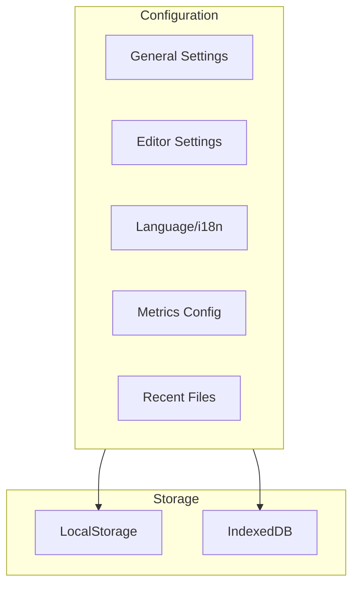
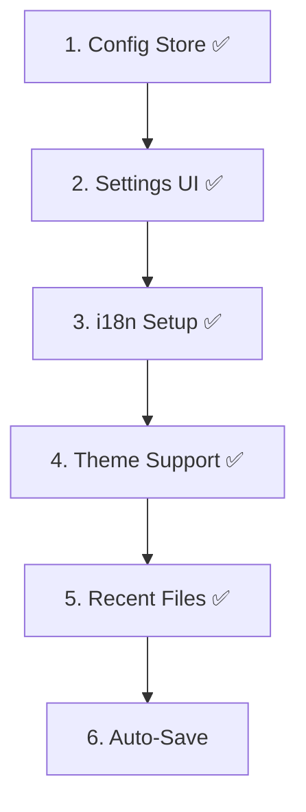

# Feature: Configuration

## Overview

Application settings, internationalization and user preferences.



## Legacy Implementation

### Affected Classes

```
WoPeD-Configuration/
├── WoPeDConfiguration.java
├── WoPeDGeneralConfiguration.java
├── WoPeDMetricsConfiguration.java
└── WoPeDRecentFile.java

WoPeD-GUI/
└── panels/
    ├── ConfEditorPanel.java
    ├── ConfLanguagePanel.java
    └── ConfMetricsPanel.java
```

## Modern Implementation

### Data Model

```typescript
// types/config.ts
interface AppConfig {
  general: GeneralConfig
  editor: EditorConfig
  language: LanguageConfig
  metrics: MetricsConfig
  recentFiles: RecentFile[]
}

interface GeneralConfig {
  theme: 'light' | 'dark' | 'system'
  autoSave: boolean
  autoSaveInterval: number
}

interface EditorConfig {
  showGrid: boolean
  snapToGrid: boolean
  gridSize: number
  defaultZoom: number
  smartEditing: boolean
}

interface LanguageConfig {
  locale: 'en' | 'de'
}

interface RecentFile {
  path: string
  name: string
  lastOpened: Date
}
```

### Config Store

```typescript
// stores/config.ts
export const useConfigStore = defineStore('config', {
  state: (): AppConfig => ({
    general: {
      theme: 'system',
      autoSave: true,
      autoSaveInterval: 60000
    },
    editor: {
      showGrid: true,
      snapToGrid: true,
      gridSize: 20,
      defaultZoom: 1,
      smartEditing: true
    },
    language: { locale: 'en' },
    metrics: { enabled: true },
    recentFiles: []
  }),
  
  actions: {
    load() {
      const saved = localStorage.getItem('woped-config')
      if (saved) Object.assign(this.$state, JSON.parse(saved))
    },
    save() {
      localStorage.setItem('woped-config', JSON.stringify(this.$state))
    }
  },
  
  persist: true
})
```

### i18n Setup

```typescript
// i18n/index.ts
import { createI18n } from 'vue-i18n'
import en from './locales/en.json'
import de from './locales/de.json'

export const i18n = createI18n({
  legacy: false,
  locale: 'en',
  messages: { en, de }
})
```

## Migration Steps



### Implemented Features

- **Config Store** ✅ - Pinia store with persistence
- **Settings Dialog** ✅ - Theme, language, editor settings
- **i18n** ✅ - English and German translations
- **Theme Support** ✅ - Dark/light mode with system detection
- **Recent Files** ✅ - Track recently opened files
- **Grid Settings** ✅ - Show/hide grid, snap-to-grid, grid size

## UI Mockup

```
┌─────────────────────────────────────────┐
│ Settings                         [X]    │
├─────────────────────────────────────────┤
│ [General] [Editor] [Language]           │
├─────────────────────────────────────────┤
│ Theme:        [System ▼]                │
│ Auto-Save:    [✓] every [60] seconds   │
│                                         │
│ Grid:         [✓] Show                 │
│ Snap to Grid: [✓]                      │
│ Grid Size:    [20] px                  │
│                                         │
│                     [Cancel] [Save]     │
└─────────────────────────────────────────┘
```

## Test Plan

| Test | Description |
|------|-------------|
| Unit | Config persistence |
| i18n | All texts translated |
| UI | Settings dialog |
