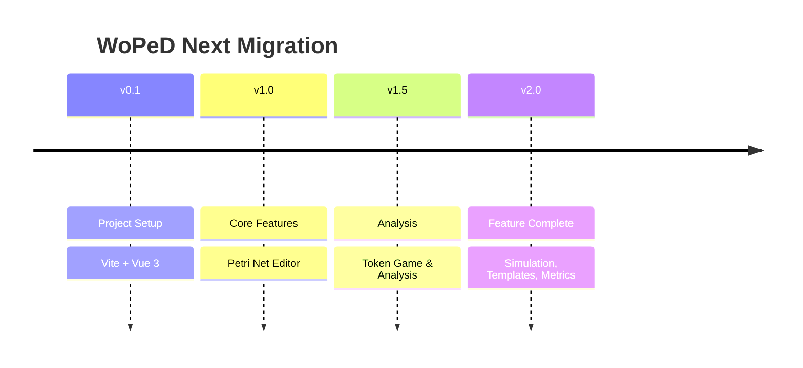

# Migration Status & Changelog

## Overview

Migration from WoPeD Java Swing to WoPeD Next (Vue.js 3).



## Implementation Status

| Feature | Status | Notes |
|---------|--------|-------|
| **01 Petri Net Editor** | ✅ Complete | Places, transitions, arcs, weights |
| **02 Workflow Operators** | ✅ Complete | AND/XOR split/join, combined operators |
| **03 Subprocesses** | ✅ Complete | Hierarchical nets, drill-down, breadcrumb |
| **04 Token Game** | ✅ Complete | Animation, conflict resolution, statistics |
| **05 Visualization & Layout** | ✅ Complete | Grid, snap, auto-layout, fit-to-view |
| **06 Qualitative Analysis** | ✅ Complete | Structure analysis, soundness checking |
| **07 Quantitative Simulation** | ✅ Complete | Time-based simulation, resources, bottleneck analysis |
| **08 Process Metrics** | ✅ Complete | Complexity metrics, structural analysis |
| **09 File Operations** | ✅ Complete | PNML/JSON import/export, image export |
| **10 Configuration** | ✅ Complete | Theme, language, editor settings |
| **11 Templates** | ✅ Complete | 10 educational example nets |
| **12 NLP Integration** | 🔜 Planned | Not yet implemented |

Legend: ✅ Complete | ⚠️ Partial | 🔜 Planned

## Changelog

### v2.0.0 - Feature Complete

#### Editor & Visualization
- Subprocesses with drill-down navigation
- Breadcrumb navigation for subprocess hierarchy
- Auto fit-to-view on page load
- Arc weight display at arc midpoint

#### Token Game
- Animated token movement
- Conflict resolution dialog
- Statistics (firings per transition, states visited)
- Integrated in collapsible right panel

#### Simulation & Analysis
- Quantitative simulation with discrete event model
- Resource management and allocation
- Bottleneck analysis
- Utilization charts
- XES log export
- Process metrics calculation

#### File Operations
- PNML import/export with subprocess support
- JSON import/export with full model support
- SVG/PNG image export
- Templates menu with 10 example nets

#### UI/UX
- Collapsible right panel (expanded by default)
- Tabbed panel for Properties/Token Game/Simulation
- Template submenu in File menu
- Improved toolbar with icon tooltips

### v1.0.0 - Initial Release

#### Core Features
- Petri net editor with canvas
- Places, transitions, arcs
- Workflow operators (AND/XOR split/join)
- Selection and deletion
- Properties panel

#### Basic Features
- Dark/light theme
- German/English localization
- Grid and snap-to-grid
- Local storage for settings

#### File Operations
- Basic PNML import/export
- New/Save/Load functionality

## Dependencies

### Core
```json
{
  "vue": "^3.5.x",
  "vue-i18n": "^11.1.x",
  "pinia": "^3.x",
  "vue-konva": "^3.x",
  "konva": "^9.x",
  "nanoid": "^5.x"
}
```

### Build
```json
{
  "vite": "^6.x",
  "typescript": "~5.6.x",
  "@vitejs/plugin-vue": "^5.x"
}
```

### Production
- nginx:alpine (Docker)
- GitHub Actions (CI/CD)
- GitHub Pages (Hosting)

## Feature Detail Documents

Each feature has a detailed specification document:

| Document | Content |
|----------|---------|
| [00-migration-overview.md](./00-migration-overview.md) | Migration plan |
| [01-petri-net-editor.md](./01-petri-net-editor.md) | Editor specification |
| [02-workflow-operators.md](./02-workflow-operators.md) | Operator types |
| [03-subprocess-management.md](./03-subprocess-management.md) | Subprocess handling |
| [04-token-game.md](./04-token-game.md) | Token game logic |
| [05-visualization-layout.md](./05-visualization-layout.md) | Visualization features |
| [06-qualitative-analysis.md](./06-qualitative-analysis.md) | Analysis algorithms |
| [07-quantitative-simulation.md](./07-quantitative-simulation.md) | Simulation engine |
| [08-process-metrics.md](./08-process-metrics.md) | Metrics calculation |
| [09-file-operations.md](./09-file-operations.md) | File formats |
| [10-configuration.md](./10-configuration.md) | Settings management |
