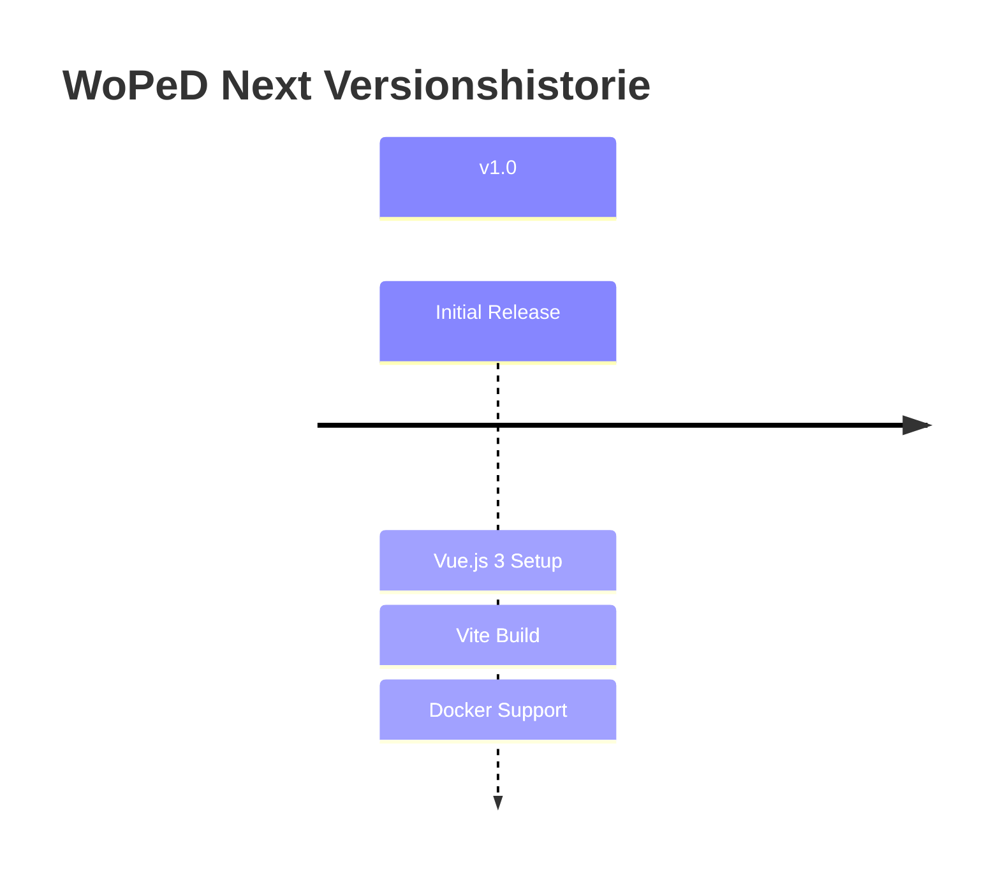
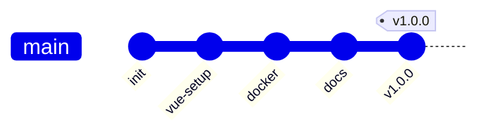
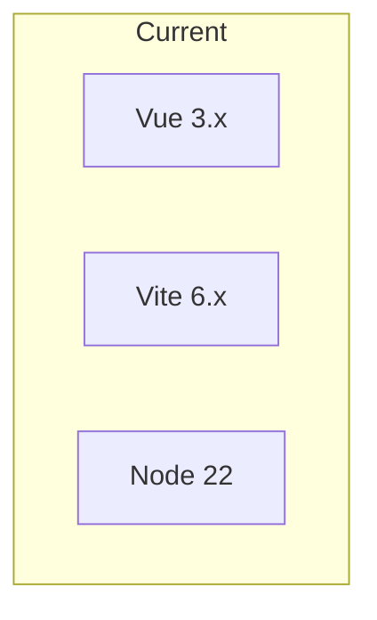

# Migrationen

## Übersicht



## Changelog

### v1.0.0 (Initial Release)



#### Features
- Vue.js 3 mit Vite initialisiert
- Docker-Unterstützung mit Multi-Stage Build
- nginx als Produktions-Webserver
- Cursor Rules für Entwicklung

#### Dateien
| Aktion | Datei |
|--------|-------|
| ➕ Added | `src/`, `public/`, `index.html` |
| ➕ Added | `Dockerfile`, `docker-compose.yml` |
| ➕ Added | `nginx.conf` |
| ➕ Added | `.cursor/rules/` |
| ➕ Added | `docs/` |

---

## Migrations-Template

### Version X.Y.Z

```markdown
#### Breaking Changes
- [ ] Beschreibung

#### Migrationsschritte
1. Schritt 1
2. Schritt 2

#### Rollback
- Anleitung für Rollback
```

## Abhängigkeiten-Updates



| Paket | Aktuelle Version | Update-Zyklus |
|-------|------------------|---------------|
| vue | 3.x | Minor releases |
| vite | 6.x | Minor releases |
| node | 22.x LTS | LTS releases |
