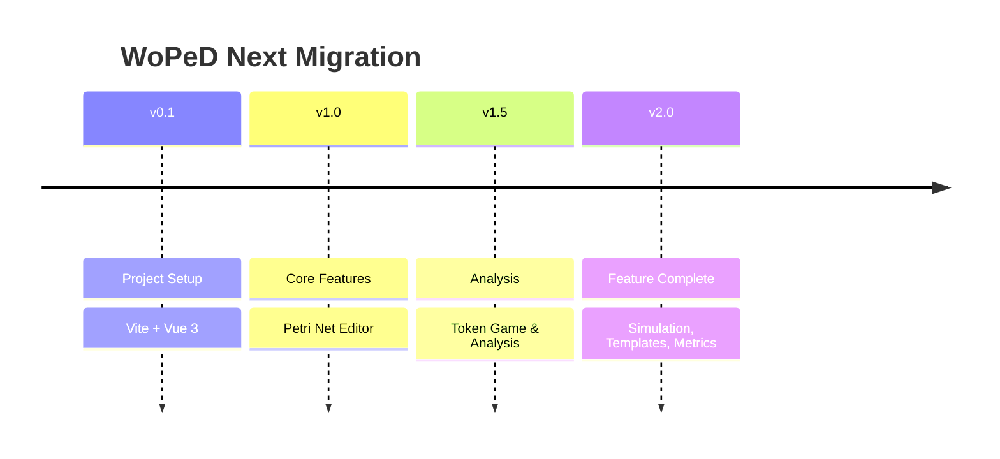

# Migration Status & Changelog

## Overview

Migration from WoPeD Java Swing to WoPeD Next (Vue.js 3).



## Implementation Status

| Feature | Status | Notes |
|---------|--------|-------|
| **01 Petri Net Editor** | ✅ Complete | Places, transitions, arcs, weights |
| **02 Workflow Operators** | ✅ Complete | AND/XOR split/join, combined operators |
| **03 Subprocesses** | ✅ Complete | Hierarchical nets, drill-down, breadcrumb |
| **04 Token Game** | ✅ Complete | Animation, conflict resolution, statistics |
| **05 Visualization & Layout** | ✅ Complete | Grid, snap, auto-layout, fit-to-view |
| **06 Qualitative Analysis** | ✅ Complete | Structure analysis, soundness checking |
| **07 Quantitative Simulation** | ✅ Complete | Time-based simulation, resources, bottleneck analysis |
| **08 Process Metrics** | ✅ Complete | Complexity metrics, structural analysis |
| **09 File Operations** | ✅ Complete | PNML/JSON import/export, image export |
| **10 Configuration** | ✅ Complete | Theme, language, editor settings |
| **11 Templates** | ✅ Complete | 10 educational example nets |
| **12 NLP Integration** | ⏸️ Deferred | Wird als letztes Feature komplett neu konzipiert — der bisherige Ansatz (10-nlp-integration.md) wird durch ein neues Konzept ersetzt |

Legend: ✅ Complete | ⚠️ Partial | 🔜 Planned | ⏸️ Deferred

## Changelog

### v3.0.0 - Full Feature Implementation (excl. NLP)

#### Analysis Features
- **CoverabilityGraphView.vue** — Interactive SVG visualization of the reachability graph with BFS-layered layout, zoom/pan, color-coded nodes (initial/final/deadlock), edge labels
- **AnalysisWizard.vue** — Step-by-step wizard for running workflow/soundness/metrics analyses
- **CustomMetricsBuilder.vue** — User-defined metrics with formula language (shunting-yard parser), variables (places, transitions, arcs, etc.), threshold support
- **MassAnalysis.vue** — Batch analysis across all nets with results table, expandable details, CSV export

#### Simulation Features
- **ThroughputLineChart.vue** — SVG line chart showing throughput over time with area fill, tooltips
- **ResourcePieChart.vue** — SVG donut chart for resource utilization visualization
- **SimulationTimeline.vue** — Horizontal timeline of simulation events with per-case lanes, color-coded event types, zoom/scroll

#### Resource Management
- Extended `useResourceStore` with **Roles** (`ResourceRole`), **Groups** (`ResourceGroup`), **Allocations** (`ResourceAllocation`)
- `addRole`, `updateRole`, `removeRole`, `addGroup`, `updateGroup`, `removeGroup`, `addAllocation`, `removeAllocation` actions
- `getResourcesByGroup`, `getRoleById`, `getGroupById`, `getAllocationsForResource`, `getAllocationsForTransition` getters
- **ResourceManager.vue** — Full tabbed UI (Resources, Roles & Groups, Allocations) with CRUD forms

#### Editor Features
- **ProcessTree.vue** — Tree view of subprocess hierarchy with navigation, collapsible nodes, active net highlighting
- **SubProcessNode.vue** — Integrated `SubprocessPreview` component with hover popup for rich preview
- `smartEditing` added to `EditorConfig` type and defaults

#### Type Fixes
- `TokenGameConfig.conflictResolution` type corrected from `'first'` to `'priority'`

#### i18n
- Added translation keys for all new features in English and German locales

### v2.3.0 - Quick Wins & Component Gaps

#### Editor Enhancements
- Context menu on right-click (Select, Duplicate, Delete, Properties, Open Subprocess)
- Drag & Drop file opening (.pnml, .json) with drop overlay
- Auto-save composable (`useAutoSave.ts`) with localStorage persistence
- `GraphBeautifier.vue` one-click layout component

#### Component Extraction
- `OperatorBase.vue` — shared base component for all operator node types
- `AnalysisResults.vue` + `IssueList.vue` — extracted from AnalysisPanel
- `SimulationDashboard.vue` — MetricCard grid + charts wrapper
- `ContextMenu.vue` — reusable context menu with Teleport

#### File Operations
- Recent Files submenu in FileMenu (integrated with config store)
- Files tracked on open and displayed in dropdown

#### Analysis & Metrics
- Metrics report export (plaintext download)
- Resource store: `getByType`, `getResourcesByRole`, `totalCapacity` getters

#### UX Polish
- Overview panel: grab cursor + drag feedback for viewport navigation
- Conflict resolution renamed `first` → `priority` (i18n en/de)

### v2.2.0 - Low-Complexity Gap Closure

#### Architecture & Validation
- Zod schemas for PetriNet data model (`utils/schemas.ts`) with JSON-parser integration
- Command pattern abstraction for undo/redo (`utils/commands.ts`)

#### Refactoring & Component Extraction
- `SubProcessView.vue` — standalone subprocess navigation with breadcrumb
- `HistoryPanel.vue` — extracted from TokenGameControls as reusable history list
- `EditorGrid.vue` — grid rendering extracted from EditorCanvas
- `LayoutSettings.vue` — layout settings extracted from ViewToolbar
- `MetricsSidebar.vue` — standalone wrapper for MetricsSection

#### Naming & Consistency
- Conflict resolution mode renamed from `first` to `priority`

#### Visualization Enhancements
- Metric bar visualization for ratio-metrics (0–1) in MetricsSection
- Resource utilization bar display in ResourceConfig (post-simulation)

#### Documentation
- Documented custom force-directed layout (replaces d3-force dependency)
- Documented custom SVG charts (replaces chart.js / vue-chartjs dependency)

### v2.1.0 - Triggers & Resources Complete

#### Triggers & Resources
- Resource Store (`stores/resources.ts`) for central resource management
- TriggerEditor uses resource dropdown instead of freetext
- Trigger icons (T/R/M) rendered on transitions in the canvas
- SimulationEngine allocates/releases resources during simulation
- SimulationEngine uses time trigger delay as processing time fallback
- PNML import/export preserves trigger data in `<toolspecific>` elements
- JSON import/export preserves trigger data

### v2.0.0 - Feature Complete

#### Editor & Visualization
- Subprocesses with drill-down navigation
- Breadcrumb navigation for subprocess hierarchy
- Auto fit-to-view on page load
- Arc weight display at arc midpoint

#### Token Game
- Animated token movement
- Conflict resolution dialog
- Statistics (firings per transition, states visited)
- Integrated in collapsible right panel

#### Simulation & Analysis
- Quantitative simulation with discrete event model
- Resource management and allocation
- Bottleneck analysis
- Utilization charts
- XES log export
- Process metrics calculation

#### File Operations
- PNML import/export with subprocess support
- JSON import/export with full model support
- SVG/PNG image export
- Templates menu with 10 example nets

#### UI/UX
- Collapsible right panel (expanded by default)
- Tabbed panel for Properties/Token Game/Simulation
- Template submenu in File menu
- Improved toolbar with icon tooltips

### v1.0.0 - Initial Release

#### Core Features
- Petri net editor with canvas
- Places, transitions, arcs
- Workflow operators (AND/XOR split/join)
- Selection and deletion
- Properties panel

#### Basic Features
- Dark/light theme
- German/English localization
- Grid and snap-to-grid
- Local storage for settings

#### File Operations
- Basic PNML import/export
- New/Save/Load functionality

## Dependencies

### Core
```json
{
  "vue": "^3.5.x",
  "vue-i18n": "^11.1.x",
  "pinia": "^3.x",
  "vue-konva": "^3.x",
  "konva": "^9.x",
  "nanoid": "^5.x"
}
```

### Build
```json
{
  "vite": "^6.x",
  "typescript": "~5.6.x",
  "@vitejs/plugin-vue": "^5.x"
}
```

### Production
- nginx:alpine (Docker)
- GitHub Actions (CI/CD)
- GitHub Pages (Hosting)

## Feature Detail Documents

Each feature has a detailed specification document:

| Document | Content |
|----------|---------|
| [00-migration-overview.md](./00-migration-overview.md) | Migration plan |
| [01-petri-net-editor.md](./01-petri-net-editor.md) | Editor specification |
| [02-workflow-operators.md](./02-workflow-operators.md) | Operator types |
| [03-subprocess-management.md](./03-subprocess-management.md) | Subprocess handling |
| [04-token-game.md](./04-token-game.md) | Token game logic |
| [05-visualization-layout.md](./05-visualization-layout.md) | Visualization features |
| [06-qualitative-analysis.md](./06-qualitative-analysis.md) | Analysis algorithms |
| [07-quantitative-simulation.md](./07-quantitative-simulation.md) | Simulation engine |
| [08-process-metrics.md](./08-process-metrics.md) | Metrics calculation |
| [09-file-operations.md](./09-file-operations.md) | File formats |
| [10-configuration.md](./10-configuration.md) | Settings management |
