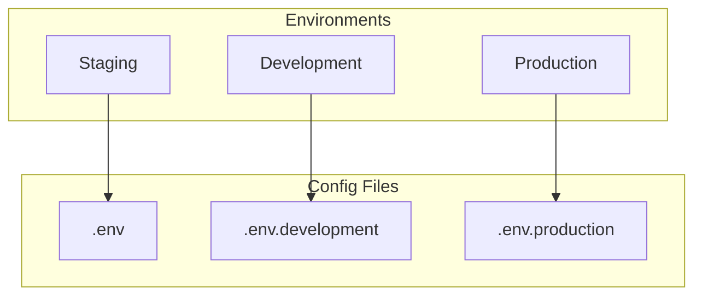
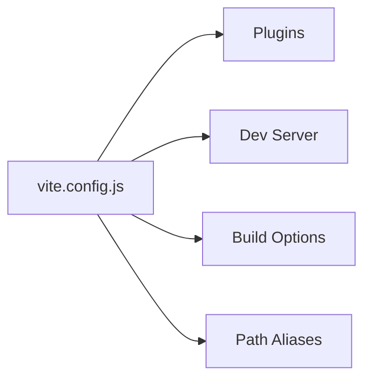

# Configuration

## Overview



## Environment Variables

### Vite Environment Variables

```bash
# .env.example
VITE_APP_TITLE=WoPeD Next
VITE_API_URL=http://localhost:3000/api
VITE_DEBUG=false
VITE_P2T_ENDPOINT=https://woped.dhbw-karlsruhe.de/p2t/generateText
VITE_T2P_ENDPOINT=https://woped.dhbw-karlsruhe.de/t2p-2.0/generate_pnml
```

| Variable | Description | Default |
|----------|-------------|---------|
| `VITE_APP_TITLE` | Application title | WoPeD Next |
| `VITE_API_URL` | Backend API URL | - |
| `VITE_DEBUG` | Debug mode | false |
| `VITE_P2T_ENDPOINT` | P2T API endpoint (likely to change as APIs evolve) | - |
| `VITE_T2P_ENDPOINT` | T2P API endpoint (likely to change as APIs evolve) | - |

> **Note**: Only variables with `VITE_` prefix are available in the client.

## Vite Configuration



### Path Aliases

```javascript
// vite.config.js
resolve: {
  alias: {
    '@': '/src',
    '@components': '/src/components',
    '@assets': '/src/assets'
  }
}
```

## Docker Configuration

### docker-compose.yml

| Service | Port | Description |
|---------|------|-------------|
| woped-next | 8080:80 | Frontend Container |

### Nginx Settings

| Setting | Value | Description |
|---------|-------|-------------|
| Gzip | enabled | Compression |
| Cache | 1 year | Static assets |
| SPA Routing | try_files | Fallback to index.html |
