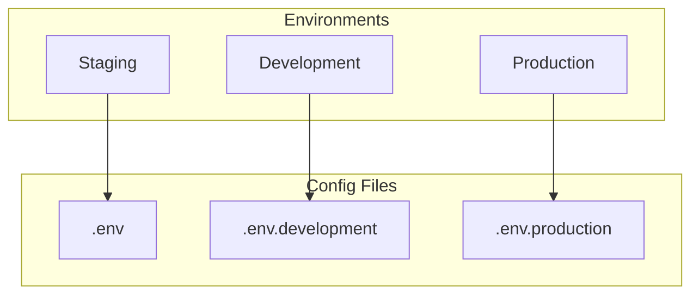
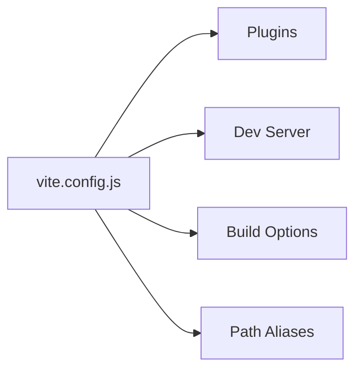

# Konfiguration

## Übersicht



## Umgebungsvariablen

### Vite Environment Variables

```bash
# .env.example
VITE_APP_TITLE=WoPeD Next
VITE_API_URL=http://localhost:3000/api
VITE_DEBUG=false
```

| Variable | Beschreibung | Default |
|----------|--------------|---------|
| `VITE_APP_TITLE` | Anwendungstitel | WoPeD Next |
| `VITE_API_URL` | Backend API URL | - |
| `VITE_DEBUG` | Debug-Modus | false |

> **Hinweis**: Nur Variablen mit `VITE_` Prefix sind im Client verfügbar.

## Vite Konfiguration



### Path Aliases

```javascript
// vite.config.js
resolve: {
  alias: {
    '@': '/src',
    '@components': '/src/components',
    '@assets': '/src/assets'
  }
}
```

## Docker Konfiguration

### docker-compose.yml

| Service | Port | Beschreibung |
|---------|------|--------------|
| woped-next | 8080:80 | Frontend Container |

### Nginx Settings

| Setting | Wert | Beschreibung |
|---------|------|--------------|
| Gzip | enabled | Komprimierung |
| Cache | 1 Jahr | Statische Assets |
| SPA Routing | try_files | Fallback auf index.html |
