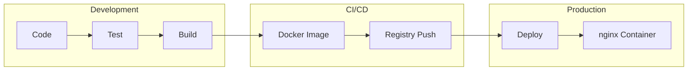
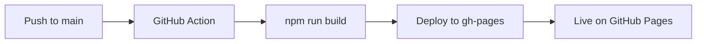
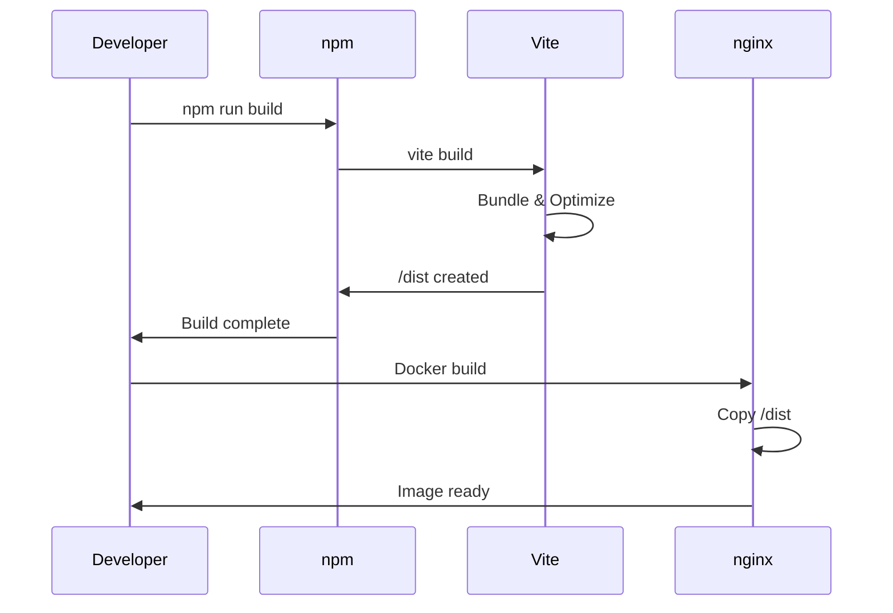

# Deployment

## Deployment Process



## GitHub Pages

The application is automatically deployed to GitHub Pages via GitHub Actions.



**URL**: https://taminofischer.github.io/woped-next/

## Docker

### Build Image

```bash
# Build locally
docker build -t woped-next .

# With tag
docker build -t woped-next:v1.0.0 .
```

### Start Container

```bash
# With Docker Compose (recommended)
docker compose up -d

# Directly with Docker
docker run -d -p 8080:80 --name woped-next woped-next
```

### Container Management

```bash
# Show logs
docker compose logs -f

# Stop container
docker compose down

# Restart with rebuild
docker compose up -d --build
```

## Build Process



## Production Build

```bash
# Create build
npm run build

# Test build locally
npm run preview
```

### Build Output

```
dist/
├── index.html
├── assets/
│   ├── index-[hash].js
│   └── index-[hash].css
└── vite.svg
```

## Health Checks

| Endpoint | Expected | Description |
|----------|----------|-------------|
| `/` | 200 OK | Main page |
| `/assets/*` | 200 OK | Static assets |

## Rollback

```bash
# Deploy previous version
docker compose down
docker tag woped-next:previous woped-next:latest
docker compose up -d
```
