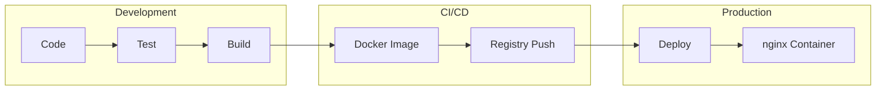
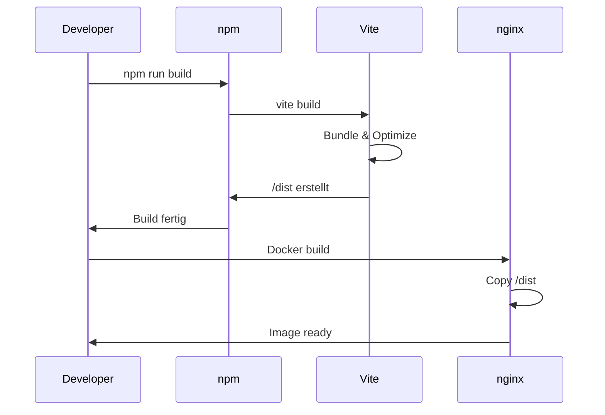

# Deployment

## Deployment-Prozess



## Docker

### Image bauen

```bash
# Lokal bauen
docker build -t woped-next .

# Mit Tag
docker build -t woped-next:v1.0.0 .
```

### Container starten

```bash
# Mit Docker Compose (empfohlen)
docker compose up -d

# Direkt mit Docker
docker run -d -p 8080:80 --name woped-next woped-next
```

### Container Management

```bash
# Logs anzeigen
docker compose logs -f

# Container stoppen
docker compose down

# Neustart mit Rebuild
docker compose up -d --build
```

## Build-Prozess



## Produktions-Build

```bash
# Build erstellen
npm run build

# Build lokal testen
npm run preview
```

### Build Output

```
dist/
├── index.html
├── assets/
│   ├── index-[hash].js
│   └── index-[hash].css
└── vite.svg
```

## Health Checks

| Endpoint | Erwartung | Beschreibung |
|----------|-----------|--------------|
| `/` | 200 OK | Hauptseite |
| `/assets/*` | 200 OK | Statische Assets |

## Rollback

```bash
# Vorherige Version deployen
docker compose down
docker tag woped-next:previous woped-next:latest
docker compose up -d
```
